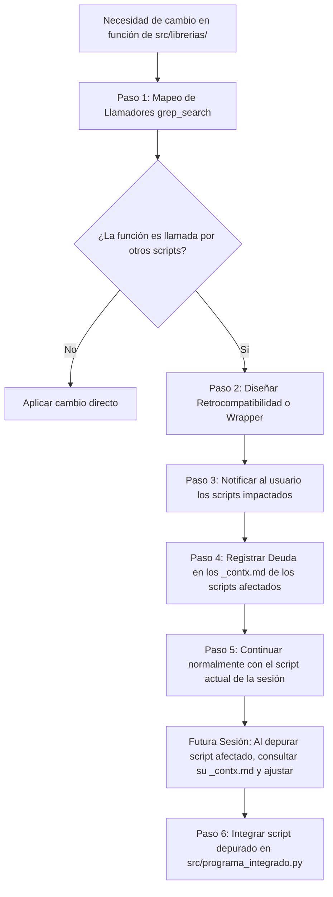

# Skill: Auditoría de Librerías e Integración en `programa_integrado.py`

> [!IMPORTANT]
> **Reglas Madres:** Esta habilidad opera exclusivamente en el entorno de desarrollo local. El agente **NUNCA ejecuta commits** ni interactúa con GitHub.

**Descripción de Activación:** Ejecuta este flujo cuando el usuario indique:
* *"audita las llamadas a librerías e integra [modulo.py] en el programa integrado"*
* *"audita el impacto de librerías de [modulo.py]"*
* *"integra este módulo depurado en src/programa_integrado.py"*
* o al modificar cualquier función en `src/librerias/`.

**Objetivo:** 
1. **Evacuación Progresiva Uno a Uno**: Permitir modificar y enriquecer librerías compartidas (`metodos_rsa.py`, `rsa_io.py`, `gestor_fases.py`, `estaciones.py`) **sin necesidad de alterar simultáneamente todos los otros programas afectados**, evitando dispersar el foco de la sesión.
2. **Notificación y Registro de Impacto Diferido**: Cada vez que se altere una función compartida, el agente debe **notificar conscientemente al usuario** y registrar en los archivos de contexto (`_contx.md`) qué scripts quedan pendientes de compatibilizar y qué ajuste requerirán en su momento.
3. **Integración Progresiva en `src/programa_integrado.py`**: Conforme cada script satélite es depurado y compatibilizado, se integra como menú/pestaña/acción en la aplicación central unificada.

---

## 📋 Flujo de Trabajo: Evacuación Progresiva y Registro Consciente



---

## 🔍 Paso a Paso del Procedimiento

### 1. Detección y Mapeo de Llamadores
Antes de modificar una función en `src/librerias/`:
* Usar `grep_search` para listar todos los archivos que llaman a esa función en `src/subprogramas/` y `modulos externos/`.
* Identificar exactamente qué argumentos y tipo de retorno esperan los scripts existentes.

### 2. Retrocompatibilidad Preferente (Invariable)
* Siempre que sea posible, extender la función usando **parámetros opcionales con valores por defecto** (ej. `def fn(a, b, nuevo_param=None):`). De este modo, los otros programas siguen funcionando sin requerir edición inmediata.

### 3. Notificación Explícita al Usuario
El agente debe reportar en el chat de la sesión un bloque claro de **Notificación de Impacto**:
```text
⚠️ Notificación de Impacto en Librería:
- Función modificada: metodos_rsa.py -> clasificar_evento_sismico()
- Módulo actual bajo depuración: Insercion de estaciones EVT.py (Adaptado)
- Scripts satélite pendientes de compatibilizar:
  1. src/subprogramas/fases.py (Espera retorno de 2 valores en vez de dict)
  2. modulos externos/acelerografo.py (Usa firma antigua)
- Estado: Se deja registrado en los _contx.md correspondientes para evacuarlos cuando se intervengan individualmente.
```

### 4. Registro de Memoria Técnica en Contextos (`_contx.md`)
En el archivo `_contx.md` de cada script afectado (bajo la sección `## 5. Deuda Técnica y Riesgos Críticos`):
* Se añade una entrada explícita indicando qué cambio se introdujo en la librería y cuál es el ajuste puntual que se debe realizar cuando llegue el turno de depurar ese script.

### 5. Continuidad de la Sesión
* El agente **no toca los otros scripts en la sesión actual** (salvo que el usuario lo solicite expresamente). Se mantiene el foco exclusivo en el script que se está depurando.

### 6. Integración en `src/programa_integrado.py`
Cuando un script satélite completa su turno de depuración y compatibilización:
* Se mueve/adapta su lógica a `src/subprogramas/` respetando clases PyQt5.
* Se añade la opción correspondiente en el menú de `src/programa_integrado.py`.
* Se comparte el `directorio_trabajo` base de la aplicación principal.
* Se encapsulan procesos pesados en `QThread` para mantener la interfaz fluida.
* El script satélite original en `modulos externos/` queda listo para deprecación o archivo.
