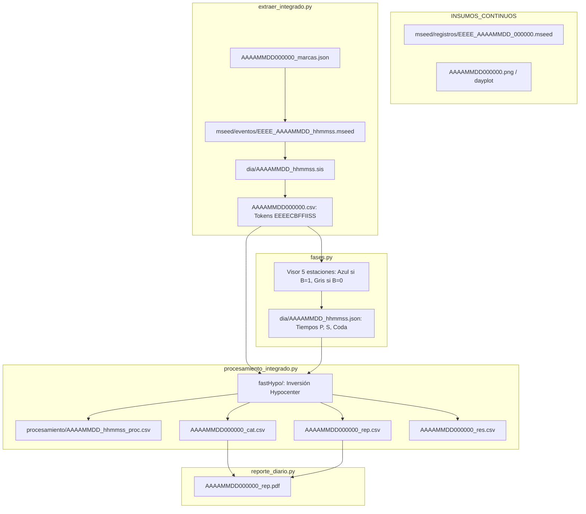

# Estructura de Datos en el Directorio `..\DIA\` — Contexto Técnico Maestro

> **Propósito**: Servir como referencia técnica unificada e inmutable sobre la organización del árbol de carpetas temporales, el contrato de la **Matriz Maestra de Eventos (`AAAAMMDD000000.csv`)**, la sintaxis de los tokens de estaciones (**`EEEECBFFIISS`**), catálogos diarios y subdirectorios operativos bajo el directorio de trabajo sísmico.

---

## 1. Jerarquía Temporal del Repositorio `..\DIA\`

La organización física en disco sigue el esquema temporal estándar:

$$\Large \mathbf{..\backslash DIA \ \backslash \ AAAA \ \backslash \ AAAA\_MM \ \backslash \ AAAA\_MM\_DD \ \backslash}$$

* **`AAAA`**: Año en 4 dígitos (ej. `2026`).
* **`AAAA_MM`**: Año y mes en 2 dígitos con guion bajo (ej. `2026_08`).
* **`AAAA_MM_DD`**: Directorio raíz de la jornada diaria (ej. `2026_08_24`).

> [!NOTE]
> La función [`metodos_gestion.obtener_directorios(archivo)`](file:///c:/proyectos/rsa_sismologia/src/librerias/metodos_gestion.py) resuelve automáticamente la ubicación canónica y mantiene retrocompatibilidad con esquemas históricos (`DIA\AAAA_MM\AAAA_MM_DD\`, `DIA\AAAA_MM_DD\` o `DIA\AAMMDD000000\`).

---

## 2. Mapa Completo del Directorio Diario (`AAAA_MM_DD`)

```text
..\DIA\AAAA\AAAA_MM\AAAA_MM_DD\
│
├── 📄 AAAAMMDD000000.csv               ← Matriz Maestra de Eventos y Configuración de Estaciones
├── 📄 AAAAMMDD000000_cat.csv           ← Catálogo de sismos localizados (Hypocenter)
├── 📄 AAAAMMDD000000_rep.csv           ← Resumen tabulado de eventos del día para boletín
├── 📄 AAAAMMDD000000_res.csv           ← Conteo consolidado por tipo de evento
├── 📄 AAAAMMDD000000_marcas.json       ← Marcas temporales (picks UTC) seleccionadas en dayplot
├── 📄 AAAAMMDD000000.xml               ← Consolidado estructurado en XML
├── 📄 AAAAMMDD000000_rep.pdf           ← Boletín sismológico diario final emitido
├── 📄 AAAAMMDD_estaciones.csv          ← Snapshot de configuración de las 101 estaciones
├── 📄 AAAAMMDD_est.csv                 ← Matriz de estado y comportamiento operativo de canales
├── 📄 AAAAMMDD_aux.csv                 ← Archivo auxiliar temporal de trabajo de extracción
├── 🖼️ AAAAMMDD000000.png / dayplot.png ← Gráfico del sismograma helicoidal continuo de 24 horas
│
├── 📁 dia\                             ← Descriptores de eventos individuales
│   ├── AAAAMMDD_hhmmss.sis             ← Descriptor sismológico en formato RSA/SEISAN
│   ├── AAAAMMDD_hhmmss.fas             ← Tiempos de fases para localización hipocentral
│   └── AAAAMMDD_hhmmss.json            ← Diccionario de fases (P, S, Coda) en formato JSON
│
├── 📁 mseed\
│   ├── 📁 eventos\                     ← Recortes MiniSEED por estación para cada evento
│   │   ├── EEEE_AAAAMMDD_hhmmss.mseed  ← ej: BOB1_20260824_143022.mseed
│   │   └── ...
│   └── 📁 registros\                   ← Registros continuos de 24 horas por estación
│       ├── EEEE_AAAAMMDD_000000.mseed  ← ej: BOB1_20260824_000000.mseed
│       └── ...
│
├── 📁 fastHypo\                         ← Archivos de entrada/salida para el motor Hypocenter
│   ├── MMDDHHMI.rsa                    ← Archivo de fases compactas de entrada
│   ├── PhaseDDH.HMI                    ← Formato de fases para Hypocenter
│   ├── MMDDHH.MIL / MIP / MIS          ← Archivos de control y salidas intermedias
│   └── AAAAMMDD_hhmmss.out             ← Salida con solución hipocentral (RMS, GAP, ERZ)
│
├── 📁 procesamiento\                   ← Procesamiento sismológico por evento
│   ├── AAAAMMDD_hhmmss_proc.csv        ← Amplitudes pico a pico, períodos y magnitudes por estación
│   └── ...
│
├── 📁 reportes\                        ← Informes individuales y metadatos de turno
│   ├── AAAAMMDD_hhmmss_rep.pdf         ← Reporte individual del sismo (mapa + trazas)
│   ├── AAAAMMDD_resp.csv               ← Responsables técnicos asignados en los 3 turnos
│   └── AAAAMMDD_tiempos.csv            ← Bitácora de tiempos de inicio/fin de procesamiento
│
└── 📁 acelerogramas\                   ← Registros de aceleración (Acelerógrafos Kinemetrics)
    ├── EVT_AAAAMMDD_hhmmss.evt         ← Registros binarios EVT
    └── EVT_AAAAMMDD_hhmmss.txt / asc   ← Acelerogramas convertidos a texto plano
```

---

## 3. Matriz Maestra de Eventos (`AAAAMMDD000000.csv`)

Es un archivo de texto plano estructurado con delimitador **punto y coma (`;`)**. Cada fila describe un evento sísmico detectado.

```text
[Col 0] ; [Col 1]               ; [Col 2]        ; [Col 3]        ; [Col 4]        ; ... ; [Col 103]
  ID    ; Archivo .sis          ; Tipo de Evento ; Estación 0     ; Estación 1     ; ... ; Estación 100
```

### 3.1. Columnas de Encabezado del Evento (Columnas 0 a 2)

| Columna | Nombre | Tipo | Descripción |
|:---:|:---|:---:|:---|
| **`0`** | **ID** | `int` | Consecutivo numérico del evento en el día (`1`, `2`, `3`, ...). |
| **`1`** | **Archivo `.sis`** | `str` | Nombre del descriptor bajo `dia\` (ej. `20260824_143022.sis`). |
| **`2`** | **Tipo de Evento** | `str` | Clasificación sismológica oficial del evento (ver tabla abajo). |

#### Tipos de Evento Sismológicos del Sistema (`lista_filtros`):
* **`SISMO`**: Sismo tectónico local o regional procesable para localización, magnitud y catálogo.
* **`FF`**: Fuera de Foco / Fuera de Red (evento distal o con arribos lejanos a la red).
* **`FC`**: Falla Cercana / Foco Cercano (evento local de falla geológica cercana a las estaciones).
* **`TELESISMO`**: Sismo a gran distancia epicentral (> 1000 km / sismo global).
* **`Ruido`**: Señal no sísmica (ruido ambiental, tráfico, viento o perturbación electromagnética).
* **`INDEFINIDO`**: Señal detectada con relación señal/ruido dudosa o pendiente de análisis.
* **`Evento_local`**: Microevento de muy baja magnitud o colapso muy próximo.
* **`CONTROL`**: Pulsos de calibración, pruebas instrumentales o sincronizaciones GPS.
* **`REVISION`**: Evento marcado para reevaluación por el analista.

---

### 3.2. Columnas de Estaciones (Columnas 3 a 103): Token `EEEECBFFIISS`

Cada columna `i + 3` corresponde exactamente a la **estación $i$** del catálogo maestro ([`datos/estaciones.csv`](file:///c:/proyectos/rsa_sismologia/datos/estaciones.csv), hasta 101 estaciones).

* Si la estación no tiene datos para el evento: Contiene un guion `"-"`.
* Si la estación tiene registro para el evento: Contiene un **token de longitud fija de 12 caracteres**:

$$\Large \mathbf{EEEECBFFIISS}$$

```text
Posición:  0   1   2   3   4   5   6   7   8   9  10  11
Carácter: [E] [E] [E] [E] [C] [B] [F] [F] [I] [I] [S] [S]
           └─────┬─────┘   │   │   └──┬──┘ └──┬──┘ └──┬──┘
                 │         │   │      │       │       └── Frecuencia Sup. (SS) en Hz
                 │         │   │      │       └────────── Frecuencia Inf. (II) en Hz
                 │         │   │      └────────────────── Orden del Filtro (FF)
                 │         │   └───────────────────────── Bandera de Aporte (B: 1 ó 0)
                 │         └───────────────────────────── Componente (C: 1, 2, 3...)
                 └─────────────────────────────────────── Código Estación (EEEE)
```

| Parámetro | Posición | Longitud | Valores | Descripción |
|:---|:---:|:---:|:---:|:---|
| **Código (`EEEE`)** | 0..3 | 4 chars | Ej. `BOB1`, `PATS`, `LABR` | Código alfanumérico único de la estación. |
| **Componente (`C`)** | 4 | 1 char | `1`, `2`, `3` (o `Z`, `N`, `E`) | Componente procesada (`1`=Vertical/Z, `2`=Norte/N, `3`=Este/E). |
| **Aporte (`B`)** | 5 | 1 char | **`1`** o **`0`** | **Bandera de Aporte**:<br>• **`1`**: Estación que **aporta** al sismo (usada en localización y graficada en **azul**).<br>• **`0`**: Estación que **no aporta** (descartada de la localización y graficada en **gris**). |
| **Orden (`FF`)** | 6..7 | 2 dígitos | `00` a `08` (ej. `02`, `04`) | Orden del filtro Butterworth pasa-banda (`00` = sin filtro). |
| **Frec. Inf. (`II`)** | 8..9 | 2 dígitos | `00` a `99` (ej. `01` = 1.0 Hz) | Frecuencia de corte inferior en Hz. |
| **Frec. Sup. (`SS`)** | 10..11 | 2 dígitos | `00` a `99` (ej. `08` = 8.0 Hz) | Frecuencia de corte superior en Hz. |

---

## 4. Estructura de Otros Archivos de la Raíz del Día

### 4.1. Catálogo Diario (`AAAAMMDD000000_cat.csv`)
Contiene 20 columnas delimitadas por `;` con la solución hipocentral:
```text
Id;anio;mes;dia;hora;min;seg;lat;long;prof;rms;e-x;e-y;e-0;e-z;Mag;Tipo Mag;Fuente;ruta;Ubicacion
```

### 4.2. Resumen de Boletín (`AAAAMMDD000000_rep.csv`)
Estructura formateada para generar las tablas del PDF diario:
```text
0;Fecha Hora (UTC);Evento;Magn.;Prof.(km);Lat.;Long.;Ubicación
```

### 4.3. Conteo Estadístico (`AAAAMMDD000000_res.csv`)
Conteo de eventos clasificados para análisis de turnos y acumulados:
```text
SISMO;FF;FC;TELESISMOS;Local_CONTROL;INDEFINIDO;Ruido
```

### 4.4. Marcas Temporales (`AAAAMMDD000000_marcas.json`)
Lista JSON de timestamps UTC seleccionados en el visor general:
```json
[
  "2026-08-24T14:30:22.000000Z",
  "2026-08-24T18:15:10.000000Z"
]
```

---

## 5. Diagrama de Flujo y Relación entre Archivos



---

## 6. Reglas Invariantes para Agentes y Desarrolladores

1. **Longitud Fija Obligatoria**: El token de estación debe tener **exactamente 12 caracteres**. Al modificar aportes o filtros, utilizar la rebanada:
   ```python
   nueva_cadena = cadena_anterior[:5] + nuevo_aporte + nuevo_filtro_6caracteres
   ```
2. **Offset Fijo de Columnas (+3)**: La estación con índice $i$ de `estaciones.csv` se encuentra siempre en la columna `i + 3` de cada fila en `AAAAMMDD000000.csv`.
3. **Lectura y Escritura Atómica**: Usar siempre [`metodos_rsa.lectura_archivo()`](file:///c:/proyectos/rsa_sismologia/src/librerias/metodos_rsa.py) y [`rsa_io.escritura_archivo()`](file:///c:/proyectos/rsa_sismologia/src/librerias/rsa_io.py).
4. **Resolución de Rutas**: Nunca usar rutas absolutas directas al disco `G:`; resolver siempre con `obtener_directorios(ruta_archivo)` para soportar dinámicamente cualquier árbol temporal.
