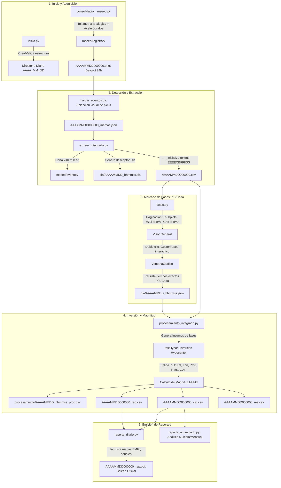

# Contexto Técnico Maestro para Agentes IA — `rsa_sismologia`

> **Propósito**: Guía y referencia técnica de nivel superior para cualquier agente IA (**Antigravity**, **Codex**) operando en `rsa_sismologia`. Consolida la arquitectura del software, el modelo de datos bajo `..\DIA\`, los archivos de configuración, el pipeline sismológico de punta a punta y las reglas de oro de desarrollo.

---

## 🧭 1. Identidad y Arquitectura del Sistema

* **Repositorio**: `rsa_sismologia` (Red Sísmica de Alerta - Análisis Sismológico e Instrumentación).
* **Entorno**: Python 3.9 / PyQt5 / ObsPy / Matplotlib sobre Windows (VS Code, terminales PowerShell y Spyder IDE).
* **Punto de Entrada Central**: [`src/programa_integrado.py`](file:///c:/proyectos/rsa_sismologia/src/programa_integrado.py).
* **Patrón de Navegación**: **Máquina de Estados LIFO Asíncrona**.
  * La ventana principal desapila y muestra subprogramas secundarios (`Inicio_proceso`, `Extraer_evento`, `VentanaPrincipal` de fases, `Proceso`, `Reporte_diario`, etc.).
  * Al cerrar cualquier subprograma, se emite una señal (`cerrado = pyqtSignal()`) y se restaura el estado y modo de trabajo anterior (**Diario** o **Período**) mediante `QTimer.singleShot`.
  * **Regla Crítica**: *NUNCA* ejecutar `delattr` sobre `QMainWindow` ni `plt.close()` sobre figuras incrustadas en `FigureCanvasQTAgg`.

---

## 🗄️ 2. Estructura de Datos en el Directorio Sísmico `..\DIA\`

La jornada sismológica se organiza en un árbol jerárquico temporal resuelto mediante [`metodos_gestion.obtener_directorios()`](file:///c:/proyectos/rsa_sismologia/src/librerias/metodos_gestion.py):

$$\Large \mathbf{..\backslash DIA \ \backslash \ AAAA \ \backslash \ AAAA\_MM \ \backslash \ AAAA\_MM\_DD \ \backslash}$$

```text
..\DIA\AAAA\AAAA_MM\AAAA_MM_DD\
│
├── 📄 AAAAMMDD000000.csv               ← MATRIZ MAESTRA DE EVENTOS (archivo_csv)
├── 📄 AAAAMMDD000000_cat.csv           ← Catálogo hipocentral (Id, Fecha, Lat, Lon, Prof, Mag, RMS)
├── 📄 AAAAMMDD000000_rep.csv           ← Resumen tabulado para boletín diario
├── 📄 AAAAMMDD000000_res.csv           ← Conteo consolidado por tipo de evento
├── 📄 AAAAMMDD000000_marcas.json       ← Marcas temporales (picks UTC) del dayplot
├── 📄 AAAAMMDD000000.xml               ← Estructura sismológica estandarizada en XML
├── 📄 AAAAMMDD000000_rep.pdf           ← Boletín sismológico oficial del día
├── 📄 AAAAMMDD_estaciones.csv          ← Snapshot de configuración de las 101 estaciones del día
├── 📄 AAAAMMDD_est.csv                 ← Matriz de estado y comportamiento operativo de canales
├── 📄 AAAAMMDD_aux.csv                 ← Archivo auxiliar temporal de trabajo de extracción
├── 🖼️ AAAAMMDD000000.png / dayplot.png ← Sismograma helicoidal continuo de 24 horas
│
├── 📁 dia\                             ← Descriptores de eventos individuales (.sis, .fas, .json)
├── 📁 mseed\eventos\                   ← Recortes MiniSEED por estación para cada sismo
├── 📁 mseed\registros\                 ← Registros continuos de 24 horas por estación
├── 📁 fastHypo\                         ← Archivos de inversión hipocentral con Hypocenter (.rsa, .out)
├── 📁 procesamiento\                   ← Hojas de cálculo de amplitudes y magnitudes (_proc.csv)
├── 📁 reportes\                        ← Informes individuales, responsables (_resp.csv) y tiempos
└── 📁 acelerogramas\                   ← Registros de movimiento fuerte (EVT, TXT, ASC)
```

> 📖 **Referencia Completa**: [`docs/contexto_estructura_datos_dia.md`](file:///c:/proyectos/rsa_sismologia/docs/contexto_estructura_datos_dia.md)

---

## 🎯 3. La Matriz Maestra `AAAAMMDD000000.csv` y el Token `EEEECBFFIISS`

Archivo delimitado por **punto y coma (`;`)**. Cada fila describe un evento sísmico detectado:

```text
[Col 0] ; [Col 1]               ; [Col 2]        ; [Col 3]        ; [Col 4]        ; ... ; [Col 103]
  ID    ; Archivo .sis          ; Tipo de Evento ; Estación 0     ; Estación 1     ; ... ; Estación 100
```

### A. Tipos de Eventos Oficiales (`Columna 2`):
* `SISMO` (tectónico procesable), `FF` (fuera de foco/red), `FC` (falla cercana), `TELESISMO` (global), `Ruido` (no sísmico), `INDEFINIDO` (dudoso), `Evento_local` (microevento), `CONTROL` (calibración) y `REVISION`.

### B. Token de Estación de 12 Caracteres (`Columnas 3 a 103`):
Si la estación no tiene datos contiene `"-"`. Si tiene datos, contiene un token de longitud fija estricta:

$$\Large \mathbf{EEEECBFFIISS}$$

* **`EEEE`** (Pos 0..3): Código de 4 letras de la estación (ej. `BOB1`, `PATS`, `LABR`).
* **`C`** (Pos 4): Componente (`1` = Z/Vertical, `2` = N/Norte, `3` = E/Este).
* **`B`** (Pos 5): **Bandera de Aporte** (`1` = Aporta/Azul; `0` = No aporta/Gris).
* **`FF`** (Pos 6..7): Orden del filtro Butterworth (`00` = sin filtro, `02`, `04`).
* **`II`** (Pos 8..9): Frecuencia de corte inferior en Hz (ej. `01` = 1.0 Hz).
* **`SS`** (Pos 10..11): Frecuencia de corte superior en Hz (ej. `08` = 8.0 Hz).

---

## ⚙️ 4. Ecosistema de Configuración (`datos/` y `datos/mapas/`)

| Archivo | Formato / Claves | Propósito | Consumidores Principales |
|:---|:---|:---|:---|
| [`datos/estaciones.csv`](file:///c:/proyectos/rsa_sismologia/datos/estaciones.csv) | 25 columnas por `;` (`NUM_ESTACION`, `CODIGO`, `SENSOR`, `CANALES`, `COMPONENTE`, `BITS`, `GANANCIA`, `LATITUD`, `LONGITUD`, etc.) | Inventario instrumental maestro de las 101 estaciones de la red. | `metodos_gestion.parametros_estaciones()`, `cargar_parametros()`, todos los subprogramas. |
| [`datos/digitales.csv`](file:///c:/proyectos/rsa_sismologia/datos/digitales.csv) | `Est. Digital; Numero; Habilitado` | Mapeo de carpetas de acelerógrafos digitales al índice de estación. | `consolidacion_mseed.py`, `Insercion de estaciones EVT.py`. |
| [`datos/analogicas.csv`](file:///c:/proyectos/rsa_sismologia/datos/analogicas.csv) | `ESTACION; NOMBRE; CODIGO` | Subconjunto de estaciones analógicas telemétricas a 64 sps continuos. | `rsa_utilidades.extraccion()`, `consolidacion_mseed.py`. |
| [`datos/responsables.csv`](file:///c:/proyectos/rsa_sismologia/datos/responsables.csv) | `Responsable; Ruta_dia; Ruta_fast` | Asignación de operadores de turno y sus rutas de trabajo en red. | `inicio.py`, `rsa_procesamiento.archivos_fast()`. |
| [`datos/poblaciones.csv`](file:///c:/proyectos/rsa_sismologia/datos/poblaciones.csv) | `x; Y; Nombre 2; Nombre; Tipo; Provincia; Canton` (>1040 poblaciones) | Base geográfica para cálculo de distancia geodésica del epicentro. | `rsa_utilidades.ubicacion(lat, lon)`. |
| [`datos/mapas/mapas.csv`](file:///c:/proyectos/rsa_sismologia/datos/mapas/mapas.csv) | `nombre; lat_min; lat_max; long_min; long_max; salto; estaciones` | Catálogo de recortes cartográficos vectoriales EMF para reportes PDF. | `rsa_pdf_graficos.mapa_configuracion()`, `reporte_acumulado.py`. |

> 📖 **Referencia Completa**: [`docs/contexto_archivos_configuracion_datos.md`](file:///c:/proyectos/rsa_sismologia/docs/contexto_archivos_configuracion_datos.md)

---

## 🔄 5. Pipeline y Ciclo de Vida Operativo Sismológico



---

## 📋 6. Índice de Archivos de Contexto Técnico (`_contx.md` y `docs/`)

| Script / Módulo | Archivo de Contexto | Descripción Clave |
|:---|:---|:---|
| **Estructura de Datos `DIA`** | [`docs/contexto_estructura_datos_dia.md`](file:///c:/proyectos/rsa_sismologia/docs/contexto_estructura_datos_dia.md) | Organización de carpetas, tokens de 12 chars y matriz CSV. |
| **Archivos de Configuración** | [`docs/contexto_archivos_configuracion_datos.md`](file:///c:/proyectos/rsa_sismologia/docs/contexto_archivos_configuracion_datos.md) | `estaciones.csv`, `digitales.csv`, `analogicas.csv`, `responsables.csv`, `poblaciones.csv`, `mapas.csv`. |
| [`src/programa_integrado.py`](file:///c:/proyectos/rsa_sismologia/src/programa_integrado.py) | [`src/programa_integrado_contx.md`](file:///c:/proyectos/rsa_sismologia/src/programa_integrado_contx.md) | Máquina de estados LIFO, switch de menús y protección de punteros. |
| [`src/subprogramas/inicio.py`](file:///c:/proyectos/rsa_sismologia/src/subprogramas/inicio.py) | [`src/subprogramas/inicio_contx.md`](file:///c:/proyectos/rsa_sismologia/src/subprogramas/inicio_contx.md) | Inicialización de jornada, selector de turnos y diagnóstico. |
| [`src/subprogramas/extraer_integrado.py`](file:///c:/proyectos/rsa_sismologia/src/subprogramas/extraer_integrado.py) | [`src/subprogramas/extraer_integrado_contx.md`](file:///c:/proyectos/rsa_sismologia/src/subprogramas/extraer_integrado_contx.md) | Corte de sismos, gestión de memoria de streams 24h y tokens. |
| [`src/subprogramas/fases.py`](file:///c:/proyectos/rsa_sismologia/src/subprogramas/fases.py) | [`src/subprogramas/fases_contx.md`](file:///c:/proyectos/rsa_sismologia/src/subprogramas/fases_contx.md) | Marcado de fases (P, S, Coda), paginador y `GestorFases`. |
| [`src/subprogramas/procesamiento_integrado.py`](file:///c:/proyectos/rsa_sismologia/src/subprogramas/procesamiento_integrado.py) | [`src/subprogramas/procesamiento_integrado_contx.md`](file:///c:/proyectos/rsa_sismologia/src/subprogramas/procesamiento_integrado_contx.md) | Pipeline Hypocenter/FastHypo, cálculo de magnitud y catálogos. |
| [`src/subprogramas/reporte_diario.py`](file:///c:/proyectos/rsa_sismologia/src/subprogramas/reporte_diario.py) | [`src/subprogramas/reporte_diario_contx.md`](file:///c:/proyectos/rsa_sismologia/src/subprogramas/reporte_diario_contx.md) | Generación del PDF del boletín diario con ReportLab y EMFs. |
| [`src/subprogramas/reporte_acumulado.py`](file:///c:/proyectos/rsa_sismologia/src/subprogramas/reporte_acumulado.py) | [`src/subprogramas/reporte_acumulado_contx.md`](file:///c:/proyectos/rsa_sismologia/src/subprogramas/reporte_acumulado_contx.md) | Consolidación temporal y catálogos acumulados por período. |
| [`src/librerias/gestor_fases.py`](file:///c:/proyectos/rsa_sismologia/src/librerias/gestor_fases.py) | [`src/librerias/gestor_fases_contx.md`](file:///c:/proyectos/rsa_sismologia/src/librerias/gestor_fases_contx.md) | Controlador de eventos de mouse (drag & drop, doble clic). |
| [`src/librerias/metodos_gestion.py`](file:///c:/proyectos/rsa_sismologia/src/librerias/metodos_gestion.py) | [`src/librerias/metodos_gestion_contx.md`](file:///c:/proyectos/rsa_sismologia/src/librerias/metodos_gestion_contx.md) | `obtener_directorios()`, `parametros_estaciones()`, `cargar_parametros()`. |
| [`src/librerias/panel_estado.py`](file:///c:/proyectos/rsa_sismologia/src/librerias/panel_estado.py) | [`src/librerias/panel_estado_contx.md`](file:///c:/proyectos/rsa_sismologia/src/librerias/panel_estado_contx.md) | Panel desacoplado de diagnóstico y conteo de turnos. |

---

## 🚨 7. Reglas de Oro Inviolables para el Agente

1. **PROHIBICIÓN ABSOLUTA DE EJECUTAR COMMITS**: Solo redactar y proponer mensajes para GitHub Desktop. Nunca ejecutar `git commit` ni `git push`.
2. **CERO ACCESO A GITHUB REMOTO**: No asumir sincronización remota ni invocar APIs de GitHub.
3. **Código y Nomenclatura en Español**: Variables, funciones y comentarios descriptivos en español sismológico.
4. **Respeto a los 12 Caracteres de Token**: Cualquier edición a filtros o aportes debe mantener exactamente `EEEECBFFIISS` (12 caracteres).
5. **Offset de Estaciones $+3$**: En `AAAAMMDD000000.csv`, la estación $i$ de `estaciones.csv` está siempre en la columna $i+3$.
6. **Resolución Dinámica de Rutas**: Usar siempre `obtener_directorios(archivo)` y `extraer_hasta_directorio()` en lugar de concatenaciones fijas con `G:\`.
7. **Estabilidad C++ / PyQt5 / Matplotlib**:
   * *Nunca* usar `delattr` sobre instancias de `QMainWindow`.
   * *Nunca* llamar `plt.close()` sobre figuras incrustadas en `FigureCanvasQTAgg`.
   * Usar `self.figura.clear()` y `self.canvas.draw()`.
