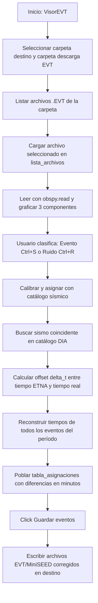

# `Corrección de EVT por reseteo.py` — Contexto Técnico para Agentes IA

> Aplicación especializada en PyQt5 y ObsPy (`VisorEVT`) para la inspección, visualización triaxial, reclasificación y corrección temporal de registros binarios EVT de acelerógrafos Kinemetrics ETNA afectados por reseteo de reloj interno (fechas en los años 1980).

**Ruta**: `c:/proyectos/rsa_sismologia/modulos externos/Corrección de EVT por reseteo.py`  
**LOC**: 1,397 líneas | **Lenguaje**: Python 3 (PyQt5, ObsPy, Matplotlib, NumPy)  
**Hardware Objetivo**: Acelerógrafos Kinemetrics ETNA (Formato binario EVT)  

---

## 1. Identidad, Alcance y Propósito

Cuando un acelerógrafo ETNA pierde la batería de respaldo de su reloj en tiempo real (RTC), reinicia su contador temporal a una fecha base de fábrica (típicamente `1980-01-01` o `1980-01-25`). Aunque la hora interna está desfasada por décadas, el intervalo relativo entre disparos sucesivos se mantiene exacto.

### Objetivos Clave:
1. **Detección de Carpetas de Reseteo**: Identifica carpetas con formato `AAAAMMDD` o `AAMMDD` cuyos registros se sitúan entre 1980 y 2000 (`es_carpeta_reseteo_valida`).
2. **Visualización Triaxial Interactiva**: Renderiza los 3 canales de aceleración (Vertical, Norte-Sur, Este-Oeste) en un lienzo Matplotlib integrado en Qt.
3. **Calibración con Catálogo Sísmico**: Utiliza un sismo de referencia ("evento ancla") registrado simultáneamente en la red continua para calcular el offset temporal exacto ($\Delta T$) y corregir toda la serie de disparos.
4. **Reconstrucción por Períodos**: Maneja discontinuidades y múltiples eventos ancla a lo largo de un período de descarga.
5. **Clasificación Rápida por Atajos de Teclado**: Permite etiquetar registros rápidamente mediante `Ctrl+S` (Evento Sísmico) y `Ctrl+R` (Ruido/Disparo instrumental).
6. **Exportación y Guardado**: Escribe los archivos corregidos en la carpeta de destino preclasificada.

---

## 2. Diagrama de Arquitectura y Flujo de Datos

---

## 3. Contratos de Datos y Configuración

### 3.1. Detección de Fechas y Nombres de Carpeta
* **Carpetas de Reseteo (1980–1999)**: Cadenas numéricas de 6 u 8 dígitos evaluadas por `datetime.strptime("%Y%m%d")` o `datetime.strptime("%y%m%d")`.
* **Carpetas Normales (≥ 2000)**: Evaluadas por `es_carpeta_posterior_2000()`.

### 3.2. Catálogo de Eventos Sísmicos
* Ubicación de búsqueda: `<Raiz_Catalogo>/DIA/<AAAAMMDD>/eventos_<AAAAMMDD>.csv` o catálogos consolidados.
* Campos auditados: Fecha/Hora del evento (`YYYYMMDD_HHMMSS`), tipo (`SISMO`, `FF`, `FC`) y estaciones participantes.

### 3.3. Estructura de la Tabla de Asignaciones (`tabla_asignaciones`)
* **Columna 0**: Nombre del archivo EVT.
* **Columna 1**: Fecha y hora reconstruida/corregida.
* **Columna 2**: Nombre del evento del catálogo asociado.
* **Columna 3**: Diferencia temporal residual en minutos.

---

## 4. Métodos y Clases Principales

| Componente / Método | Tipo | Descripción |
|---|---|---|
| `VisorEVT` | Clase (QWidget) | Ventana principal de visualización, clasificación y corrección de archivos EVT. |
| `es_carpeta_reseteo_valida(nombre)` | Función | Retorna `True` si el nombre de carpeta corresponde a una fecha reseteada (1980–1999). |
| `obtener_fecha_desde_nombre_carpeta(nombre)` | Función | Parsea fechas en formatos de 6 y 8 dígitos. |
| `seleccionar_destino_preclasificacion()` | Slot UI | Define la ruta final de guardado de los archivos depurados. |
| `seleccionar_carpeta_descarga()` | Slot UI | Carga y lista todos los archivos `.evt` o `.EVT` de la jornada seleccionada. |
| `marcar_actual(etiqueta)` | Clasificación | Marca el registro activo como `'evento'` o `'ruido'`, actualiza colores en la lista y avanza al siguiente. |
| `calibrar_con_ultimo_sismo()` | Algoritmo | Identifica el evento ancla, compara contra el catálogo del día y calcula la traslación temporal para todo el lote. |
| `abrir_mseed_desde_tabla(item)` | Visualización | Al hacer doble clic en la tabla de asignaciones, carga y muestra el registro MiniSEED asociado. |
| `guardar_eventos()` | Exportación | Aplica las cabeceras corregidas y exporta los archivos a la carpeta de destino. |

---

## 5. Deuda Técnica y Riesgos Críticos

1. **Dependencia de Catálogo Externo**: La corrección automática de tiempo requiere que el evento sísmico haya sido detectado y catalogado previamente en la red telemétrica para servir como ancla temporal.
2. **Deriva del Reloj Interno (Drift)**: Si el acelerógrafo estuvo desconectado por meses, el drift del oscilador de cuarzo puede acumular varios segundos de error entre disparos distantes en el tiempo, lo que requiere reconstrucción por subperíodos.
3. **Atajos de Teclado Globales**: Los accesos directos `Ctrl+S` y `Ctrl+R` operan sobre el elemento activo en `QListWidget`; si el foco se pierde, debe asegurarse que la selección sea consistente.

---

## 6. Checklist de Regresión

Antes de validar cualquier modificación en `Corrección de EVT por reseteo.py`, verificar:
- [ ] La interfaz gráfica `VisorEVT` se inicializa con todos sus paneles, splitter y lienzo de Matplotlib.
- [ ] La función `es_carpeta_reseteo_valida` discrimina correctamente años 1980 de años 2000+.
- [ ] El ploteo triaxial de trazas EVT maneja correctamente registros con 1, 3 o más componentes sin lanzar excepciones de índices.
- [ ] La tabla de asignaciones calcula con precisión la diferencia en minutos con respecto al evento de catálogo más cercano.
- [ ] El guardado final no sobreescribe archivos originales de descarga sin confirmación del usuario.
