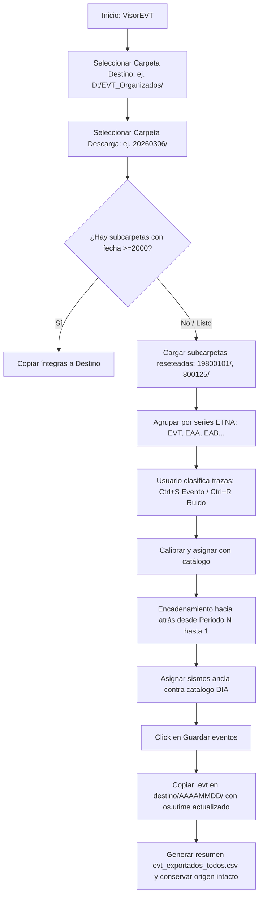

# `Corrección de EVT por reseteo.py` — Contexto Técnico para Agentes IA

> Aplicación especializada en PyQt5 y ObsPy (`VisorEVT`) para la inspección, visualización triaxial, reclasificación, calibración por múltiples períodos de reseteo y organización no destructiva de registros binarios EVT de acelerógrafos Kinemetrics ETNA con relojes desfasados a los años 1980.

**Ruta**: `c:/proyectos/rsa_sismologia/modulos externos/Corrección de EVT por reseteo.py`  
**LOC**: ~850 líneas | **Lenguaje**: Python 3 (PyQt5, ObsPy, Matplotlib, NumPy)  
**Hardware Objetivo**: Acelerógrafos Kinemetrics ETNA (Formato binario EVT en FAT16/FAT32)  

---

## 1. Identidad, Alcance y Propósito

Cuando un acelerógrafo ETNA sufre caídas de energía o pierde su batería de respaldo, reinicia su reloj interno a 1980 e incrementa el prefijo de serie de nombres (`EVT`, `EAA`, `EAB`, etc.). Cada serie representa una **isla temporal independiente**. Este módulo resuelve el encadenamiento de ventanas temporales hacia atrás para reorganizar los archivos en sus fechas reales en carpetas `AAAAMMDD/`.

### Objetivos Clave:
1. **Preservación del Modelo `mtime` de Campo**: Utiliza la fecha de modificación registrada por el firmware en el sistema FAT del archivo como la base temporal de disparo del equipo.
2. **Detección de Múltiples Series ETNA**: Identifica y agrupa los archivos por series (`[A-Za-z]+(\d+)`), segmentando la descarga en $N$ períodos independientes.
3. **Calibración con Catálogo Sísmico `DIA`**: Carga dinámicamente cualquier variante de catálogo (`AAAAMMDD_estaciones.csv`, `AAAAMMDD000000.csv`, `eventos_*.csv`) usando `rsa_io.py` y `metodos_rsa.py`.
4. **Encadenamiento Temporal Hacia Atrás**: Resuelve desde el período más reciente hacia el más antiguo, utilizando sismos ancla o el techo de fin de período (`limite_fin_periodo_siguiente`) para acotar series intermedias sin sismos.
5. **Clasificación Rápida por Atajos de Teclado**: `Ctrl+S` para Evento Sísmico y `Ctrl+R` para Ruido instrumental.
6. **Exportación No Destructiva**: Copia los archivos a sus subcarpetas `AAAAMMDD/` ajustando la marca `os.utime`, conservando intacta la descarga original de la tarjeta como respaldo crudo.

---

## 2. Diagrama de Arquitectura y Flujo de Datos

---

## 3. Contratos de Datos y Configuración

### 3.1. Detección de Series ETNA
* Expresión regular: `([A-Za-z]+)(\d{1,4})`
* Ejemplos: `EVT001` (Serie base), `EAA001` (1er reseteo), `EAB012` (2do reseteo).

### 3.2. Catálogo Diario `DIA`
* Búsqueda multi-formato: `.../DIA/AAAA/AAAA_MM/AAAA_MM_DD/[fecha]*.csv`

---

## 4. Métodos y Funciones Principales

| Función / Método | Tipo | Descripción |
|---|---|---|
| `VisorEVT` | Clase (QWidget) | Interfaz gráfica interactiva para depuración y calibración. |
| `analizar_posibles_reseteos_evt()` | Algoritmo | Agrupa archivos en períodos según el prefijo alfabético de serie. |
| `cargar_catalogo_por_fecha(fecha_str)` | I/O | Carga flexible de catálogos diarios usando `rsa_io.py`. |
| `calibrar_periodos_con_reseteos()` | Algoritmo | Encadena las referencias temporales hacia atrás entre períodos sucesivos. |
| `seleccionar_ancla_periodo(...)` | UI / Selección | Presenta lista ordenada por $\Delta T$ para vincular el sismo ancla con el catálogo. |
| `exportar_todos_evt(destino)` | I/O No Destructivo | Copia archivos a carpetas `AAAAMMDD/` con `os.utime` corregido sin borrar origen. |

---

## 5. Checklist de Regresión

Antes de validar cualquier modificación en `Corrección de EVT por reseteo.py`, verificar:
- [ ] `python -m py_compile` retorna código 0.
- [ ] La preclasificación copia carpetas $\ge 2000$ sin alterar las originales.
- [ ] El cambio de atajos `Ctrl+S` y `Ctrl+R` actualiza los colores en la lista de archivos.
- [ ] La calibración de períodos maneja correctamente series con y sin sismos ancla.
- [ ] La exportación final crea las carpetas `AAAAMMDD/` y `evt_exportados_todos.csv`.
