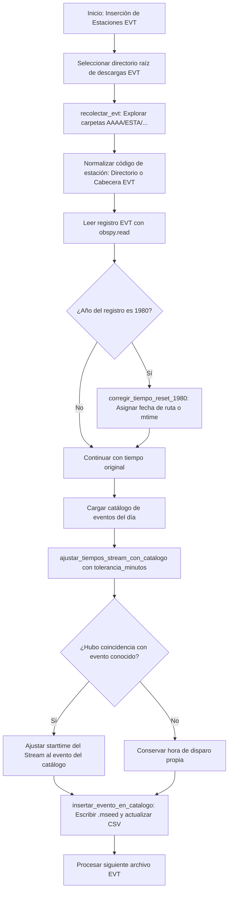

# `Insercion de estaciones EVT.py` — Contexto Técnico para Agentes IA

> Aplicación en PyQt5 y ObsPy para la inserción, normalización de códigos y sincronización temporal de registros fuera de tiempo y disparos por eventos en formato binario EVT hacia los catálogos y repositorios MiniSEED de la Red Sísmica de Alerta (RSA).

**Ruta**: `c:/proyectos/rsa_sismologia/modulos externos/Insercion de estaciones EVT.py`  
**LOC**: 977 líneas | **Lenguaje**: Python 3 (PyQt5, ObsPy, NumPy, CSV)  
**Estructura de Directorios Fuente**: `../AAAA/ESTA/Datos evt/` (Año, Estación, Archivos EVT)  

---

## 1. Identidad, Alcance y Propósito

Las estaciones acelerográficas autónomas (como los acelerógrafos Kinemetrics ETNA) registran eventos por disparo de umbral en tarjetas de memoria locales que se descargan periódicamente de forma manual. Este script integra dichos registros diferidos en la base de datos central de eventos del proyecto.

### Objetivos Clave:
1. **Normalización de Códigos de Estación**: Mapea nombres históricos y variantes de nombres de carpetas y cabeceras binarias a los códigos oficiales de 4 letras de la RSA mediante `DICCIONARIO_ESTACIONES_EVT` y `DICCIONARIO_ESTACIONES_DIRECTORIO`.
2. **Corrección de Tiempos Reseteados (1980)**: Ajusta automáticamente registros con año 1980 extrayendo la fecha real desde la ruta del archivo o la fecha de modificación del archivo binario (`corregir_tiempo_reset_1980`).
3. **Calce y Ajuste con Catálogo de Eventos**: Compara la hora de disparo del registro contra la lista de sismos conocidos (`YYYYMMDD_HHMMSS`) dentro de una ventana de tolerancia paramétrica en minutos (`ajustar_tiempos_stream_con_catalogo`).
4. **Inyección en Catálogo e Historial**: Guarda el archivo convertido a MiniSEED (`<ESTACION>_<YYYYMMDD_HHMMSS>.mseed`) en la carpeta de eventos y marca la columna correspondiente a la estación en la matriz de eventos del día (`insertar_evento_en_catalogo`).

---

## 2. Diagrama de Arquitectura y Flujo de Datos

---

## 3. Contratos de Datos y Diccionarios de Normalización

### 3.1. Mapeo de Cabeceras EVT (`DICCIONARIO_ESTACIONES_EVT`)
Homologa códigos breves internos del firmware ETNA a la nomenclatura RSA:
* `"CHB"` ➔ `"CHAB"` (Chanlud Base)
* `"CHC"` ➔ `"CHAC"` (Chanlud Cima)
* `"MZB"` ➔ `"MABA"` (Mazar Base)
* `"MZC"` ➔ `"MACI"` (Mazar Cima)
* `"MZD"` ➔ `"MADE"` (Mazar Margen Derecha)
* `"PABA"` ➔ `"DPBA"` (Paute Base)
* `"PACI"` ➔ `"DPCI"` (Paute Cima)
* `"ACC1"` ➔ `"EEAS"` (Estación Acelerográfica Sur)
* `"UDEC"`, `"UCET"` ➔ `"UCET"` (Universidad de Cuenca)

### 3.2. Mapeo de Directorios (`DICCIONARIO_ESTACIONES_DIRECTORIO`)
Traduce variantes de nombres de carpetas en disco a códigos canónicos:
* `"Azogues"`, `"CICA"` ➔ `"CICA"`
* `"ChanludBase"`, `"ChaBase"`, `"Chanlbas"` ➔ `"CHAB"`
* `"Chanlcim"`, `"ChaCima"`, `"ChanludCima"` ➔ `"CHAC"`
* `"EEBase"`, `"EEE-Base"` ➔ `"EEBA"`
* `"EEAlNor"`, `"EEALNor"`, `"EEE-AltNort"` ➔ `"EEAN"`
* `"EEAltSur"`, `"EEAlSur"`, `"EEE-AltSur"` ➔ `"EEAS"`
* `"Huajibam"`, `"Huajibamba"`, `"HUAJIBAM"` ➔ `"AHUA"`
* `"MazarBas"`, `"MazarBase"` ➔ `"MABA"`
* `"MazarCim"`, `"MazarCima"` ➔ `"MACI"`
* `"MazarDer"` ➔ `"MADE"`
* `"Miraflo"`, `"Miraflor"`, `"Miraflores"` ➔ `"MIRA"`
* `"PauteBas"`, `"PauteBase"` ➔ `"DPBA"`
* `"PauMed"` ➔ `"DPME"`
* `"PauteCim"`, `"PauteCima"` ➔ `"DPCI"`
* `"Regcivil"` ➔ `"REGC"`
* `"UAzuay"` ➔ `"UDAZ"`
* `"UCoficin"` ➔ `"UCAO"`

---

## 4. Métodos y Funciones Principales

| Función / Método | Tipo | Descripción |
|---|---|---|
| `normalizar_codigo_estacion_desde_directorio(nombre)` | Helper | Convierte nombres de carpetas de estaciones al código estándar de 4 letras. |
| `normalizar_codigo_estacion_desde_evt(codigo)` | Helper | Traduce los identificadores grabados en la cabecera binaria del archivo EVT. |
| `extraer_fecha_evt_desde_ruta(archivo)` | Parser | Extrae la fecha en formato `AAAAMMDD` a partir de los segmentos del directorio padre. |
| `corregir_tiempo_reset_1980(stream, archivo)` | Algoritmo | Desplaza el `starttime` del stream cuando el año detectado es 1980 utilizando la fecha de la ruta o de modificación. |
| `ajustar_tiempos_stream_con_catalogo(...)` | Sincronización | Empareja el stream con el evento del catálogo más cercano dentro de la tolerancia temporal y ajusta el `starttime`. |
| `insertar_evento_en_catalogo(...)` | Base de Datos / I/O | Convierte el stream a MiniSEED, lo almacena en el directorio de eventos y actualiza la matriz CSV de presencia de estaciones. |

---

## 5. Deuda Técnica y Riesgos Críticos

1. **Colisiones de Seriales/Estaciones**: Si un equipo acelerográfico fue reubicado entre diferentes estaciones a lo largo del tiempo, la cabecera interna del EVT puede contener el código de la estación anterior; por ello, la resolución prioriza la carpeta padre o el serial del equipo.
2. **Tolerancia de Calce Temporal**: Si la tolerancia de minutos se define muy amplia (ej. >15 min), existe riesgo de calzar erróneamente un disparo instrumental con un sismo no relacionado ocurrido en la misma ventana.
3. **Persistencia en Matriz de Eventos CSV**: La escritura en el archivo CSV de eventos del día debe preservar el orden de las columnas de estaciones para no corromper la compatibilidad con `GestorFases`.

---

## 6. Checklist de Regresión

Antes de validar cualquier modificación en `Insercion de estaciones EVT.py`, verificar:
- [ ] Los diccionarios `DICCIONARIO_ESTACIONES_EVT` y `DICCIONARIO_ESTACIONES_DIRECTORIO` contienen todas las estaciones de la red sin duplicados conflictivos.
- [ ] La corrección de año 1980 asigna correctamente horas, minutos y microsegundos conservando la cadencia de muestreo original.
- [ ] Los archivos MiniSEED generados contienen las componentes triaxiales completas y son legibles mediante `obspy.read()`.
- [ ] La matriz de eventos del catálogo conserva el número de columnas y cabeceras originales tras la inserción de nuevas estaciones.
