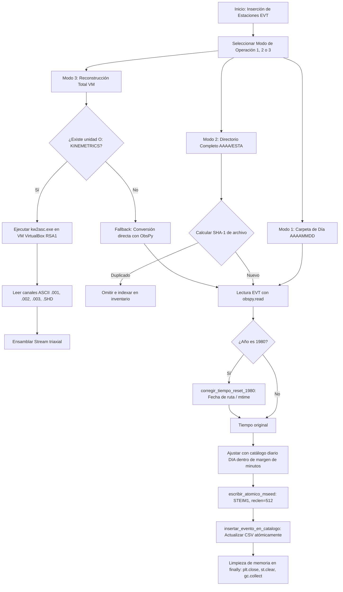

# `Insercion de estaciones EVT.py` — Contexto Técnico para Agentes IA

> Aplicación especializada en PyQt5 y ObsPy para la normalización, conversión e inserción atómica de registros acelerográficos binarios Kinemetrics (EVT / K2 / ETNA) hacia los catálogos diarios y repositorios MiniSEED de la Red Sísmica de Alerta (RSA), con soporte de compresión STEIM1, deduplicación criptográfica SHA-1 y fallback automático mediante máquina virtual DOS/Windows `kw2asc.exe`.

**Ruta**: `c:/proyectos/rsa_sismologia/modulos externos/Insercion de estaciones EVT.py`  
**LOC**: ~1,000 líneas | **Lenguaje**: Python 3 (PyQt5, ObsPy, NumPy, CSV)  
**Estructura de Entrada**: 
- Modo 1 (Día individual): `.../AAAAMMDD/*.evt`
- Modo 2 (Directorio completo con SHA-1): `.../AAAA/ESTA/Datos evt/*.evt`
- Modo 3 (Reconstrucción total con VM): `.../AAAA/ESTA/Datos evt/*.evt` utilizando entorno VirtualBox `O:\KINEMETRICS`

---

## 1. Identidad, Alcance y Propósito

Las estaciones acelerográficas autónomas registran eventos por disparo de umbral en tarjetas locales que se descargan periódicamente. Este script procesa dichas descargas y las incorpora a los catálogos y trazas de la RSA.

### Objetivos Clave:
1. **Normalización Canónica de Estaciones**: Mapea variantes históricas de nombres de carpetas y códigos de cabecera binaria a los 18 códigos oficiales de 4 letras de la RSA (`EEAN`, `EEAS`, `EEBA`, `CHAB`, `CHAC`, `MABA`, `MACI`, `MADE`, `DPBA`, `DPCI`, `DPME`, `AHUA`, `MIRA`, `CICA`, `UDAZ`, `UCET`, `UCAO`, `REGC`).
2. **Escritura MiniSEED Estándar y Atómica**: Escribe archivos `.mseed` con compresión canónica **`STEIM1`** y longitud de registro **`reclen=512`**, utilizando reemplazo atómico seguro (`archivo.mseed.tmp` $\to$ `archivo.mseed`) para evitar corrupción ante interrupciones.
3. **Manejo Seguro de Máquina Virtual Kinemetrics (`kw2asc.exe`)**: Valida la existencia de la unidad montada `O:\KINEMETRICS` antes de invocar la reconstrucción VM; si no está disponible, realiza fallback transparente mediante conversión interna en ObsPy.
4. **Deduplicación Criptográfica (SHA-1)**: En el procesamiento de directorios completos, genera hashes SHA-1 para omitir duplicados físicos e indexa el inventario en `inventario_evt_directorio_completo.csv`.
5. **Liberación Estricta de Memoria**: Ejecución de bloques `finally:` con `plt.close('all')`, `st.clear()`, `del st` y `gc.collect()` para procesar miles de archivos continuos sin fugas de memoria RAM.
6. **Inserción Atómica en Catálogo `DIA`**: Actualiza las matrices `AAAAMMDD_estaciones.csv` preservando columnas, cabeceras y orden canónico de fases.

---

## 2. Diagrama de Arquitectura y Flujo de Datos

---

## 3. Contratos de Datos y Normalización

### 3.1. Mapeo Oficial de Estaciones
Diccionarios depurados sin duplicados en `DICCIONARIO_ESTACIONES_EVT` y `DICCIONARIO_ESTACIONES_DIRECTORIO`:
* Chanlud: `CHAB` (Base), `CHAC` (Cima)
* Mazar: `MABA` (Base), `MACI` (Cima), `MADE` (Margen Derecha)
* Paute: `DPBA` (Base), `DPCI` (Cima), `DPME` (Media)
* Red Urbana / Regional: `EEBA`, `EEAN`, `EEAS`, `AHUA`, `MIRA`, `CICA`, `UDAZ`, `UCET`, `UCAO`, `REGC`.

### 3.2. Formato de Salida MiniSEED
* Archivo: `<ESTACION>_<AAAAMMDD_HHMMSS>.mseed`
* Encoding: `STEIM1` (compatibilidad universal con SeisComP, SAC, ObsPy y Geopsy).
* Reclen: `512` bytes.

---

## 4. Métodos y Funciones Principales

| Función / Método | Tipo | Descripción |
|---|---|---|
| `escribir_atomico_mseed(stream, destino)` | I/O MiniSEED | Escribe de forma atómica con codificación `STEIM1` y `reclen=512`. |
| `normalizar_codigo_estacion_desde_directorio(nombre)` | Parser | Convierte nombres de carpetas de estaciones al código canónico de 4 letras. |
| `normalizar_codigo_estacion_desde_evt(codigo)` | Parser | Traduce códigos de cabecera binaria del ETNA. |
| `corregir_tiempo_reset_1980(stream, archivo)` | Algoritmo | Corrige estampas desfasadas a 1980 usando la fecha del directorio o `mtime`. |
| `ajustar_tiempos_stream_con_catalogo(...)` | Sincronización | Empareja el stream con el evento del catálogo más cercano dentro de la tolerancia. |
| `insertar_evento_en_catalogo(...)` | Base de Datos | Inyecta el archivo MiniSEED en la carpeta de eventos y actualiza la matriz CSV del día. |
| `procesar_evt_con_kw2asc_vm(...)` | Integración VM | Ejecuta la conversión de bajo nivel mediante `kw2asc.exe` en VirtualBox `RSA1`. |

---

## 5. Deuda Técnica y Riesgos Mitigados

1. **Ausencia de VM Kinemetrics**: Mitigado con detección preventiva de `O:\KINEMETRICS` y fallback a ObsPy.
2. **Duplicación de Archivos**: Mitigado con hashing SHA-1 en Modo 2.
3. **Consumo de Memoria**: Mitigado con liberación explícita `st.clear()`, `del st` y `gc.collect()`.

---

## 6. Checklist de Regresión

Antes de validar cualquier modificación en `Insercion de estaciones EVT.py`, verificar:
- [ ] La compilación con `python -m py_compile` retorna código 0.
- [ ] La escritura de archivos `.mseed` genera formato `STEIM1` con bloques de `512` bytes.
- [ ] En ausencia de la unidad `O:`, el script no colapsa y continúa mediante ObsPy.
- [ ] La matriz `AAAAMMDD_estaciones.csv` se actualiza de forma atómica sin corromper cabeceras.
