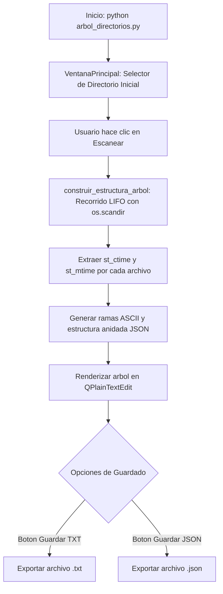

# `arbol_directorios.py` — Contexto Técnico para Agentes IA

> Aplicación de escritorio independiente en PyQt5 (`VentanaPrincipal`) para el escaneo visual iterativo de estructuras de directorios, inspección de metadatos de archivos (fechas de creación y modificación) y exportación a texto plano (`.txt` con ramas ASCII `├──`/`└──`) y estructura JSON (`.json`).

**Ruta**: `c:/proyectos/rsa_sismologia/modulos externos/arbol_directorios.py`  
**LOC**: ~215 líneas | **Lenguaje**: Python 3 (PyQt5, JSON, Pathlib, OS)  
**Ejecución**: Standalone GUI (`python "modulos externos/arbol_directorios.py"`)  
**Salidas**: Visualización en pantalla, exportación a `.txt` y `.json`  

---

## 1. Identidad, Alcance y Propósito

`arbol_directorios.py` es una utilidad gráfica de inventario rápido de carpetas y discos de almacenamiento sísmico (`DIA/`, `MES/`, `ANIO/`, backups o tarjetas de memoria de campo).

### Objetivos Clave:
1. **Lanzamiento Autónomo (Standalone GUI)**: Al ejecutarse, abre directamente su ventana interactiva `VentanaPrincipal` para que el operador seleccione cualquier carpeta e inicie el escaneo.
2. **Escaneo Iterativo por Pila (`pila = [...]`)**: Evita bloqueos y desbordamientos por recursión profunda en árboles con miles de subdirectorios.
3. **Metadatos Temporales Exactos**: Extrae `stat.st_ctime` y `stat.st_mtime` formateados como `AAAA-MM-DD HH:MM:SS`.
4. **Doble Exportación Asistida**: Botones dedicados para guardar el resultado en texto plano (`.txt`) o en documento estructurado (`.json`).

---

## 2. Diagrama de Arquitectura y Flujo de Datos



---

## 3. Contratos de Datos y Configuración

### 3.1. Estructura del JSON Generado
```json
{
  "nombre": "nombre_directorio",
  "tipo": "directorio",
  "contenido": [
    {
      "nombre": "archivo.ext",
      "tipo": "archivo",
      "creado": "AAAA-MM-DD HH:MM:SS",
      "modificado": "AAAA-MM-DD HH:MM:SS"
    }
  ]
}
```

---

## 4. Métodos y Funciones Principales

| Función / Clase | Tipo | Descripción |
|---|---|---|
| `VentanaPrincipal` | QMainWindow | Interfaz gráfica interactiva con selector de rutas, cuadro de texto y botones de exportación. |
| `escanear()` | Slot UI | Inicia el escaneo iterativo de la ruta ingresada y despliega el árbol en pantalla. |
| `guardar_txt()` | Slot UI | Abre diálogo para guardar el árbol de texto con codificación UTF-8. |
| `guardar_json()` | Slot UI | Abre diálogo para guardar la estructura serializada en formato JSON. |

---

## 5. Pautas para Integración en `src/programa_integrado.py`

* Cuando se integre al menú principal, se invocará abriendo la ventana gráfica independiente:
  ```python
  from arbol_directorios import VentanaPrincipal
  self.ventana_arbol = VentanaPrincipal()
  self.ventana_arbol.show()
  ```

---

## 6. Checklist de Regresión

Antes de validar cualquier modificación en `arbol_directorios.py`, verificar:
- [ ] `python -m py_compile "modulos externos/arbol_directorios.py"` retorna código 0.
- [ ] Al ejecutar el script, la ventana `VentanaPrincipal` se abre de inmediato.
- [ ] El botón *Escanear* procesa directorios sin colapsar.
- [ ] Los botones *Guardar TXT* y *Guardar JSON* generan los archivos con codificación UTF-8.
