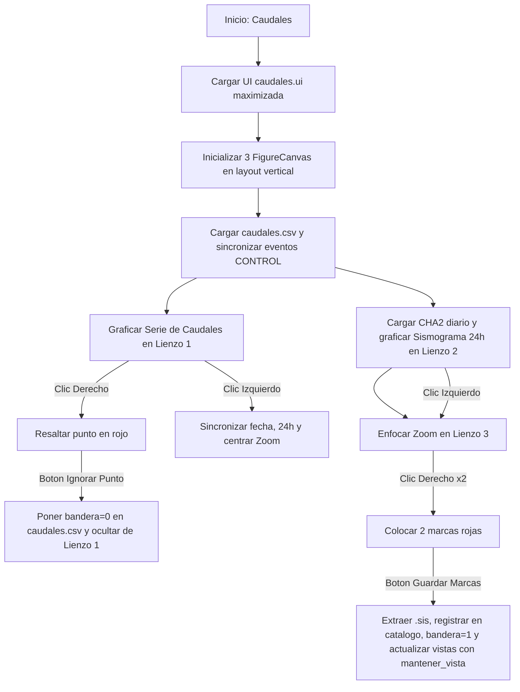

# `caudales_filtraciones.py` — Contexto Técnico para Agentes IA

> Aplicación en PyQt5 y Matplotlib integrada para la detección, marcado interactivo, inspección sincrónica multicanal y cálculo de caudales de filtración en presas a partir de señales sísmicas instrumentadas (estación `CHA2`), administrando el archivo maestro `caudales.csv` y 3 lienzos gráficos sincronizados en tiempo real.

**Ruta**: `c:/proyectos/rsa_sismologia/modulos externos/caudales_filtraciones.py`  
**LOC**: ~815 líneas | **Lenguaje**: Python 3 (PyQt5, ObsPy, Matplotlib, NumPy)  
**Interfaz UI**: `src/ui/caudales.ui` (Panel lateral compacto + QSplitter vertical con 3 FigureCanvas)  
**Estación Clave**: `CHA2` (Canales verticales `Z` / `ENV`)  

---

## 1. Identidad, Alcance y Propósito

`caudales_filtraciones.py` monitorea los ciclos de descarga de los vertederos/aforadores de filtración en las estructuras de presas. Cada evento de descarga genera una perturbación mecánica periódica registrada por la estación acelerográfica/sismológica `CHA2`.

### Objetivos Clave:
1. **Fórmula de Caudal**: Calcula el caudal volumétrico ($Q$) en función del intervalo de tiempo ($\Delta t$ en segundos) entre eventos consecutivos de descarga:
   $$\text{Caudal} = \text{int}\left(1.214 \times \frac{3\,500\,000}{\Delta t}\right)$$
   *(donde $1.214$ es el factor de calibración empírico para compensar geometrías del aforador).*
2. **Arquitectura Reactiva de 3 Lienzos Verticales**:
   - **Lienzo 1 (Superior)**: Serie temporal de caudales confirmados (`bandera == '1'`) en el periodo histórico seleccionado.
   - **Lienzo 2 (Medio)**: Sismograma diario de 24 horas (`CHA2_AAAAMMDD_000000.mseed`) con líneas de eventos (verde=confirmado, rojo=ignorado/pendiente).
   - **Lienzo 3 (Inferior)**: Ventana de zoom de alta resolución ($\pm 10$ min) para colocación precisa de 2 marcas de tiempo con clic derecho.
3. **Navegación Sincrónica Top-Down**:
   - Clic izquierdo en Lienzo 1 $\to$ actualiza automáticamente la fecha, carga el sismograma 24h y enfoca el zoom en el evento clickeado.
   - Clic derecho en Lienzo 1 $\to$ resalta en rojo un punto de caudal incoherente para su exclusión (`bandera = '0'`) mediante el botón `🚫 Ignorar Punto Seleccionado`.
   - Clic izquierdo en Lienzo 2 $\to$ re-centra la ventana de zoom inferior en cualquier instante del día.
4. **Preservación Estricta de Encuadre (`mantener_vista=True`)**:
   - Al guardar marcas o ignorar puntos, el sismograma central y el zoom conservan exactamente sus límites temporales (`xlim`) y de amplitud (`ylim`), evitando reseteos visuales molestos.
5. **Contención No Invasiva de Errores MSEED**:
   - Si no existe el MiniSEED para la fecha consultada, se despliega un mensaje sutil en gris en el centro del lienzo sin arrojar popups modales bloqueantes.

---

## 2. Diagrama de Arquitectura y Flujo de Datos

---

## 3. Contratos de Datos y Configuración

### 3.1. Archivo `caudales.csv`
Ubicado en `directorio_trabajo/caudales.csv` (por defecto `G:/Mi unidad/DIA/caudales.csv`):

| Columna | Tipo | Significado | Ejemplo |
|---|---|---|---|
| `0` | String | Nombre del archivo de evento `.sis` | `20260821_143000.sis` |
| `1` | String / Entero | Caudal calculado (L/s) | `450` |
| `2` | String (`'0'` o `'1'`) | Bandera de validación (1=Confirmado/Visible, 0=Ignorado/Oculto) | `1` |

### 3.2. Archivo de Registro Sísmico Diario
* Nomenclatura fija: `CHA2_AAAAMMDD_000000.mseed`
* Ubicación: `.../AAAAMMDD/mseed/`
* Canales priorizados: Terminados en `'Z'` o `'ENV'`.

---

## 4. Métodos y Funciones Principales

| Componente / Método | Tipo | Descripción |
|---|---|---|
| `Caudales.__init__()` | Constructor | Configura selectores de fechas, combos, conecta botones (incluyendo `boton_siguiente_ciclo`), inicializa variables internas y maximiza la ventana. |
| `inicializar_lienzos_graficos()` | UI / Matplotlib | Incrusta las 3 instancias de `FigureCanvasQTAgg` y `NavigationToolbar2QT` (altura 24px) suprimiendo ejes Y y títulos redundantes. |
| `verificar_senal_en_intervalo(dt_min, dt_max)` | Telemetría / Sismología | Comprueba si existen datos sísmicos registrados para la estación `CHA2` en la ventana temporal solicitada. |
| `obtener_estado_bombeo_y_prediccion()` | Lógica / Vigilancia | Proyecta la próxima descarga usando la **Moda de las últimas 10 mediciones validadas** ($Q > 0$). Evalúa si existe señal en la ventana del ciclo esperado; de no haber señal, activa `REINICIO_MEDICION` para solicitar una marca base ($T_0$). |
| `ir_a_siguiente_ciclo_esperado()` | Asistente UX | Salto guiado secuencial: calcula el próximo $T_{\text{esperado}}$, conmuta el selector de fecha del sismograma y centra automáticamente el Zoom en la franja estimada. |
| `cargar_guia_operacion()` | UI / HTML | Despliega en `cuadro_guia` el diagnóstico dinámico de la bomba (horas transcurridas, ciclos omitidos, badge de alarma o reinicio de medición) y el flujo rápido de operación. |
| `al_hacer_clic_caudales()` | Slot Ratón | Maneja clic izquierdo (navegación y sincronización) y clic derecho (selección y resaltado en rojo para exclusión). |
| `ignorar_punto_caudal_seleccionado()` | Lógica | Establece `bandera = '0'` para el evento seleccionado en `caudales.csv` sin recalcular valores y actualiza gráficos y diagnóstico. |
| `desplegar_grafico(silencioso, mantener_vista)` | Slot / Plot | Grafica la traza de 24h con diezmado, marcas de eventos y franja sombreada predictiva (`axvspan`). Si `mantener_vista=True`, restaura `xlim` y `ylim`. |
| `actualizar_grafico_zoom(centro_tiempo)` | Slot / Plot | Extrae y grafica un corte en alta resolución ($\pm 10$ min) alrededor de `centro_tiempo`, superponiendo la franja predictiva sombreada. |
| `gestionar_marca_tiempo(tiempo_click)` | Lógica | Inserta o elimina hasta 2 marcas temporales rojas sincronizándolas entre el sismograma 24h y el zoom. |
| `guardar_marcas()` | Extracción Sísmica | Valida 2 marcas, extrae el `.sis`, actualiza catálogos diarios, fija `bandera='1'` en `caudales.csv`, refresca el diagnóstico y gráficos. |
| `graficar_caudales(silencioso)` | Visualización | Grafica los caudales confirmados (`bandera='1'`) en el periodo histórico y resalta en rojo la selección activa. |
| `limpiar_graficos_sismograma(mensaje)` | Contención | Dibuja un mensaje limpio en los lienzos cuando un archivo MiniSEED no existe o falla su lectura. |

---

## 5. Deuda Técnica y Riesgos Críticos

1. **Dependencia de Estación Fija (`CHA2`)**: `cargar_componentes_fecha()` busca archivos que inicien con `CHA2_`. Si se añade otra estación de filtración, debe agregarse un selector de estación.
2. **Conversión de Zonas Horarias en Matplotlib**: Se utiliza `tzinfo=None` al convertir `mdates.num2date` para evitar inconsistencias de tiempo ingenuo (*naive*) vs consciente (*aware*) al interactuar con ObsPy `UTCDateTime`.
3. **Inmutabilidad de Datos Históricos en `caudales.csv`**: Las filas ya existentes en `caudales.csv` son registros permanentes e inmutables; no se someten a recálculos automáticos al cargar la aplicación. Los nuevos caudales se computan exclusivamente para marcas nuevas respecto al último evento confirmado anterior.
4. **Residente de Vigilancia (`vigilante_caudales.py`)**: Monitorea `caudales.csv` en segundo plano para notificar al usuario en Windows si transcurren más de $1.5 \times \Delta t$ sin bombeo o si no se ha revisado la aplicación hoy.

---

## 6. Checklist de Regresión

Antes de validar cualquier modificación en `caudales_filtraciones.py`, verificar:
- [ ] La ventana inicia maximizada con el panel de control compacto a la izquierda y 3 lienzos apilados a la derecha.
- [ ] El panel izquierdo muestra el diagnóstico dinámico de bombeo (último evento, caudal, horas transcurridas y badge de estado).
- [ ] El botón `🎯 Ir a Siguiente Ciclo Esperado` calcula la hora estimada del próximo bombeo y enfoca directamente la fecha y zoom en la franja estimada.
- [ ] El sismograma 24h y el Zoom dibujan la franja sombreada tenue (`axvspan`) en la zona donde se espera el pulso del motor.
- [ ] Cambiar las fechas de periodo actualiza automáticamente la serie superior de caudales.
- [ ] Cambiar la fecha del sismograma o diezmado actualiza inmediatamente la traza 24h y el zoom.
- [ ] Clic izquierdo en la serie superior sincroniza fecha, traza 24h y centra el zoom.
- [ ] Clic derecho en la serie superior resalta el punto en rojo y el botón `🚫 Ignorar Punto Seleccionado` lo pasa a bandera 0.
- [ ] Colocar 2 marcas con clic derecho en el zoom y pulsar `💾 Guardar marcas (.SIS)` extrae el evento, pone bandera 1 y mantiene intactos `xlim` y `ylim`.
- [ ] El proceso residente `vigilante_caudales.py` se ejecuta en la bandeja del sistema emitiendo notificaciones según el estado del sistema.
- [ ] Fechas sin MiniSEED no lanzan excepciones y muestran el aviso gris de ausencia de datos.
