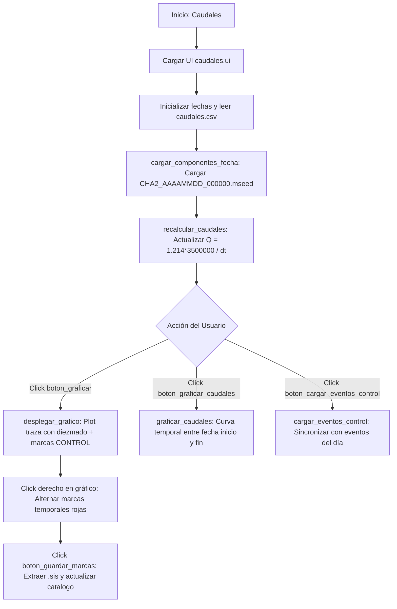

# `caudales_filtraciones.py` — Contexto Técnico para Agentes IA

> Aplicación en PyQt5 y Matplotlib para la detección, marcado interactivo y cálculo de caudales de filtración en presas a partir de señales sísmicas instrumentadas (estación `CHA2`), administrando el archivo maestro `caudales.csv`.

**Ruta**: `c:/proyectos/rsa_sismologia/modulos externos/caudales_filtraciones.py`  
**LOC**: 431 líneas | **Lenguaje**: Python 3 (PyQt5, ObsPy, Matplotlib, NumPy)  
**Interfaz UI**: `src/ui/caudales.ui`  
**Estación Clave**: `CHA2` (Canales verticales `Z` / `ENV`)  

---

## 1. Identidad, Alcance y Propósito

`caudales_filtraciones.py` monitorea los ciclos de descarga de los vertederos/aforadores de filtración en las estructuras de presas. Cada evento de descarga genera una perturbación mecánica periódica registrada por la estación acelerográfica/sismológica `CHA2`.

### Objetivos Clave:
1. **Fórmula de Caudal**: Calcula el caudal volumétrico ($Q$) en función del intervalo de tiempo ($\Delta t$ en segundos) entre eventos consecutivos de descarga:
   $$\text{Caudal} = \text{int}\left(1.214 \times \frac{3\,500\,000}{\Delta t}\right)$$
   *(donde $1.214$ es el factor de ajuste empírico calibrado para compensar errores geométricos del aforador).*
2. **Marcado Interactivo en Gráfico**: Permite al analista hacer clic derecho sobre el sismograma diario para colocar 2 marcas temporales, definir ventanas y extraer el evento sísmico de control (`.sis`).
3. **Gestión de `caudales.csv`**: Almacena el histórico consolidado con triplete `[nombre_evento, caudal, bandera]` (donde `bandera == '1'` representa eventos validados y `'0'` eventos no confirmados).
4. **Visualización Histórica de Caudales**: Grafica la curva temporal de evolución de caudales entre `selector_fecha_inicio` y `selector_fecha_fin`.

---

## 2. Diagrama de Arquitectura y Flujo de Datos

---

## 3. Contratos de Datos y Configuración

### 3.1. Archivo `caudales.csv`
Ubicado en `directorio_trabajo/caudales.csv` (por defecto `G:/Mi unidad/DIA/caudales.csv`):

| Columna | Tipo | Significado | Ejemplo |
|---|---|---|---|
| `0` | String | Nombre del archivo de evento `.sis` | `20260821_143000.sis` |
| `1` | String / Entero | Caudal calculado (L/s) | `450` |
| `2` | String (`'0'` o `'1'`) | Bandera de validación (1=Confirmado, 0=Ruido) | `1` |

### 3.2. Archivo de Registro Sísmico Diario
* Nomenclatura fija: `CHA2_AAAAMMDD_000000.mseed`
* Ubicación: `.../AAAAMMDD/mseed/`
* Componentes priorizadas: Canales con terminación `'Z'` o `'ENV'`.

---

## 4. Métodos y Funciones Principales

| Componente / Método | Tipo | Descripción |
|---|---|---|
| `Caudales.__init__()` | Constructor | Configura rangos de fechas (última semana por defecto), combos de diezmado (`1`, `2`, `5`, `8`, `10`) y conexiones de botones. |
| `seleccionar_directorio_trabajo()` | Slot UI | Selector de carpeta base de trabajo (`DIA`). |
| `cargar_componentes_fecha()` | Lógica | Carga el archivo `CHA2` del día, detecta componentes y dispara `recalcular_caudales()`. |
| `recalcular_caudales()` | Cálculo Matemático | Ordena eventos cronológicamente, calcula $\Delta t$ entre eventos sucesivos y aplica la fórmula de calibración $1.214 \times 3500000 / \Delta t$. |
| `desplegar_grafico()` | Matplotlib UI | Genera la ventana interactiva con la traza diezamada, líneas verdes punteadas de eventos CONTROL y escucha eventos de clic derecho (`button_press_event`). |
| `guardar_marcas()` | Extracción Sísmica | Valida exactamente 2 marcas de tiempo, recorta la ventana en formato `.sis` y actualiza la matriz de eventos. |
| `graficar_caudales()` | Visualización | Filtra eventos con bandera `'1'` en el rango temporal seleccionado y plotea la serie histórica de caudal. |
| `cargar_eventos_control()` | Sincronización | Lee el archivo CSV de eventos del día (`directorios['archivo_csv']`), identifica eventos clasificados como `CONTROL` y los incorpora a `self.caudales`. |

---

## 5. Deuda Técnica y Riesgos Críticos

1. **Dependencia de Nombre de Estación Cableado (`CHA2`)**: `cargar_componentes_fecha()` asume explícitamente el prefijo `CHA2_`. Si la estación de monitoreo de filtraciones cambia de código en el futuro, debe parametrizarse.
2. **Interactividad Matplotlib / Qt**: El callback `on_right_click` depende del backend interactivo de Matplotlib (`plt.show()`). En sesiones remotas o sin GUI activa, debe evitarse invocar `desplegar_grafico()`.
3. **Formatos de Nombres de Evento**: Acepta cadenas con o sin extensión `.sis` y con prefijo de siglo (`20YYMMDD_...` vs `YYMMDD_...`), requiriendo el saneamiento aplicado en `recalcular_caudales()`.

---

## 6. Checklist de Regresión

Antes de validar cualquier modificación en `caudales_filtraciones.py`, verificar:
- [ ] La interfaz `src/ui/caudales.ui` carga todos sus selectores (`selector_fecha_inicio`, `selector_fecha_fin`, `combo_diezmado`, `combo_traza`).
- [ ] La fórmula de caudal preserva la bandera (`'1'` o `'0'`) de cada fila existente en `caudales.csv`.
- [ ] El guardado de marcas extrae correctamente la ventana de tiempo sin arrojar excepciones de límites fuera de traza.
- [ ] Los eventos marcados como `CONTROL` en el catálogo diario se sincronizan sin duplicar registros.
