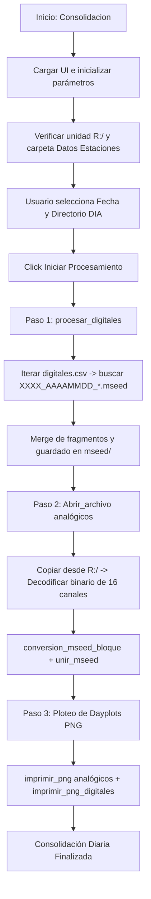

# `consolidacion_mseed.py` — Contexto Técnico para Agentes IA

> Aplicación integral en PyQt5 que consolida en una sola operación tanto los registros de telemetría analógica continua (desde unidad `R:`) como los registros de acelerógrafos digitales (desde `Datos Estaciones` vía `digitales.csv`), generando volúmenes diarios MiniSEED y gráficos de control `dayplot`.

**Ruta**: `c:/proyectos/rsa_sismologia/modulos externos/consolidacion_mseed.py`  
**LOC**: 972 líneas | **Lenguaje**: Python 3 (PyQt5, ObsPy, NumPy, Matplotlib)  
**Fuentes de Entrada**: Unidad de red `R:/` (telemetría continua) y carpeta `Datos Estaciones` (acelerógrafos digitales)  

---

## 1. Identidad, Alcance y Propósito

`consolidacion_mseed.py` unifica las capacidades de `automatico.py` y `acelerografo.py` en un pipeline único para facilitar la jornada operativa diaria del operador sismológico.

### Objetivos Clave:
1. **Flujo Híbrido Completo**: Procesa en una sola ejecución las estaciones analógicas transmitidas por radioenlace y las estaciones digitales descargadas en disco.
2. **Procesamiento de Estaciones Digitales (`procesar_digitales`)**:
   - Lee `datos/digitales.csv` y busca carpetas locales correspondientes.
   - Filtra fragmentos `XXXX_AAAAMMDD_HHMMSS*.mseed` garantizando que el código coincida con el catálogo.
   - Ordena por tiempo de inicio real (`stats.starttime`), une las trazas y escribe el archivo diario consolidado en `Directorio_registros`.
3. **Procesamiento de Estaciones Analógicas (`Abrir_archivo`)**:
   - Detecta archivos continuos en `R:/` con formato `AAMMDDhhmmss`.
   - Decodifica tramas binarias de 2077 bytes/s a 64 sps.
   - Realiza escritura atómica en `.tmp` y posterior reemplazo con `os.replace`.
4. **Ploteo Consolidado de Dayplots**: Genera gráficos PNG de 24 horas para todos los canales habilitados tanto analógicos como digitales.

---

## 2. Diagrama de Arquitectura y Flujo de Datos

---

## 3. Contratos de Datos y Configuración

### 3.1. Esquema de Entradas
1. **Unidad `R:/`**: Archivos de telemetría analógica sin extensión (`YYMMDDhhmmss`).
2. **`directorio_trabajo/Datos Estaciones/<Carpeta>/`**: Archivos MiniSEED digitales (`XXXX_YYYYMMDD_HHMMSS*.mseed`).
3. **`datos/digitales.csv`**: Tabla de correspondencia entre subcarpeta e índice en `parametros_estaciones()`.

### 3.2. Esquema de Salidas en `Directorio_registros` (`.../AAAAMMDD/mseed/`)
* Canales analógicos: `<NOMBRE_CANAL>_20YYMMDD_000000.mseed`
* Estaciones digitales: `<CODIGO_ESTACION>_YYYYMMDD_000000.mseed`
* Gráficos en `Directorio_base` (`.../AAAAMMDD/`): Archivos `.png` de 24 horas a 200 DPI.
* Archivo de enlace en `directorio_trabajo/comunicaciones.csv`: Registro sobrio del estado de cada estación (`1` = OK, `0` = Corte de comunicación).

---

## 4. Métodos y Funciones Principales

| Método / Función | Responsabilidad |
|---|---|
| `MyApp.procesar_digitales()` | Procesa todas las estaciones digitales habilitadas en `digitales.csv` con búsqueda resiliente de carpetas (`LAB02` <-> `LAB2`), une sus trazas y retorna la lista de PNGs pendientes. |
| `MyApp.imprimir_png_digitales(...)` | Genera los dayplots PNG para cada archivo digital consolidado según el canal/componente configurado, cerrando figuras con `plt.close('all')` para evitar fugas de memoria. |
| `MyApp.Abrir_archivo()` | Gestiona el ciclo completo de descarga y decodificación de la telemetría continua desde `R:` o fallback automático en `directorio_trabajo`. |
| `MyApp.unir_mseed(arch1, arch2)` | Une pares de archivos MiniSEED analógicos por canal conservando discontinuidades reales con `split()`. |
| `MyApp.validar_fila_digital(fila, idx)` | Valida límites y tipos de datos en filas de `digitales.csv`. |
| `MyApp.seleccionar_traza_png_digital(...)` | Prioriza la traza vertical (`Z`) según la cadena de orientación o componente configurada. |
| `Leer_binario_comun(...)` | Decodifica la trama binaria multiplexada por hardware de 16 canales y 2077 bytes por segundo. |
| `escribir_atomico_mseed(stream, dest)` | Escritura de seguridad mediante archivo temporal `.tmp`, `fsync` y reemplazo atómico `os.replace` con hasta 3 reintentos ante bloqueos en Windows/Google Drive. |

---

## 5. Deuda Técnica y Riesgos Críticos

1. **Doble Dependencia de Almacenamiento**: Requiere acceso simultáneo a la unidad de red `R:` y a la ruta local/nube `Datos Estaciones`. Si `R:` no está disponible, el módulo digital puede ejecutarse de forma aislada, pero el usuario debe confirmar la advertencia.
2. **Volumen de Logs en UI**: Dado que procesa tanto analógicos como digitales, el buffer de `Lbl_Mensajes` recibe cientos de líneas de log; se usa `QCoreApplication.processEvents()` para mantener la fluidez de la ventana sin congelar el hilo principal de Qt.
3. **Escritura Atómica en Unidades Mapeadas**: Se debe asegurar que las carpetas de destino admitan `os.replace` sin bloqueos de antivirus o permisos de red en Windows.

---

## 6. Checklist de Regresión

Antes de validar cualquier modificación en `consolidacion_mseed.py`, verificar:
- [ ] La aplicación maneja adecuadamente tanto la presencia como la ausencia de la unidad `R:`.
- [ ] Las estaciones digitales se ordenan estrictamente por `stats.starttime` antes de ejecutar `merge()`.
- [ ] La compresión de salida en todos los archivos `.mseed` es `STEIM1` con longitud de registro `512`.
- [ ] Los dayplots PNG para estaciones analógicas y digitales se generan en las rutas canónicas del día sin sobreescribirse entre sí.
