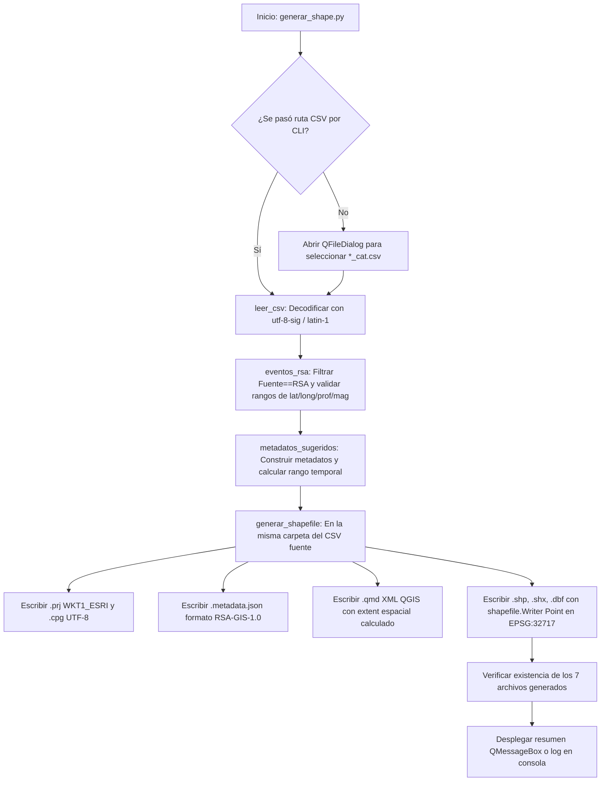

# `generar_shape.py` — Contexto Técnico para Agentes IA

> Módulo y herramienta de exportación geoespacial para convertir catálogos sísmicos de la Red Sísmica de Alerta (RSA) (`*_cat.csv`) a capas vectoriales Shapefile (ESRI) proyectadas en UTM Zona 17S (EPSG:32717), acompañadas de sus metadatos nativos para QGIS (`.qmd`), metadatos JSON (`.metadata.json`), archivos de proyección (`.prj` en WKT1_ESRI) y codificación (`.cpg`).

**Ruta**: `c:/proyectos/rsa_sismologia/modulos externos/generar_shape.py`  
**LOC**: 520 líneas | **Lenguaje**: Python 3 (Pandas, PyProj, PyShp / `shapefile`, PyQt5)  
**CRS Objetivo**: WGS 84 / UTM Zona 17S (`EPSG:32717`) proyectado desde WGS 84 (`EPSG:4326`)  
**Archivos Generados**: `<nombre>.shp`, `<nombre>.shx`, `<nombre>.dbf`, `<nombre>.prj`, `<nombre>.cpg`, `<nombre>.metadata.json`, `<nombre>.qmd`  

---

## 1. Identidad, Alcance y Propósito

`generar_shape.py` transforma la información tabular de los catálogos sísmicos consolidados (`*_cat.csv`) en capas geográficas estándar listas para su apertura y análisis en Sistemas de Información Geográfica (GIS) como QGIS, ArcGIS y GeoServer.

### Objetivos Clave:
1. **Filtrado Estricto de Fuente RSA**: Procesa exclusivamente los eventos cuya columna `Fuente` sea `'RSA'`, validando rangos físicos de latitud ($-90$ a $90$), longitud ($-180$ a $180$), profundidad ($\ge 0$) y magnitud.
2. **Transformación Geodésica Rigurosa**: Convierte coordenadas geográficas (WGS84 / EPSG:4326) a proyectadas UTM Zona 17S (EPSG:32717) mediante `pyproj.Transformer` con `always_xy=True`.
3. **Generación del Set Completo GIS (7 archivos)**:
   - Geometrías de punto (`.shp`), índice (`.shx`) y tabla DBF (`.dbf`).
   - Proyección `.prj` en formato `WKT1_ESRI` (garantizando compatibilidad universal sin advertencias de proyección no válida).
   - Codificación `.cpg` (`UTF-8`).
   - Metadatos estructurados `.metadata.json` (estándar `RSA-GIS-1.0`).
   - Metadatos XML enriquecidos para QGIS 3.x (`.qmd`) con extensión espacial (`extent`) calculada automáticamente a partir de los puntos.
4. **Ejecución Dual (CLI / GUI)**: Puede ejecutarse interactivamente con diálogos PyQt5 o por línea de comandos automatizada recibiendo argumentos de archivo y metadatos opcionales.

---

## 2. Diagrama de Arquitectura y Flujo de Datos

---

## 3. Contratos de Datos y Configuración

### 3.1. Estructura del Catálogo de Entrada (`*_cat.csv`)
* Nomenclatura requerida: Nombre de archivo terminado obligatoriamente en `_cat.csv` (ej. `2026_cat.csv`, `catalogo_mensual_cat.csv`).
* Separador: Punto y coma (`;`).
* Columnas obligatorias:
  - `Id`: Identificador del sismo.
  - `lat`, `long`: Coordenadas en grados decimales (WGS84).
  - `prof`: Profundidad focal en km.
  - `Mag`: Magnitud del sismo.
  - `Fuente`: Debe contener `'RSA'` para ser incluido.
* Columnas temporales opcionales: `año`/`anio`, `mes`, `día`/`dia`, `hora`, `min`/`minuto`, `seg`/`segundo` (empleadas para componer la fecha GMT ISO 8601).
* Columna descriptiva opcional: `Ubicación` / `Ubicacion`.

### 3.2. Tabla de Atributos DBF (`.dbf`)
Campos exportados (limitados a 10 caracteres por estándar DBF):
`Latitud` (F 12.6), `Longitud` (F 13.6), `Prof_km` (F 12.3), `Magnitud` (F 8.2), `Titulo` (C 254), `Resumen` (C 254), `Fecha` (C 30), `Idioma` (C 20), `Pal_clave` (C 100), `CRS` (C 80), `Categoria` (C 80), `Creador` (C 80), `Contacto` (C 120), `Licencia` (C 254).

---

## 4. Métodos y Funciones Principales

| Función / Clase | Tipo | Descripción |
|---|---|---|
| `Metadatos` | Dataclass | Estructura que encapsula título, resumen, fecha, CRS, autor, contacto y licencia. |
| `leer_csv(ruta_csv)` | I/O / Parser | Lee el CSV delimitado por `;` con detección de codificación (`utf-8-sig`, `latin-1`) y validación de columnas mínimas. |
| `eventos_rsa(df)` | Generador / Filtro | Valida registros con `Fuente == 'RSA'`, verifica rangos físicos y transforma campos. |
| `fecha_gmt_fila(fila, df)` | Helper | Compone la cadena ISO 8601 en tiempo UTC (`YYYY-MM-DDTHH:MM:SS.fffZ`). |
| `metadatos_sugeridos(df, nombre)` | Helper | Auto-completa los metadatos a partir de las ubicaciones y el rango de fechas del catálogo. |
| `escribir_metadatos(ruta_base, metadatos, n)` | I/O JSON | Genera el archivo `<nombre>.metadata.json` con el estándar `RSA-GIS-1.0`. |
| `escribir_metadatos_qgis(ruta_base, metadatos, registros)` | I/O XML | Genera el archivo `<nombre>.qmd` con los metadatos y el *bounding box* espacial calculado. |
| `generar_shapefile(ruta_csv, metadatos)` | Núcleo GIS | Ejecuta la proyección a EPSG:32717 y genera los 7 archivos geoespaciales junto al CSV. |

---

## 5. Pautas para Integración en `src/programa_integrado.py`

Cuando este módulo sea integrado al menú principal del sistema:
1. **Llamada desde Menú**: Podrá invocarse desde el menú de *Exportación / Herramientas GIS* recibiendo la ruta del catálogo actual (`_cat.csv`) o abriendo el selector.
2. **Uso de Librerías RSA**: Podrá consumir `lectura_archivo()` de `rsa_io.py` para unificar la lectura de CSVs.
3. **No Dependencia de GUI Externa**: La función `generar_shapefile(ruta_csv, metadatos)` es totalmente desacoplada de la interfaz gráfica y puede ser llamada programáticamente desde cualquier flujo por lotes.

---

## 6. Checklist de Regresión

Antes de validar cualquier modificación en `generar_shape.py`, verificar:
- [ ] `python -m py_compile "modulos externos/generar_shape.py"` retorna código 0.
- [ ] La proyección genera coordenadas UTM válidas dentro de la Zona 17S (valores de Este ~500,000–800,000 y Norte ~9,500,000–10,000,000).
- [ ] Los 7 archivos (`.shp`, `.shx`, `.dbf`, `.prj`, `.cpg`, `.metadata.json`, `.qmd`) se crean íntegros en el mismo directorio del CSV fuente.
- [ ] La capa se abre sin advertencias de CRS en QGIS 3.x reconociendo automáticamente `EPSG:32717`.
