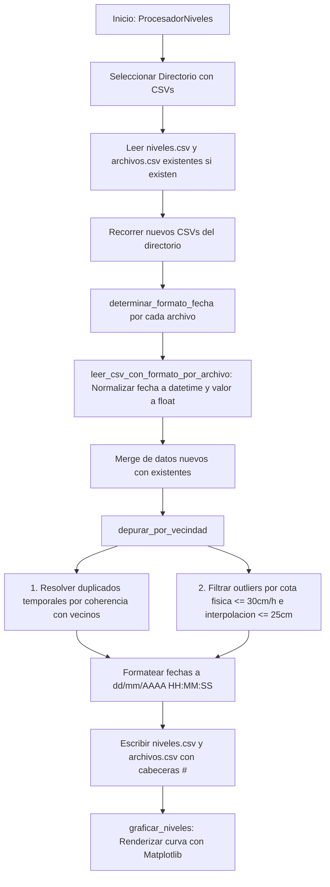

# `niveles_embalses.py` — Contexto Técnico para Agentes IA

> Aplicación en PyQt5 y Matplotlib para la consolidación, normalización de formatos heterogéneos de fecha, deduplicación temporal y depuración física de registros de nivel de embalses (presas Chanlud y Labrado), administrando los archivos maestros `niveles.csv` y el inventario `archivos.csv`.

**Ruta**: `c:/proyectos/rsa_sismologia/modulos externos/niveles_embalses.py`  
**LOC**: ~280 líneas | **Lenguaje**: Python 3 (PyQt5, Matplotlib, NumPy, rsa_io)  
**Archivos de Salida**: `niveles.csv` (Serie temporal consolidada y depurada), `archivos.csv` (Historial de CSVs procesados)  

---

## 1. Identidad, Alcance y Propósito

Las estaciones limnimétricas en las presas registran los niveles del agua en archivos CSV periódicos con formatos de fecha variables según el registrador o la exportación. Este módulo procesa un lote de archivos, resuelve conflictos de solapamiento y genera una serie continua y limpia.

### Objetivos Clave:
1. **Detección Dinámica de Formato por Archivo (`determinar_formato_fecha`)**: Evalúa de manera independiente cada CSV procesado contra 12 formatos de fecha posibles (separadores `/`, `-`, con/sin segundos, formato ISO y variantes de 2 o 4 dígitos de año), evitando fallos por heterogeneidad de fuentes.
2. **Depuración por Vecindad y Filtrado de Outliers (`depurar_por_vecindad`)**:
   - **Resolución de duplicados**: Si existen lecturas coincidentes en el mismo instante de tiempo, selecciona el valor más armónico evaluando la coherencia cuadrática con sus vecinos temporalmente más cercanos.
   - **Cota física de variación por hora (`max_delta_por_hora=0.30` m/h)**: Descarta anomalías o picos de ruido del sensor incompatibles con la física hidráulica del embalse.
   - **Interpolación lineal entre vecinos (`umbral_abs_interpolacion=0.25` m)**: Elimina disparos espurios aislados.
3. **Persistencia Estructurada y Respeto de Cabeceras**:
   - `quitar_cabecera_si_corresponde()` detecta si el archivo fuente contiene metadatos antes de recortar, preservando registros válidos.
   - Guarda `niveles.csv` y `archivos.csv` con cabeceras explicativas iniciadas con `#`.
4. **Visualización Gráfica**: Plotea la serie resultante con formateo temporal legible (`DateFormatter("%d/%m/%Y %H:%M")`).

---

## 2. Diagrama de Arquitectura y Flujo de Datos

---

## 3. Contratos de Datos y Configuración

### 3.1. Archivo Consolidado `niveles.csv`
Estructura delimitada por punto y coma (`;`):
* Fila 0–2: Cabeceras descriptivas con prefijo `#`.
* Columna 0: Identificador de estación / sensor.
* Columna 1: Fecha y hora en formato canónico `dd/mm/AAAA HH:MM:SS`.
* Columna 2: Nivel medido en metros sobre el nivel del mar (m s.n.m.) con formato decimal compacto.

### 3.2. Archivo de Inventario `archivos.csv`
Lista única de nombres de archivos `.csv` procesados para evitar re-lecturas redundantes.

---

## 4. Métodos y Funciones Principales

| Función / Método | Tipo | Descripción |
|---|---|---|
| `ProcesadorNiveles` | Clase (QWidget) | Ventana principal de selección de carpeta y procesamiento. |
| `determinar_formato_fecha(fechas)` | Parser | Identifica el formato de fecha evaluando una muestra de hasta 50 filas. |
| `leer_csv_con_formato_por_archivo(ruta)` | Parser / I/O | Extrae y normaliza filas de un archivo individual con su formato propio. |
| `depurar_por_vecindad(filas)` | Algoritmo | Elimina duplicados por distancia a vecinos y descarta outliers físicos. |
| `procesar_archivos(directorio)` | Flujo Principal | Orquesta la lectura, fusión, depuración, guardado y graficación. |
| `graficar_niveles(niveles, formato)` | Visualización | Grafica la serie temporal con `DateFormatter` y cuadrícula. |

---

## 5. Pautas para Integración en `src/programa_integrado.py`

Cuando se incorpore al menú principal:
1. Podrá ubicarse en la categoría de **Instrumentación y Monitoreo de Presas** junto a `caudales_filtraciones.py`.
2. Utiliza `rsa_io.py` (`lectura_archivo`, `escritura_archivo`), garantizando coherencia absoluta con el resto del proyecto.

---

## 6. Checklist de Regresión

Antes de validar cualquier modificación en `niveles_embalses.py`, verificar:
- [ ] `python -m py_compile "modulos externos/niveles_embalses.py"` retorna código 0.
- [ ] El parser reconoce fechas con formato día/mes y mes/día sin lanzar `ValueError`.
- [ ] Registros con timestamps duplicados son resueltos sin generar saltos abruptos en la gráfica.
- [ ] La escritura de `niveles.csv` y `archivos.csv` genera cabeceras válidas y es legible con `lectura_archivo()`.
