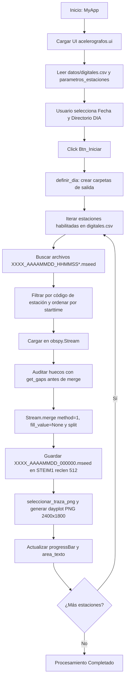

# `acelerografo.py` — Contexto Técnico para Agentes IA

> Aplicación de escritorio en PyQt5 y ObsPy para la consolidación y unión total de archivos MiniSEED fragmentados diarios por estación de acelerógrafos digitales, generando volúmenes diarios unificados y gráficos de control `dayplot` (PNG).

**Ruta**: `c:/proyectos/rsa_sismologia/modulos externos/acelerografo.py`  
**LOC**: 407 líneas | **Lenguaje**: Python 3 (PyQt5, ObsPy, Matplotlib Agg)  
**Interfaz UI**: `src/ui/acelerografos.ui`  
**Lanzador**: `Acelerografos.bat` o ejecución directa en Spyder / Terminal  

---

## 1. Identidad, Alcance y Propósito

`acelerografo.py` resuelve la necesidad operativa de procesar estaciones sismológicas digitales que almacenan su registro en múltiples fragmentos `.mseed` a lo largo del día (patrón `XXXX_AAAAMMDD_HHMMSS*.mseed`).

### Objetivos Clave:
1. **Consolidación Diaria**: Fusiona fragmentos MiniSEED cronológicamente mediante `Stream.merge(method=1, fill_value=None)` y `split()`, preservando la integridad de huecos/gaps sin rellenar datos artificialmente.
2. **Inspección de Continuidad**: Registra y audita huecos y solapes antes y después de la unión de trazas.
3. **Generación de Dayplots**: Produce visualizaciones de 24 horas (`dayplot`) en formato PNG con resolución de 2400x1800 a 200 DPI para el canal representativo configurado.
4. **Cierre Controlado en Windows**: Implementa `salir()` con `os._exit(0)` para liberar descriptores y threads de Qt evitando procesos colgados en segundo plano.

---

## 2. Diagrama de Arquitectura y Flujo de Datos

---

## 3. Contratos de Datos y Configuración

### 3.1. Archivo `datos/digitales.csv`
Mapea la carpeta del dispositivo con el índice del catálogo de estaciones:
* **Columna 0**: Nombre de la subcarpeta dentro de `Datos Estaciones` (ej. `ChanludBase`, `MazarCim`).
* **Columna 1**: Índice numérico entero que apunta a la fila de `parametros_estaciones()`.

### 3.2. Parámetros de Estaciones (`parametros_estaciones()`)
* `HAB_CANAL`: Bandera `'1'` (habilitada) o `'0'` (deshabilitada).
* `NOMBRE`: Nombre descriptivo de la estación.
* `CODIGO`: Código alfanumérico estándar de 4 letras (ej. `CHAB`, `MACI`).
* `COMPONENTE`: Índice 1-based del canal seleccionado para el gráfico (`1`, `2`, `3`).
* `CANAL`: Orientación o tipo de componente (ej. `ZNE`, `HHZ`, `HNZ`).
* `DIEZMADO_PLT`, `FACTOR_MUL`, `GANANCIA`: Parámetros de escalamiento y ploteo.

### 3.3. Estructura de Directorios Generados
* `Directorio_base`: Carpeta raíz del día `.../AAAAMMDD/`.
* `Directorio_dia`: Subcarpeta `.../AAAAMMDD/` para dayplots.
* `Directorio_registros`: Subcarpeta `.../AAAAMMDD/mseed/` donde se guardan los archivos consolidados `XXXX_AAAAMMDD_000000.mseed`.

---

## 4. Métodos y Funciones Principales

| Componente / Método | Tipo | Descripción |
|---|---|---|
| `extraer_hasta_directorio(ruta, nombre)` | Función auxiliar | Recorta rutas absolutas hasta el directorio base del proyecto (`rsa_sismologia`). |
| `MyApp.__init__()` | Constructor | Carga `acelerografos.ui`, inicializa fecha actual, rutas por defecto y parámetros de `digitales.csv`. |
| `agregar_mensaje(texto)` | Método UI | Publica mensajes formateados con hora `[HH:MM:SS]` en `self.area_texto` y refresca eventos con `processEvents()`. |
| `seleccionar_drive()` | Slot UI | Abre diálogo para seleccionar la carpeta base `DIA` y ubica automáticamente `Datos Estaciones`. |
| `showDate(date)` | Slot UI | Actualiza `self.date` y la ruta base de archivos con formato `AAAAMMDD000000`. |
| `validar_fila_digital(fila, num)` | Método validación | Verifica que la fila contenga carpeta e índice válido dentro de los límites de configuración. |
| `filas_digitales_validas()` | Método validación | Filtra y devuelve la lista de tuplas validadas `(numero_fila, fila, carpeta, num_estacion)`. |
| `registrar_huecos(stream, cod, momento)` | Auditoría | Ejecuta `stream.get_gaps()` y detalla en el log la presencia de saltos temporales o solapes. |
| `seleccionar_traza_png(...)` | Lógica negocio | Selecciona la traza vertical/prioritaria según orientación (`tipo_canal`) o índice de componente. |
| `Iniciar()` | Slot principal | Ejecuta el bucle de búsqueda de fragmentos, lectura por cabeceras, fusión atómica y ploteo PNG. |
| `definir_dia()` | Método I/O | Obtiene rutas canónicas mediante `obtener_directorios()` y crea carpetas si no existen (`mkdir`). |
| `salir()` | Slot UI | Cierra la ventana y termina el proceso inmediatamente con `os._exit(0)`. |

---

## 5. Deuda Técnica y Riesgos Críticos

1. **Patrón de Nombres Estricto**: `re.compile(r'^([A-Za-z0-9]{4})_(\d{8})_(\d{6}).*\.mseed$', re.IGNORECASE)` exige exactamente 4 caracteres de código y 8 dígitos de fecha. Archivos con nombres corruptos o diferentes prefijos son descartados y logueados.
2. **Dependencia de Matplotlib Backend Agg**: Se fuerza `matplotlib.use('Agg')` para evitar interferencias de renderizado entre los hilos de Qt y Matplotlib en entornos Windows sin display X11.
3. **Cierre Forzado `os._exit(0)`**: Es indispensable en Windows para evitar procesos zombies en segundo plano, pero puede causar que Spyder notifique el reinicio de su consola IPython tras pulsar *Salir*.

---

## 6. Checklist de Regresión

Antes de validar cualquier modificación en `acelerografo.py`, verificar:
- [ ] La UI `acelerografos.ui` carga sin errores de widgets faltantes (`Btn_Iniciar`, `Btn_drive`, `Btn_Salir`, `area_texto`, `dateEdit`).
- [ ] La selección de carpetas con espacios o acentos (`G:/Mi unidad/...`) no rompe el flujo en Windows.
- [ ] Los archivos `.mseed` consolidados resultantes son legibles con `obspy.read()` y mantienen codificación `STEIM1` a 512 bytes.
- [ ] No se alteran nombres de widgets de Qt ni la estructura de retorno de `parametros_estaciones()`.
- [ ] El dayplot PNG se genera en las dimensiones 2400x1800 con DPI 200 sin bloquear la interfaz.
