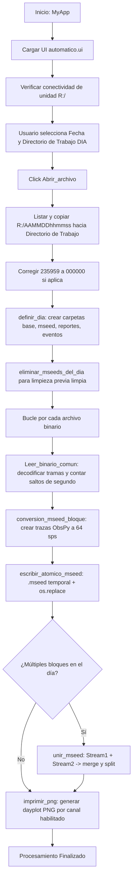

# `automatico.py` — Contexto Técnico para Agentes IA

> Aplicación automatizada en PyQt5 para la adquisición, decodificación binaria de telemetría continua de 16 canales desde la unidad de red `R:`, conversión atómica a MiniSEED y generación de gráficos diarios `dayplot` (PNG).

**Ruta**: `c:/proyectos/rsa_sismologia/modulos externos/automatico.py`  
**LOC**: 768 líneas | **Lenguaje**: Python 3 (PyQt5, ObsPy, NumPy, Matplotlib)  
**Interfaz UI**: `src/ui/automatico.ui`  
**Dispositivo Fuente**: Telemetría continua conectada en unidad de red (`R:/`)  

---

## 1. Identidad, Alcance y Propósito

`automatico.py` implementa el flujo de extracción desatendida y conversión de registros analógicos/continuos de la Red Sísmica de Alerta (RSA).

### Objetivos Clave:
1. **Adquisición desde Unidad de Red (`R:/`)**: Detecta y copia archivos de telemetría continua con nomenclatura `AAMMDDhhmmss` sin extensión correspondientes a la fecha seleccionada.
2. **Corrección de Archivo de Medianoche**: Corrige automáticamente el desfase del archivo de cierre diario (`AAMMDD235959` ➔ `AAMMDD000000`).
3. **Decodificación de Trama Binaria de 16 Canales**: Procesa tramas con sincronismo `b'\x08\x00\x05\x00'`, cabecera fija de 20 bytes, 2048 bytes de cuerpo (16 canales x 64 muestras de 2 bytes = 2048 bytes) y 2077 bytes por segundo.
4. **Escritura Atómica MiniSEED**: Genera archivos temporales ocultos (`.tmp`) con `fsync` y reemplazo atómico (`os.replace`) para evitar archivos `.mseed` corruptos ante caídas de red o cortes eléctricos.
5. **Fusión Diaria sin Relleno**: Une los bloques del día mediante `Stream.merge(method=1, fill_value=None)` y `split()`, preservando los huecos reales del registro.
6. **Generación Automatizada de Dayplots**: Plotea las 24 horas continuas de los canales habilitados a 2400x1800 px (200 DPI).

---

## 2. Diagrama de Arquitectura y Flujo de Datos

---

## 3. Contratos de Datos y Configuración

### 3.1. Formato de Trama Binaria de Telemetría
* **Tamaño de Segundo**: 2077 bytes exactos.
* **Marca Fija**: `b'\x08\x00\x05\x00'` (4 bytes).
* **Segundo ASCII**: 5 dígitos ASCII que indican el segundo transcurrido del día (`00000` a `86399`).
* **Cabecera de Trama**: 20 bytes fijos `b'\x02\x20\x02\x00\x40\x00\x00\x00\x00\x00\x00\x00\x10\x00\x00\x00\x00\x00\x00\x00'`.
* **Cuerpo de Señal**: 2048 bytes (16 canales multiplexados, muestreados a 64 Hz, enteros con signo de 16 bits little-endian).

### 3.2. Estructura de Directorios (`obtener_directorios()`)
* `Directorio_base`: `.../AAAAMMDD/`
* `Directorio_registros`: `.../AAAAMMDD/mseed/`
* `Directorio_dia`: `.../AAAAMMDD/` (destino de dayplots PNG)
* `archivo_estaciones`: `.../AAAAMMDD/estaciones.csv`

---

## 4. Métodos y Funciones Principales

| Función / Método | Tipo | Descripción |
|---|---|---|
| `mensaje_lbl(widget, mensaje, borrar)` | Helper UI | Añade logs con marca de tiempo `[HH:MM:SS]` a `Lbl_Mensajes` y refresca la UI de Qt con `processEvents()`. |
| `mostrar_advertencia(parent)` | Helper UI | Modal emergente cuando la unidad `R:` no está conectada o disponible en red. |
| `eliminar_mseeds_del_dia(...)` | Limpieza I/O | Borra archivos `EEEE_AAAAMMDD_*.mseed` previos antes de iniciar una regeneración limpia. |
| `escribir_atomico_mseed(stream, destino)` | I/O Seguro | Guarda el stream en archivo `.tmp`, ejecuta `fsync` y lo renombra con `os.replace`. |
| `conversion_mseed_bloque(...)` | Procesamiento | Transforma matrices de enteros `canal[16]` en objetos `obspy.Stream` con frecuencia 64 Hz. |
| `Leer_binario_comun(...)` | Core Decoder | Recorre el flujo binario desde la marca localizada, demultiplexa canales y cuantifica segundos faltantes. |
| `MyApp.Abrir_archivo()` | Slot Principal | Orquestador completo: copia de `R:`, decodificación, unión de bloques y disparo de ploteo. |
| `MyApp.unir_mseed(arch1, arch2)` | Fusión MiniSEED | Fusiona pares de streams por canal con `merge(method=1, fill_value=None)` y elimina el archivo secundario. |
| `MyApp.imprimir_png()` | Ploteo | Itera canales con `hab_canal[i] == '1'` y genera los gráficos `dayplot` de 24 horas. |

---

## 5. Deuda Técnica y Riesgos Críticos

1. **Dependencia de la Unidad de Red `R:`**: Si el equipo pierde el mapeo de red `R:`, el sistema invoca `mostrar_advertencia` y requiere intervención manual para seleccionar archivos locales.
2. **Escritura Atómica en Sistemas de Archivos Remotos/NFS/SMB**: `os.replace` requiere que el archivo temporal y el destino vivan en el mismo volumen físico para garantizar atomicidad estricta.
3. **Manejo de Memoria en Días Completos**: Matrices de 16 canales x 86,400 segundos x 64 muestras pueden consumir más de 150 MB en memoria RAM antes de la compresión `STEIM1`.

---

## 6. Checklist de Regresión

Antes de validar cualquier modificación en `automatico.py`, verificar:
- [ ] La UI `automatico.ui` carga correctamente y los botones `Btn_Iniciar`, `Btn_drive`, `Btn_Salir` responden.
- [ ] La función `Leer_binario_comun` localiza la cabecera `loc_cabecera()` sin desfasar la sincronía de 2077 bytes.
- [ ] La tasa de muestreo (`sampling_rate`) asignada a las trazas generadas es estrictamente `64.0 Hz`.
- [ ] La unión de bloques MiniSEED no introduce muestras artificiales de ceros en los huecos (`fill_value=None`).
- [ ] Los archivos `.mseed` resultantes pasan la validación de `obspy.read()`.
