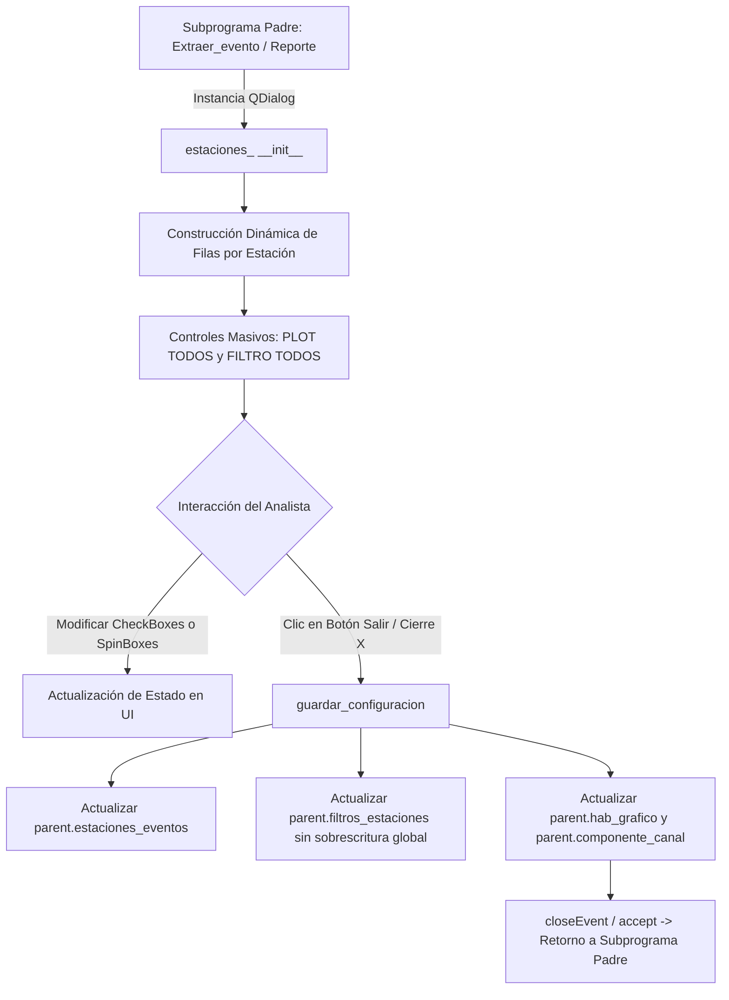

# `src/librerias/estaciones.py` — Contexto Técnico para Agentes IA

> Diálogo modal reutilizable (`estaciones_`) basado en PyQt5 para la selección de estaciones sísmicas activas, asignación de componentes/canales y parametrización individual o masiva de filtros pasa-banda Butterworth.

**Ruta**: `src/librerias/estaciones.py`  
**Lenguaje**: Python 3 (PyQt5)  
**Dependencias**: `PyQt5.QtWidgets`, `librerias.metodos_gestion.parametros_estaciones`  
**Proceso**: Invocado como diálogo modal desde subprogramas sismológicos (ej. `extraer_integrado.py`, `reporte_diario.py`).

---

## 1. Arquitectura y Flujo de Interacción

---

## 2. Contratos de Datos y E/S

* **Parámetros del Constructor (`__init__`)**:
  * `hab_grafico` (list): Lista de banderas binarias (`'1'` / `'0'`) por canal físico.
  * `estaciones_eventos` (list): Lista de índices enteros de las estaciones activas del evento.
  * `filtros` (list): Lista de cadenas de 6 dígitos `OOFFSS` (`Orden`, `Frec_Inf`, `Frec_Sup`). Ejemplo: `"020406"` (Orden 2, 4-6 Hz), `"000000"` (Filtro apagado).
  * `parent` (QWidget/QMainWindow): Referencia al widget o ventana invocadora.

* **Mutación de Atributos en `parent` (Salida vía `guardar_configuracion`)**:
  * `parent.estaciones_eventos`: Lista filtrada de estaciones cuyo checkbox `PLOT` está activado.
  * `parent.filtros_estaciones`: Lista actualizada de cadenas `OOFFSS` en las posiciones indexadas del total del padre.
  * `parent.hab_grafico`: Diccionario/lista de banderas `'1'`/`'0'` sincronizadas.

---

## 3. Componentes y Métodos Clave

| Método / Control | Tipo | Descripción |
|---|---|---|
| `estaciones_` | `QDialog` | Diálogo modal que renderiza la matriz de configuración de canales y filtros. |
| `validar()` | Método | Slot conectado a `ck_box_todos` para marcar/desmarcar masivamente la visualización de todas las estaciones. |
| `validar_filtros()` | Método | Slot conectado a `ck_box_filtros` para activar/desactivar filtros en las estaciones habilitadas. |
| `guardar_configuracion()` | Método | Procesa los valores de los widgets y actualiza atómicamente los atributos del objeto padre. |
| `closeEvent(event)` | Evento | Disparado al cerrar la ventana; invoca `guardar_configuracion()` y acepta el cierre. |
| `Salir_()` | Método | Slot conectado al botón `Btn_salir`; guarda la configuración y cierra con `accept()`. |

---

## 4. Decisiones de Diseño y Correcciones Críticas

1. **Resolución de Pérdida de Filtros**:
   * Se erradicó la sobrescritura errónea `self.parent.filtros_estaciones = self.filtros` que reseteaba los cambios realizados por el analista en el bucle individual.
2. **Centralización del Guardado (`guardar_configuracion`)**:
   * Tanto el botón explícito de salida (`Btn_salir`) como el evento de cierre de ventana (`closeEvent`) ejecutan la misma lógica unificada sin duplicar código.
3. **Carga Segura de UI**:
   * Carga de plantilla base `src/ui/secundaria.ui` mediante rutas absolutas robustas (`os.path.abspath`).

---

## 5. Riesgos Técnicos y Deuda Técnica

* **Dependencia Fuerte con Atributos del Padre**:
  * La clase asume que `self.parent` posee `estaciones_eventos_total`, `filtros_estaciones`, `hab_grafico` y `estaciones_eventos`.
  * *Evolución recomendada*: Reemplazar el acoplamiento directo por emisión de señales Qt (`pyqtSignal(list, list, dict)`).

---

## 6. Checklist de Verificación y Regresión

- [x] Sin llamadas duplicadas a `super().__init__()`.
- [x] Selección masiva `PLOT TODOS` y `FILTRO TODOS` operativa.
- [x] Los filtros editados en SpinBoxes persisten fielmente en `parent.filtros_estaciones`.
- [x] El botón `Salir` guarda la configuración y cierra el diálogo sin excepciones.
