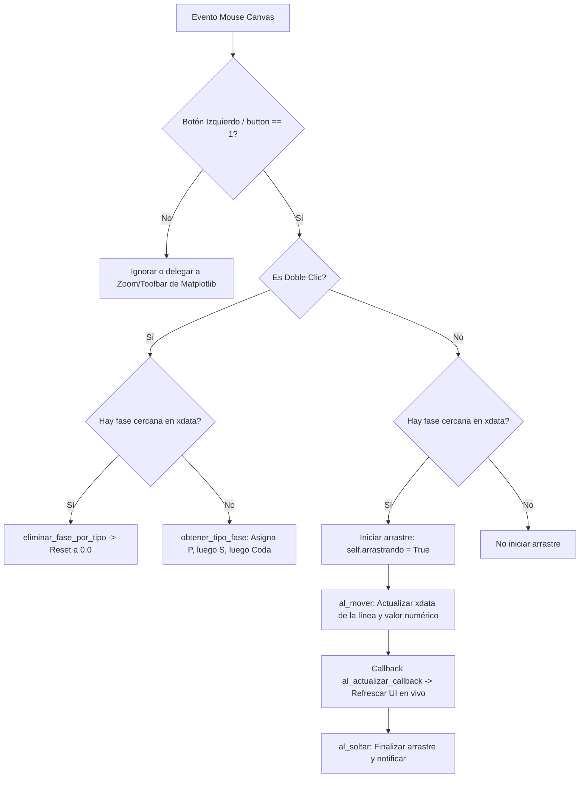

# `src/librerias/gestor_fases.py` — Contexto Técnico para Agentes IA

> Controlador interactivo de eventos de mouse y renderizado dinámico de fases sísmicas (P, S, Coda) en canvas Matplotlib para ObsPy / PyQt5.

**Ruta**: `src/librerias/gestor_fases.py`  
**Lenguaje**: Python 3 (Matplotlib, ObsPy)  
**Dependencias**: `json`, `os`, `obspy.signal.trigger`  
**Proceso**: Utilizado por `src/subprogramas/fases.py` en `VentanaGrafico` y visualizadores de detalle.

---

## 1. Arquitectura y Flujos de Eventos



---

## 2. Contratos de Datos

### 2.1. Diccionario de Fases (`self.fases`)
```python
{
    "P": [4.87],        # Float en segundos relativos al inicio de la traza
    "S": [16.11],       # Float en segundos
    "Coda": [20.47],    # Float en segundos
    "tipo_p": "I",      # 'I' / 'E'
    "polaridad_p": "+", # '+' / '-' / ' '
    "peso_p": 0,        # 0 a 4
    "polaridad_s": " ", # ' ' / '+' / '-'
    "peso_s": 2         # 0 a 4
}
```

### 2.2. Colores Institucionales
* **P**: `'red'` (Línea discontinua roja)
* **S**: `'darkorange'` (Línea discontinua naranja oscura)
* **Coda**: `'green'` (Línea discontinua verde)

---

## 3. Componentes y Métodos Clave

| Método | Descripción |
|---|---|
| `al_presionar(evento, ax, canvas)` | Filtra clic izquierdo (`button == 1`) y detecta fase cercana o doble clic. |
| `al_mover(evento, canvas)` | Modifica interactivamente la posición `x` de la línea vertical durante el arrastre y llama al callback de actualización en vivo. |
| `al_soltar(evento)` | Libera el estado de arrastre y notifica al llamador. |
| `doble_click(evento, ax, canvas)` | Alterna entre eliminación (si existe fase cercana) o adición de nueva fase en orden P $\rightarrow$ S $\rightarrow$ Coda. |
| `encontrar_fase_mas_cercana(x, ax)` | Localiza la fase más próxima al cursor dentro de una tolerancia del 2% del ancho visible del eje $x$. |
| `inicializar_fases(ax)` | Dibuja las líneas verticales `axvline` correspondientes a las fases existentes (> 0.0 s). |
| `obtener_fases()` | Retorna el diccionario completo de fases y parámetros asociados. |

---

## 4. Checklist de Verificación

- [x] Restricción estricta a clic izquierdo (`button == 1`) para permitir que clic derecho maneje zoom.
- [x] Soporte para `al_actualizar_callback` que refresca cálculos de $T_s - T_p$ en tiempo real.
- [x] Compatibilidad con la estructura canónica de `fases.py`.
