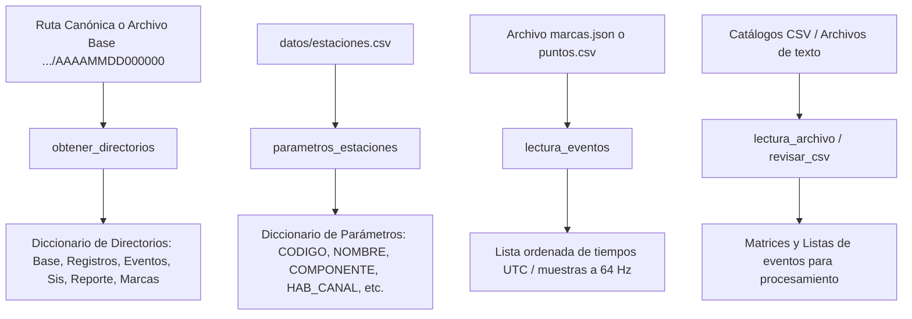

# `src/librerias/metodos_gestion.py` — Contexto Técnico para Agentes IA

> Módulo central de gestión de infraestructura de archivos, resolución de directorios canónicos del repositorio `DIA`, extracción de metadatos de estaciones y lectura/escritura de catálogos y marcas de tiempo.

**Ruta**: `src/librerias/metodos_gestion.py`  
**Lenguaje**: Python 3 (ObsPy, PyQt5)  
**Dependencias**: `os`, `pathlib.Path`, `obspy.UTCDateTime`, `json`, `csv`, `re`  
**Proceso**: Importado como librería transversal por el orquestador principal y todos los subprogramas.

---

## 1. Arquitectura y Flujo de Gestión de Rutas y Datos



---

## 2. Contratos de Datos y E/S

### 2.1. Diccionario Retornado por `obtener_directorios(archivo)`
```python
{
    'Directorio_base': '.../DIA/AAAA/AAAA_MM/AAAA_MM_DD',
    'Directorio_registros': '.../DIA/AAAA/AAAA_MM/AAAA_MM_DD/mseed/registros',
    'Directorio_eventos': '.../DIA/AAAA/AAAA_MM/AAAA_MM_DD/mseed/eventos',
    'Directorio_sis': '.../DIA/AAAA/AAAA_MM/AAAA_MM_DD/sis',
    'Directorio_reporte': '.../DIA/AAAA/AAAA_MM/AAAA_MM_DD/reporte',
    'Directorio_trabajo': '.../DIA',
    'archivo_marcas': '.../DIA/AAAA/AAAA_MM/AAAA_MM_DD/marcas.json',
    'nombre_dia': 'AAAAMMDD000000'
}
```

### 2.2. Diccionario de Configuración de `parametros_estaciones()`
```python
{
    'NUM_ESTACION': [0, 1, 2, ...],
    'CODIGO': ['LABR', 'CUSH', 'CHAI', ...],
    'NOMBRE': ['Estación La Brisa', ...],
    'COMPONENTE': ['1', '2', '3', ...],
    'HAB_CANAL': ['1', '0', ...],
    'HAB_GRAFICO': ['1', '0', ...],
    'LATITUD': [...],
    'LONGITUD': [...],
    'ELEVACION': [...]
}
```

---

## 3. Componentes y Métodos Clave

| Función | Firma | Descripción |
|---|---|---|
| `extraer_hasta_directorio` | `(ruta_completa, nombre_directorio) -> str` | Recorta una ruta absoluta hasta el directorio especificado. |
| `lectura_archivo` | `(archivo) -> list` | Lee archivos delimitados por `;` probando codificaciones UTF-8, Latin-1 y CP1252. |
| `lectura_eventos` | `(archivo) -> (str, list)` | Lee marcas temporales desde `marcas.json` (preferente) o `puntos.csv` (legado). |
| `parametros_estaciones` | `() -> dict` | Carga metadatos técnicos y geográficos desde `datos/estaciones.csv`. |
| `obtener_directorios` | `(archivo) -> dict` | Construye el mapa completo de rutas del repositorio para un día sísmico. |
| `cargar_parametros` | `(archivo) -> dict` | Carga el archivo de configuración JSON asociado a la sesión. |
| `denegar_escritura` | `(archivo)` | Marca un archivo como de sólo lectura en el sistema de archivos de Windows. |
| `habilitar_escritura` | `(archivo)` | Restaura permisos de escritura sobre un archivo protegido. |
| `revisar_csv` | `(ruta_csv) -> list` | Lee y valida la estructura tabular del catálogo de eventos. |

---

## 4. Decisiones de Diseño y Algoritmos

1. **Resolución Jerárquica del Repositorio `DIA`**:
   * Soporte integral para la estructura estándar institucional `DIA/AAAA/AAAA_MM/AAAA_MM_DD/` y variantes con nombres normalizados `AAAAMMDD000000`.
2. **Prioridad de Formatos de Marcas**:
   * Prevalencia de `marcas.json` estructurado con timestamps ISO-8601 UTC; soporte de retrocompatibilidad con la interpolación de coordenadas de `puntos.csv` de Surfer.
3. **Resiliencia de Codificación (Multi-Encoding)**:
   * `lectura_archivo()` detecta fallos `UnicodeDecodeError` e itera sobre un conjunto seguro de codecs (`utf-8`, `latin-1`, `cp1252`).

---

## 5. Riesgos Técnicos y Deuda Técnica

* **Rutas Relativas y Separadores de Windows**:
  * Empleo riguroso de `Path` y `os.path.join` para evitar fallos de escape de backslashes (`\`) en entornos Windows.
* **Sobrescritura Accidental de Catálogos**:
  * Usar `denegar_escritura` y `habilitar_escritura` con cautela para no bloquear procesos concurrentes en el explorador de Windows.

---

## 6. Checklist de Verificación y Regresión

- [x] Detección de carpetas de día con estructura de año y mes.
- [x] Lectura de `estaciones.csv` sin fugas de descriptores de archivo.
- [x] `obtener_directorios()` devuelve todas las claves requeridas por los subprogramas.
- [x] Lectura de marcas válida tanto para JSON como para puntos CSV.
