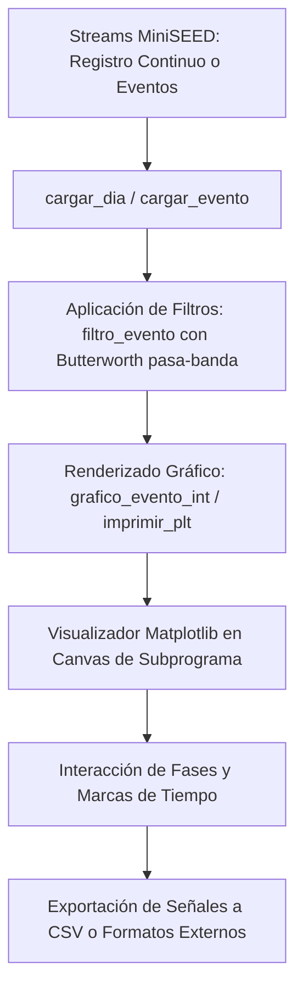

# `src/librerias/metodos_rsa.py` — Contexto Técnico para Agentes IA

> Librería central de procesamiento sismológico, renderizado gráfico multicanal con Matplotlib/ObsPy, filtrado Butterworth interactivo, carga y manipulación de streams MiniSEED continuos y por eventos.

**Ruta**: `src/librerias/metodos_rsa.py`  
**Lenguaje**: Python 3 (ObsPy, Matplotlib, NumPy)  
**Dependencias**: `obspy`, `matplotlib.figure.Figure`, `numpy`, `librerias.metodos_gestion`  
**Proceso**: Invocado por los subprogramas de extracción, marcado, fases y reportes sismológicos.

---

## 1. Arquitectura y Flujo de Procesamiento Sismológico

---

## 2. Contratos de Datos y E/S

* **Formato de Filtros (`filtro_evento`)**:
  * Entrada: Stream de ObsPy y cadena de 6 caracteres `OOFFSS` (ej. `"040210"` para Orden 4, pasa-banda 2 Hz a 10 Hz; `"000000"` para omitir filtrado).
  * Salida: Stream filtrado con detrending y remoción de media aplicados.

* **Parámetros de `grafico_evento_int`**:
  * `visor`: Eje o figura de Matplotlib donde se realiza el trazado.
  * `stLeido`: Lista/Stream de trazas de sismogramas.
  * `t_inicio`, `t_final`: Ventana temporal UTC a graficar.
  * `estaciones_eventos`: Lista de índices de estaciones seleccionadas.
  * `hab_grafico`: Diccionario o lista con banderas `'1'`/`'0'` de habilitación visual.
  * `bandera_marcas`: Control de visualización de marcas de fases sismológicas.
  * `pagina`: Control de paginación para despliegues de múltiples canales.

---

## 3. Componentes y Métodos Clave

| Función | Firma | Descripción |
|---|---|---|
| `grafico_evento_int` | `(visor, stLeido, t_inicio, t_final, estaciones_eventos, hab_grafico, bandera_marcas, pagina)` | Dibuja en Matplotlib las trazas sismológicas multicanal normalizadas con etiquetas y tiempos. |
| `filtro_evento` | `(stream, filtro_str)` | Aplica filtro Butterworth pasa-banda (desempaquetando `OOFFSS`) usando ObsPy. |
| `cargar_evento` | `(parametro, eventos_reporte, catalogo, eventos, ...)` | Carga y recorta trazas MiniSEED correspondientes a un evento específico del catálogo. |
| `cargar_dia` | `(directorios, parametros)` | Carga masiva de los streams de registro continuo de 24 horas de todas las estaciones activas. |
| `imprimir_plt` | `(...)` | Genera y guarda representaciones gráficas vectoriales y rasterizadas para informes PDF. |
| `guardar_seniales_csv`| `(...)` | Exporta las series temporales de un evento sismológico a archivos CSV. |
| `recolectar_evt` / `extraer_kinemetrics_evt` | `(...)` | Manejo y extracción de datos en formato Kinemetrics EVT hacia MiniSEED. |

---

## 4. Decisiones de Diseño y Algoritmos

1. **Normalización y Trazado Robusto**:
   * `grafico_evento_int` ajusta los offsets verticales de cada canal dinámicamente según la amplitud máxima local, evitando traslapes destructivos entre trazas continuas.
2. **Filtrado Eficiente de Señales**:
   * Previo al filtrado pasa-banda, se ejecuta `detrend("demean")` y `detrend("linear")` para estabilizar la línea base de los sismogramas y mitigar efectos de borde en la convolución.
3. **Mapeo Seguro de Tiempos UTC**:
   * Uso sistemático de `obspy.UTCDateTime` para operaciones aritméticas sobre fechas y marcas sismológicas.

---

## 5. Riesgos Técnicos y Deuda Técnica

* **Uso de Memoria en Carga Masiva de Streams**:
  * `cargar_dia` carga archivos MiniSEED de 24h a memoria. Es indispensable procesar copias y liberar referencias cuando se procesan lotes extensos.
* **Manejo de Gaps y Muestreo No Homogéneo**:
  * Si un stream contiene discontinuidades (*gaps*), debe ser consolidado o fusionado antes de pasar a filtrado.

---

## 6. Checklist de Verificación y Regresión

- [x] `grafico_evento_int` recibe `t_inicio` y `t_final` explícitos sin colapsar en eventos vacíos.
- [x] `filtro_evento` parsea correctamente cadenas de 6 dígitos sin arrojar excepción con `"000000"`.
- [x] Trazado multicanal respeta la bandera de visibilidad `hab_grafico`.
- [x] Compatibilidad verificada con `Extraer_evento`, `Marcar_evento` y `Procesamiento_evento`.
