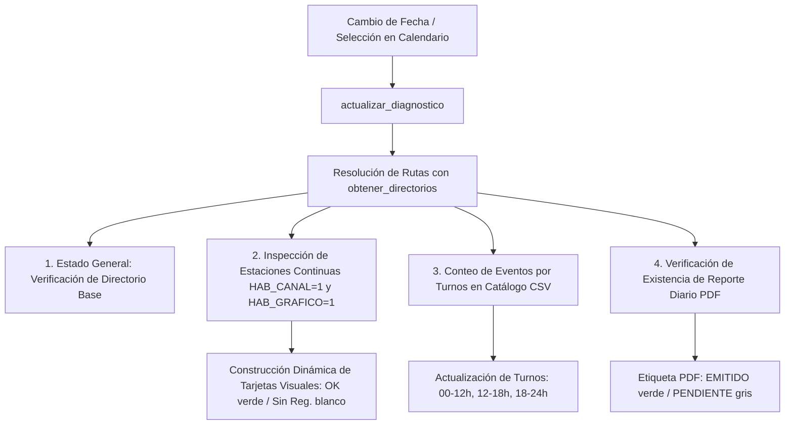

# `src/librerias/panel_estado.py` — Contexto Técnico para Agentes IA

> Componente modular reutilizable en PyQt5 para la supervisión y diagnóstico en tiempo real de la jornada sísmica: verificación de estructura de carpetas en `DIA`, disponibilidad de registros MiniSEED continuos, balance de eventos por turno y estado de emisión del informe diario en PDF.

**Ruta**: `src/librerias/panel_estado.py`  
**Lenguaje**: Python 3 (PyQt5)  
**Dependencias**: `PyQt5.QtWidgets`, `librerias.metodos_rsa`, `librerias.metodos_gestion`  
**Proceso**: Montado como panel interactivo a la derecha del formulario en `src/subprogramas/inicio.py`.

---

## 1. Arquitectura y Flujo de Diagnóstico en Vivo

---

## 2. Contratos de Datos y E/S

* **Entrada de `actualizar_diagnostico(ruta_archivo, directorio_base_trabajo, parametros_est)`**:
  * `ruta_archivo` (str): Ruta base del día (`.../DIA/YYYYMMDD000000` o `.../DIA/YYYY/YYYY_MM/YYYY_MM_DD`).
  * `directorio_base_trabajo` (str): Directorio raíz del repositorio `DIA`.
  * `parametros_est` (dict/tuple, opcional): Diccionario generado por `parametros_estaciones()`.

* **Salida Visual**:
  * Actualización de etiquetas y regeneración dinámica del grid de tarjetas en `self.grid_estaciones`.

---

## 3. Componentes y Métodos Clave

| Componente / Método | Tipo | Descripción |
|---|---|---|
| `PanelEstadoJornada` | `QWidget` | Contenedor integral de diagnóstico con hoja de estilos adaptativa CSS para PyQt5. |
| `inicializar_ui()` | Método | Construye los 3 grupos visuales (`ESTADO GENERAL`, `CONDICIÓN Y REGISTRO POR ESTACIONES`, `EVACUACIÓN DE TURNOS`). |
| `actualizar_diagnostico(...)` | Método | Analiza el sistema de archivos del día seleccionado y actualiza colores, contadores y tarjetas de estado. |

---

## 4. Decisiones de Diseño y Algoritmos

1. **Prevención de Recorte de Títulos en Windows (`QGroupBox`)**:
   * Implementación de reglas CSS con márgenes superiores (`margin-top: 14px; padding-top: 12px;`) y posicionamiento explícito de `QGroupBox::title` para evitar recortes tipográficos en Windows 10/11.
2. **Discriminación Rigurosa de Estaciones**:
   * Solamente se evalúan y despliegan las 12 estaciones sismológicas de monitoreo continuo que cumplen la condición estricta:
     $$\text{HAB\_CANAL} == \text{'1'} \quad \land \quad \text{HAB\_GRAFICO} == \text{'1'}$$
3. **Distribución en Cuadrícula Dinámica y Responsiva**:
   * Visualización en matriz de 3 columnas dentro de un `QScrollArea` sin bordes, con tarjetas individuales estilizadas (`QFrame`).

---

## 5. Riesgos Técnicos y Deuda Técnica

* **Rendimiento de E/S en Unidades de Red / Google Drive**:
  * `os.listdir(dir_registros)` se ejecuta sobre la carpeta local de MiniSEED. Si la ruta está en red remota o sincronización en la nube, el listado debe mantenerse ligero y sin bloqueos síncronos prolongados.

---

## 6. Checklist de Verificación y Regresión

- [x] Títulos de los 3 grupos visibles sin recortes ni solapamientos visuales.
- [x] Grid de estaciones muestra las 12 estaciones continuas correctamente alineadas.
- [x] Contadores de eventos por turnos (00-12, 12-18, 18-24) calculan con precisión según la columna horaria del CSV.
- [x] Estado del PDF refleja fielmente la existencia física del archivo en `reporte/`.
