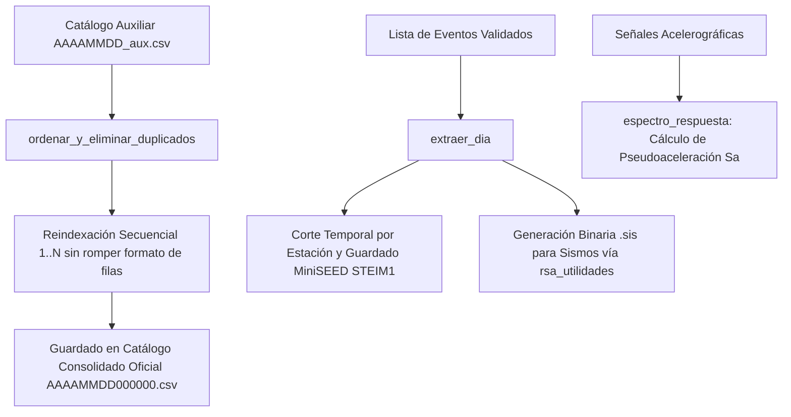

# `src/librerias/rsa_procesamiento.py` — Contexto Técnico para Agentes IA

> Módulo de procesamiento y consolidación sismológica por lotes: deduplicación y reindexación de catálogos CSV, extracción masiva de eventos diarios en MiniSEED STEIM1 y cálculo de espectros de respuesta.

**Ruta**: `src/librerias/rsa_procesamiento.py`  
**Lenguaje**: Python 3 (ObsPy, NumPy, Matplotlib)  
**Dependencias**: `obspy`, `numpy`, `librerias.metodos_rsa`, `librerias.metodos_gestion`, `librerias.rsa_utilidades`  
**Proceso**: Invocado por `extraer_integrado.py`, `procesamiento_integrado.py` y `reporte_diario.py`.

---

## 1. Arquitectura y Flujo de Procesamiento



---

## 2. Contratos de Datos y E/S

* **Entrada/Salida de `ordenar_y_eliminar_duplicados(catalogo, indice, bandera=True)`**:
  * `catalogo`: Lista de listas o tuplas representando las filas del catálogo sísmico.
  * `indice`: Columna clave de ordenamiento cronológico (índice 1 para hora del sismo).
  * `bandera`: `True` si contiene encabezado institucional, `False` si solo son filas de datos.
  * Salida: Lista de listas ordenada, sin duplicados y con la columna 0 reindexada como cadena numérica secuencial (`"1"`, `"2"`, ...).

* **Parámetros de `extraer_dia(...)`**:
  * Procesa de forma secuencial todos los eventos marcados, genera archivos `EST_AAAAMMDD_hhmmss.mseed` en `mseed/eventos/` y archivos `.sis` en `Directorio_dia`.

---

## 3. Componentes y Métodos Clave

| Función | Firma | Descripción |
|---|---|---|
| `ordenar_y_eliminar_duplicados` | `(catalogo, indice, bandera=True) -> list` | Ordena cronológicamente, descarta entradas redundantes y renumera la columna 0 de forma segura para listas y tuplas. |
| `extraer_dia` | `(eventos, directorios, parametros, ...)` | Ejecuta la extracción masiva de trazas sismológicas para cada evento confirmado. |
| `guardar_informacion_diaria` | `(...)` | Persiste metadatos de jornada y estado de procesamiento. |
| `espectro_respuesta` | `(aceleracion, dt, periodos, amortiguamiento) -> np.ndarray` | Calcula el espectro de respuesta elástico de aceleración ($S_a$) para señales sísmicas. |

---

## 4. Decisiones de Diseño y Correcciones Críticas

1. **Soporte Híbrido Lista/Tupla en Deduplicación**:
   * Corrección implementada para admitir filas tanto en formato mutable (`list`) como inmutable (`tuple`):
     ```python
     if isinstance(evento, list):
         evento[0] = str(i + 1)
     elif isinstance(evento, tuple):
         sin_duplicados[i] = [str(i + 1)] + list(evento[1:])
     ```
2. **Preservación de Compresión STEIM1**:
   * La extracción de eventos almacena siempre trazas MiniSEED en compresión `STEIM1` para máxima compatibilidad con software sismológico internacional (SEISAN, SAC, ObsPy).

---

## 5. Riesgos Técnicos y Deuda Técnica

* **Rendimiento en Días con Alta Sismicidad (Enjambres Sísmicos)**:
  * Si un día supera los 50 eventos, `extraer_dia` debe iterar liberando memoria intermedia para evitar sobrecarga de descriptores de archivo en Windows.

---

## 6. Checklist de Verificación y Regresión

- [x] `ordenar_y_eliminar_duplicados` no lanza `TypeError` al recibir filas representadas como tuplas.
- [x] Reindexación de eventos inicia estrictamente en 1 y se formatea como cadena de texto.
- [x] `extraer_dia` genera archivos MiniSEED válidos legibles con `obspy.read`.
