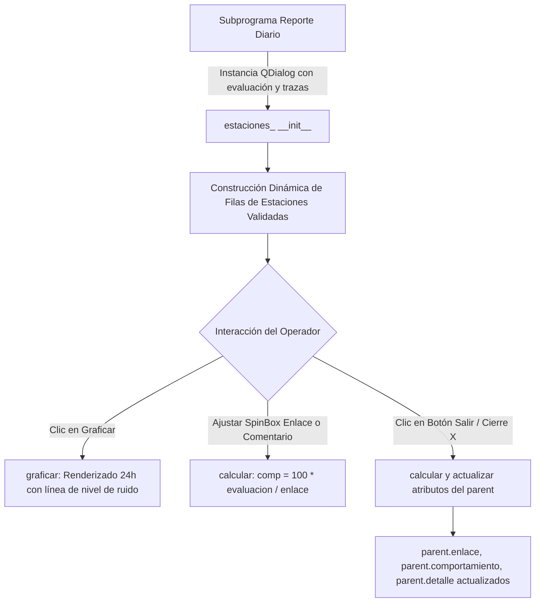

# `src/librerias/ventana_estaciones.py` — Contexto Técnico para Agentes IA

> Diálogo modal de evaluación de calidad de señal y disponibilidad de enlace de estaciones sísmicas: cálculo de porcentaje de comportamiento, comparación contra niveles de ruido de fondo y graficación diaria individual.

**Ruta**: `src/librerias/ventana_estaciones.py`  
**Lenguaje**: Python 3 (PyQt5, Matplotlib, NumPy)  
**Dependencias**: `PyQt5.QtWidgets`, `matplotlib.pyplot`, `numpy`, `librerias.metodos_gestion.parametros_estaciones`  
**Proceso**: Invocado por `reporte_diario.py` para la auditoría de enlaces y calidad de estaciones.

---

## 1. Arquitectura y Flujo de Evaluación de Calidad

---

## 2. Contratos de Datos y E/S

* **Parámetros del Constructor (`__init__`)**:
  * `evaluacion` (tuple): Tupla donde `evaluacion[0]` es la lista de puntajes de calidad y `evaluacion[1]` contiene las series temporales continuas del día (`tr_Canal`).
  * `archivo` (str): Ruta base del día analizado.
  * `parent` (object): Objeto padre (`Reporte_diario`) que almacena las listas `enlace`, `comportamiento` y `detalle`.

---

## 3. Componentes y Métodos Clave

| Método / Control | Tipo | Descripción |
|---|---|---|
| `estaciones_` | `QDialog` | Diálogo modal que construye la tabla dinámica de calidad de señal por estación. |
| `graficar()` | Método | Abre ventana interactiva de Matplotlib con el registro de 24 horas y umbral rojo de ruido. |
| `calcular()` | Método | Calcula el índice de comportamiento porcentual en base a la evaluación y el enlace reportado. |
| `closeEvent(event)` | Evento | Ejecuta `calcular()` antes de cerrar el diálogo para asegurar consistencia de datos en el padre. |

---

## 4. Decisiones de Diseño y Algoritmos

1. **Fórmula de Comportamiento de Enlace**:
   $$\text{Comportamiento (\%)} = \text{round}\left(100 \cdot \frac{\text{Evaluación}}{\text{Enlace}}, 1\right)$$
2. **Carga Segura de UI**:
   * Búsqueda en cascada de `src/ui/estaciones.ui` para evitar errores de directorio relativo.
3. **Botón Explícito de Salida (`btn_Salir`)**:
   * Incorporación de botón nativo conectado a `self.close` para ergonomía visual en el flujo de trabajo.

---

## 5. Riesgos Técnicos y Deuda Técnica

* **Acoplamiento Directo con Listas del Padre**:
  * Requiere que `self.parent` tenga inicializadas las listas `comportamiento`, `detalle` y `enlace`.

---

## 6. Checklist de Verificación y Regresión

- [x] Carga de `estaciones.ui` resuelve ruta absoluta correctamente.
- [x] Botón `Calcular` actualiza etiquetas de comportamiento y estructuras del padre.
- [x] Botón `Salir` cierra el modal tras recalcular datos.
- [x] Visualización gráfica de ruido en 24h sin excepciones.
