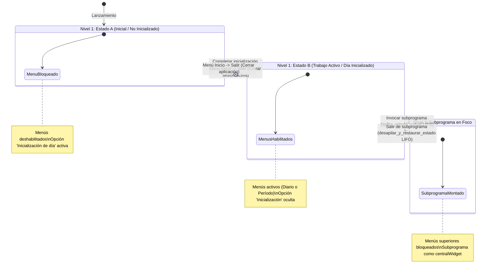

# `src/programa_integrado.py` — Contexto Técnico para Agentes IA

> Orquestador principal y contenedor de ventana única (`QMainWindow`) para todos los módulos y subprogramas de procesamiento sísmico de la Red Sísmica de Alerta (RSA).

**Ruta**: `src/programa_integrado.py`  
**Lenguaje**: Python 3 (PyQt5, Matplotlib)  
**Dependencias**: `PyQt5`, `obspy`, `matplotlib`, `librerias.metodos_rsa`, `librerias.metodos_gestion`, `librerias.rsa_procesamiento`  
**Proceso**: `python src/programa_integrado.py` o `%runfile` en Spyder IDE.

---

## 1. Arquitectura y Máquina de Estados (LIFO Stack)

`VentanaPrincipal` opera como un contenedor de ventana única con una máquina de estados jerárquica y una pila LIFO de preservación de estado:

---

## 2. Componentes y Métodos Clave

| Método / Atributo | Tipo | Descripción |
|---|---|---|
| `pila_estados` | Lista (LIFO) | Almacena instantáneas de estado (`dict`) antes de entrar a cada subprograma. |
| `apilar_estado_actual()` | Método | Guarda el estado completo de variables, menús, títulos y modo activo (Diario vs Período). |
| `desapilar_y_restaurar_estado()` | Método | Restaura con exactitud la instantánea superior de la pila LIFO al cerrar cualquier subprograma. |
| `configurar_estado_inicial()` | Método | Establece el Estado A limpio (menús deshabilitados, ventana lista para inicializar). |
| `establecer_estado_trabajo()` | Método | Establece el Estado B con los menús habilitados para el modo configurado y ventana limpia. |
| `cargar_widget_menu(widget, titulo)` | Método | Impregna el subprograma como `centralWidget`, conecta señales y envuelve `closeEvent` dinámicamente. |
| `accion_salir_ejecutar()` | Método | Gestiona la salida jerárquica: de Estado B regresa a Estado A, de Estado A cierra el software. |
| `paintEvent(event)` | Evento | Dibuja la marca de agua del nuevo logo RSA (+50% escala, 60% eje X) solo en estado inactivo. |

---

## 3. Contratos y Reglas de Integración

1. **Cero Subventanas Flotantes**: Todos los subprogramas se montan exclusivamente en `self.setCentralWidget(widget)`.
2. **Interceptor Universal de Cierre**: `cargar_widget_menu` envuelve el `closeEvent` del subprograma para garantizar que cualquier salida invoque `volver_estado_trabajo()` sin requerir modificaciones en los subprogramas.
3. **Identidad Visual Oficial**: Utiliza el logo institucional RSA en la barra superior (`110x50 px`) y como marca de agua en el fondo.
