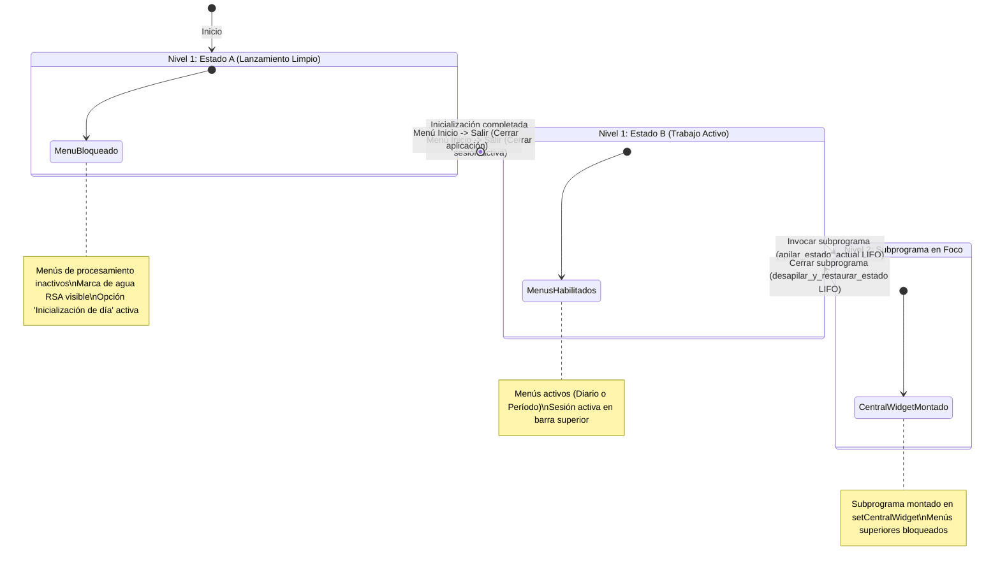

# `src/programa_integrado.py` — Contexto Técnico para Agentes IA

> Contenedor principal de ventana única (`QMainWindow`) que orquesta todos los subprogramas sísmicos de la Red Sísmica de Alerta (RSA), administrando la máquina de estados, la navegación LIFO y la identidad visual institucional.

**Ruta**: `src/programa_integrado.py`  
**Lenguaje**: Python 3 (PyQt5, Matplotlib)  
**Dependencias**: `PyQt5`, `obspy`, `matplotlib`, `librerias.metodos_rsa`, `librerias.metodos_gestion`, `librerias.rsa_procesamiento`, `librerias.panel_estado`  

---

## 1. Arquitectura de Navegación y Pila LIFO

`VentanaPrincipal` gestiona el ciclo de vida de los subprogramas y la preservación de sesión mediante una pila LIFO (*Last In, First Out*):

---

## 2. Componentes y Contratos de Estabilidad

1. **Pila LIFO de Navegación (`pila_estados`)**:
   * `apilar_estado_actual()`: Almacena variables de sesión, estado de cada menú y rótulos antes de abrir cualquier subprograma.
   * `desapilar_y_restaurar_estado()`: Restaura con exactitud el estado previo al cerrar cualquier módulo.
2. **Retorno de Control Atómico (`volver_estado_trabajo`)**:
   * Ejecutado de forma asíncrona mediante `QTimer.singleShot(0, self.volver_estado_trabajo)`.
   * Protegido por una guarda `if self.widget_activo is None: return` que descarta llamadas duplicadas y garantiza ejecución única.
   * **Invariante C++**: No ejecuta `delattr` sobre `QMainWindow` para no corromper punteros internos de PyQt5.
3. **Identidad Visual Oficial RSA**:
   * Icono de aplicación y banner superior (`110x50 px`).
   * Marca de agua central/derecha escalada al +50% en `paintEvent` (únicamente visible cuando no hay subprograma activo).
