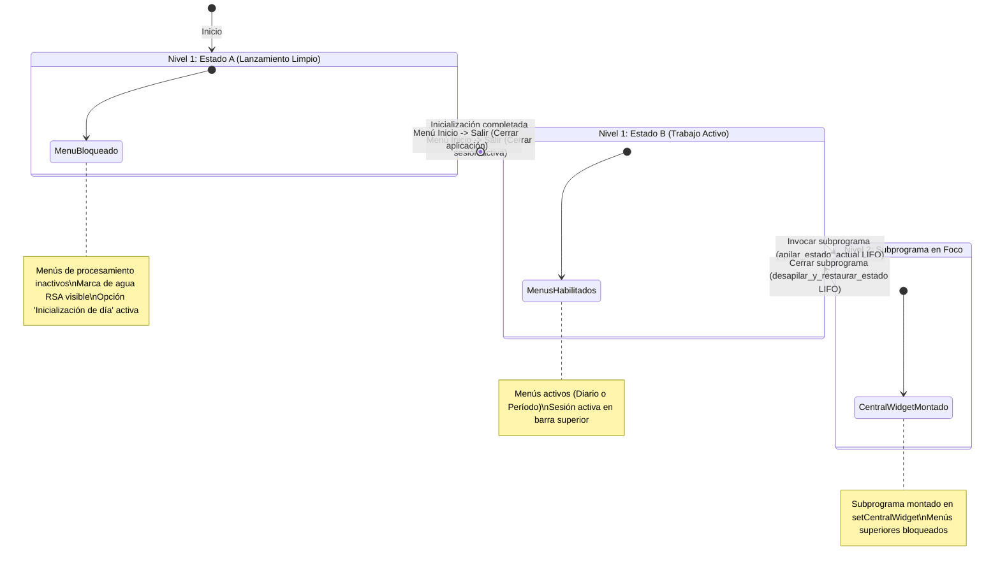

# `src/programa_integrado.py` — Contexto Técnico para Agentes IA

> Contenedor principal de ventana única (`QMainWindow`) que orquesta todos los subprogramas sísmicos de la Red Sísmica de Alerta (RSA), administrando la máquina de estados, la navegación LIFO y la identidad visual institucional.

**Ruta**: `src/programa_integrado.py`  
**Lenguaje**: Python 3 (PyQt5, Matplotlib)  
**Dependencias**: `PyQt5`, `obspy`, `matplotlib`, `librerias.metodos_rsa`, `librerias.metodos_gestion`, `librerias.rsa_procesamiento`, `librerias.panel_estado`  
**Proceso**: Punto de entrada principal (`python src/programa_integrado.py`).

---

## 1. Arquitectura de Navegación y Pila LIFO

`VentanaPrincipal` gestiona el ciclo de vida de los subprogramas y la preservación de sesión mediante una pila LIFO (*Last In, First Out*):

---

## 2. Contratos de Datos y E/S

* **Variables de Sesión Activa**:
  * `self.archivo`: Ruta canónica del día activo (`.../AAAAMMDD000000`).
  * `self.directorio_trabajo`: Directorio raíz de datos.
  * `self.responsable`: Analista u operador en turno.
  * `self.periodo`: Franja horaria seleccionada (ej. `"00:00 - 12:00"`).

* **Estructura de la Pila LIFO (`self.pila_estados`)**:
  * Cada elemento apilado contiene la tupla de variables de sesión, el estado de habilitación de menús y la configuración del banner.

---

## 3. Componentes y Métodos Clave

| Método | Tipo | Descripción |
|---|---|---|
| `VentanaPrincipal` | `QMainWindow` | Ventana contenedora única y gestor de eventos de alto nivel. |
| `cargar_widget_menu(tipo_widget, ...)` | Método | Instancia un subprograma, guarda el estado previo en `pila_estados`, bloquea menús y monta el widget central. |
| `apilar_estado_actual()` | Método | Guarda el estado completo de la ventana antes de entrar a un subprograma. |
| `desapilar_y_restaurar_estado()` | Método | Restaura el estado previo al desapilar del gestor LIFO. |
| `volver_estado_trabajo()` | Método | Desmonta el subprograma activo y restablece el Estado B mediante `QTimer.singleShot`. |
| `paintEvent(event)` | Evento | Dibuja la marca de agua institucional con opacidad controlada únicamente cuando no hay subprograma activo. |

---

## 4. Decisiones de Diseño y Estabilidad C++

1. **Retorno de Control Asíncrono y Atómico**:
   * Ejecutado con `QTimer.singleShot(0, self.volver_estado_trabajo)` con guarda de reentrada `self._retomando_control`.
2. **Invariante C++ (Cero `delattr`)**:
   * No se invoca `delattr` sobre atributos de `QMainWindow` para no corromper punteros internos del binding de PyQt5/C++.
3. **Cierre Controlado en `paintEvent`**:
   * Manejo con `try/finally` asegurando siempre la llamada a `painter.end()`.

---

## 5. Riesgos Técnicos y Deuda Técnica

* **Subprogramas Legados Basados en `QMainWindow`**:
  * La inserción de ventanas `QMainWindow` como `centralWidget` genera comportamientos erráticos de menús; deben migrarse progresivamente a `QWidget` como se hizo con `Marcar_evento` y `Extraer_evento`.

---

## 6. Checklist de Verificación y Regresión

- [x] Transición limpia entre Estado A y Estado B tras inicializar el día.
- [x] Apertura y cierre de subprogramas preservan la sesión sin duplicar barras de menú.
- [x] Marca de agua visible en Estado A y B, y oculta cuando un subprograma está activo.
- [x] Menú Inicio -> Salir cierra la sesión en Estado B y cierra la app en Estado A.
