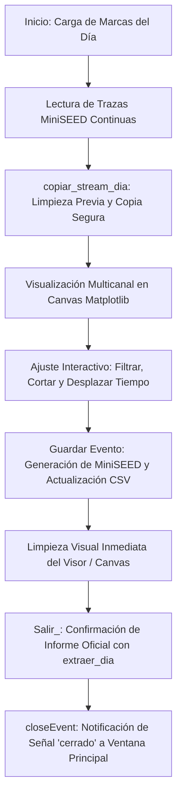

# `src/subprogramas/extraer_integrado.py` — Contexto Técnico para Agentes IA

> Módulo interactivo para la visualización gráfica multicanal de sismos en tiempo continuo, aplicación de filtros Butterworth, recorte temporal interactivo, guardado y extracción hacia archivos MiniSEED y catálogo CSV oficial.

**Ruta**: `src/subprogramas/extraer_integrado.py`  
**Lenguaje**: Python 3 (PyQt5, ObsPy, Matplotlib)  
**Dependencias**: `PyQt5`, `obspy.Stream`, `matplotlib.backends.backend_qt5agg.FigureCanvasQTAgg`, `librerias.metodos_rsa`, `librerias.metodos_gestion`, `librerias.rsa_procesamiento`, `librerias.rsa_io`  
**Proceso**: Invocado desde `src/programa_integrado.py` (Menú Procesamiento &rarr; Extraer).

---

## 1. Arquitectura y Flujo de Extracción Sismológica

---

## 2. Gestión Crítica de Memoria y Ciclo de Vida en PyQt5

1. **Gestión de Streams en Múltiples Eventos (`copiar_stream_dia`)**:
   * En cada carga o desplazamiento temporal de un evento, `copiar_stream_dia()` recicla los streams existentes y genera copias limpias de `lectura_mseed_dia`, manteniendo un consumo de memoria RAM plano e impidiendo fugas acumulativas al procesar 30 o más eventos.
2. **Limpieza Visual del Visor (`visor_limpiar_completo`)**:
   * Tras guardar cada evento, limpia los axes (`self.visor.clear()`) y refresca inmediatamente el lienzo con `self.canvas.draw()`, evitando que queden trazas residuales del evento anterior en pantalla.
   * **Invariante C++**: No invoca `plt.close(self.visor)` en tiempo de ejecución para evitar corromper los punteros C++ del `FigureCanvasQTAgg`.
3. **Cierre Estándar y Seguro (`Salir_` / `closeEvent`)**:
   * `Salir_()` gestiona el diálogo para consolidar el reporte oficial con `extraer_dia()` y llama a `self.close()`.
   * `closeEvent()` emite la señal `cerrado` y acepta el evento en Qt, permitiendo que la ventana principal (`VentanaPrincipal`) retome el control mediante su gestor LIFO.

---

## 3. Componentes y Métodos Clave

| Método / Control | Tipo | Descripción |
|---|---|---|
| `Extraer_evento` | `QMainWindow` | Ventana del subprograma con panel izquierdo de control y visor Matplotlib a la derecha. |
| `cargar_eventos()` | Método | Carga la marca seleccionada en `cmbx_eventos`, invoca `copiar_stream_dia()` y grafica la ventana temporal. |
| `guardar_evento()` | Método | Persiste el evento en disco, actualiza el catálogo auxiliar y blanquea el visor inmediatamente. |
| `copiar_stream_dia()` | Método | Duplica los streams de registro continuo para manipulación y filtrado interactivo. |
| `visor_limpiar_completo()` | Método | Limpia los axes del objeto `Figure` sin romper el enlace con el canvas. |
| `Salir_()` | Método | Solicita confirmación para extraer el día y cierra la interfaz. |
| `closeEvent(event)` | Evento | Emite la señal `cerrado` para notificar al contenedor principal. |
