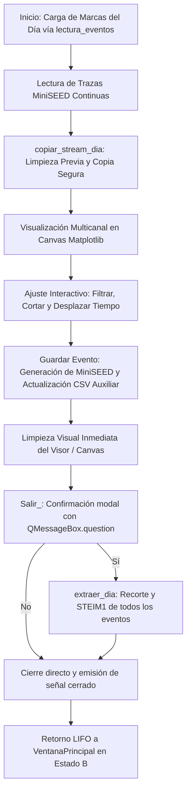

# `src/subprogramas/extraer_integrado.py` — Contexto Técnico para Agentes IA

> Módulo interactivo para la visualización gráfica multicanal de sismos en tiempo continuo, aplicación de filtros Butterworth, recorte temporal interactivo, guardado y extracción hacia archivos MiniSEED y catálogo CSV oficial.

**Ruta**: `src/subprogramas/extraer_integrado.py`  
**Lenguaje**: Python 3 (PyQt5, ObsPy, Matplotlib)  
**Dependencias**: `PyQt5.QtWidgets.QWidget`, `obspy.Stream`, `matplotlib.backends.backend_qt5agg.FigureCanvasQTAgg`, `librerias.metodos_rsa`, `librerias.metodos_gestion`, `librerias.rsa_procesamiento`, `librerias.rsa_io`  
**Proceso**: Invocado desde `src/programa_integrado.py` (Menú Procesamiento &rarr; Extraer).

---

## 1. Arquitectura y Flujo de Extracción Sismológica

---

## 2. Gestión de Memoria y Arquitectura `QWidget`

1. **Jerarquía Nativa `QWidget`**:
   * `Extraer_evento` hereda estrictamente de `QWidget` (eliminando la antigua estructura `QMainWindow`).
   * Carga `Extraer.ui` directamente en un `QHBoxLayout(self)` sin reasignar ni destruir `centralWidget`, evitando punteros *Use After Free* en C++.
   * Acceso transparente a controles mediante delegación `__getattr__` hacia `self.ui`.
2. **Gestión de Streams en Múltiples Eventos (`copiar_stream_dia`)**:
   * En cada carga o desplazamiento temporal de un evento, `copiar_stream_dia()` recicla los streams existentes y genera copias limpias de `lectura_mseed_dia`, manteniendo un consumo de memoria RAM plano e impidiendo fugas acumulativas al procesar decenas de eventos.
3. **Limpieza Visual del Visor (`visor_limpiar_completo`)**:
   * Tras guardar cada evento, limpia los axes (`self.visor.clear()`) y refresca inmediatamente el lienzo con `self.canvas.draw()`, evitando trazas residuales en pantalla.
4. **Cierre Estándar y Seguro (`Salir_` / `closeEvent`)**:
   * `Salir_()` abre el diálogo de confirmación anclado a `self.window()` y llama a `self.close()`.
   * `closeEvent()` emite la señal `cerrado` y acepta el evento en Qt, permitiendo que `VentanaPrincipal` retome el control mediante su gestor LIFO.

---

## 3. Componentes y Métodos Clave

| Método / Control | Tipo | Descripción |
|---|---|---|
| `Extraer_evento` | `QWidget` | Panel de subprograma con controles de filtrado y corte a la izquierda y visor Matplotlib a la derecha. |
| `cargar_eventos()` | Método | Carga la marca seleccionada en `cmbx_eventos`, invoca `copiar_stream_dia()` y grafica la ventana temporal. |
| `guardar_evento()` | Método | Persiste el evento en disco, actualiza el catálogo auxiliar y blanquea el visor inmediatamente. |
| `copiar_stream_dia()` | Método | Duplica los streams de registro continuo para manipulación y filtrado interactivo. |
| `visor_limpiar_completo()` | Método | Limpia los axes del objeto `Figure` sin romper el enlace con el canvas. |
| `Salir_()` | Método | Solicita confirmación para extraer el día y cierra la interfaz. |
| `closeEvent(event)` | Evento | Emite la señal `cerrado` para notificar al contenedor principal. |

---

## 4. Contratos de Datos y E/S

* **Entrada**:
  * `Directorio_base/marcas.json` (o `puntos.csv`): Marcas temporales UTC leídas por `lectura_eventos()`.
  * `mseed/registros/*.mseed`: Señales continuas de 24h a 100/250 Hz.
* **Salida**:
  * `Directorio_base/AAAAMMDD_aux.csv`: Catálogo auxiliar interactivo con metadatos y filtros por estación.
  * `mseed/eventos/EST_AAAAMMDD_hhmmss.mseed`: Trazas recortadas por evento en compresión `STEIM1`.
  * `Directorio_base/AAAAMMDD000000.csv`: Catálogo consolidado oficial reindexado secuencialmente.
  * `Directorio_dia/AAAAMMDD_hhmmss.sis`: Archivo binario generado únicamente para eventos de tipo `SISMO`.

---

## 5. Riesgos Técnicos y Deuda Técnica

> [!IMPORTANT]
> **Directiva de Deuda Técnica para Subprogramas**:
> Todos los subprogramas que se integren en `programa_integrado.py` deben heredar de `QWidget` (o `QDialog` para modales) y sus archivos `.ui` deben tener raíz `<widget class="QWidget">`. Cualquier subprograma legado que aún mantenga `QMainWindow` debe ser catalogado como deuda técnica crítica para migración inmediata a `QWidget`.

---

## 6. Checklist de Verificación y Regresión

- [x] Raíz XML de `src/ui/Extraer.ui` configurada como `QWidget`.
- [x] `Extraer_evento` hereda de `QWidget`.
- [x] Delegación de controles mediante `__getattr__` hacia `self.ui`.
- [x] Diálogos modales anclados a `self.window()`.
- [x] `extraer_dia()` completa la extracción de 11+ eventos sin colisiones de memoria.
- [x] Retorno LIFO a `VentanaPrincipal` exitoso en Estado B.

