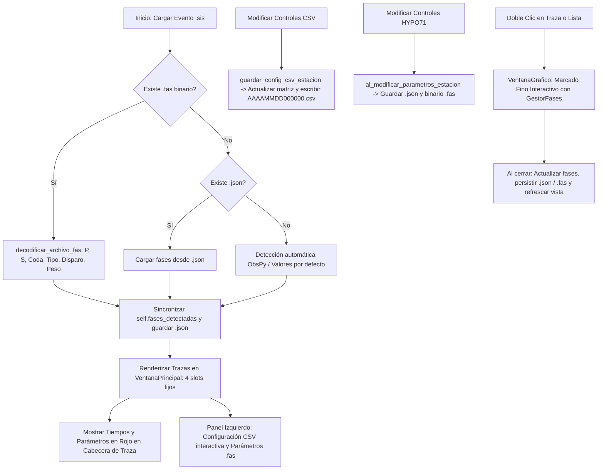

# `src/subprogramas/fases.py` — Contexto Técnico para Agentes IA

> Subprograma de visualización y marcado interactivo de fases sísmicas (P, S, Coda), sincronización bidireccional con formato binario `.fas` (HYPO71), edición interactiva de la matriz de eventos `.csv`, y despliegue integrado en `VentanaPrincipal` y `VentanaGrafico`.

**Ruta**: `src/subprogramas/fases.py`  
**Lenguaje**: Python 3 (PyQt5, ObsPy, Matplotlib)  
**Dependencias**: `PyQt5`, `obspy`, `matplotlib`, `librerias.gestor_fases.GestorFases`, `librerias.metodos_rsa`, `librerias.metodos_gestion`, `librerias.rsa_io`  
**Proceso**: Invocado desde `src/programa_integrado.py` (`Procesamiento -> Marcar fases`).

---

## 1. Arquitectura y Flujos de Ejecución



---

## 2. Contratos de Datos y Formato Binario `.fas` (HYPO71)

### 2.1. Estructura del Diccionario `self.fases_detectadas[archivo]`
```python
{
    "P": [4.87],            # Tiempo de arribo fase P en segundos relativos
    "S": [16.11],           # Tiempo de arribo fase S en segundos relativos
    "Coda": [20.47],        # Tiempo absoluto de término de coda en segundos
    "tipo_p": "I",          # 'I' (Impulsivo), 'E' (Emergente) o ' '
    "polaridad_p": "+",     # '+' (Up/Compresión), '-' (Down/Dilatación) o ' '
    "peso_p": 0,            # Ponderación HYPO71 de 0 (100%) a 4 (0%/Excluir)
    "polaridad_s": " ",     # '+' / '-' / ' '
    "peso_s": 2             # Ponderación HYPO71 de 0 a 4
}
```

### 2.2. Estructura Binaria Canónica del Archivo `.fas` (16 ranuras x 61 bytes)
Cada ranura de estación contiene bloques binarios estructurados de longitud fija:
* **Bloque P (24 bytes)**: `{cod_est:<4}{tipo_p}P{polaridad_p}{peso_p} {AAMMDDhhmmss.ss}` precedido por headers `\x02\x00\x01\x00\x08\x00\x18\x00`.
* **Bloque S (9 bytes)**: `{segundo:5.2f} S{polaridad_s}{peso_s}` precedido por float64 Little-Endian de segundos y headers `\x08\x00\x09\x00`.
* **Bloque Coda (4 bytes)**: `{coda_dur:4.1f}` precedido por headers `\x02\x00\x01\x00\x08\x00\x04\x00`.

### 2.3. Formato del Token de Estación en Matriz CSV (`EEEECBFFIISS`)
* `EEEE`: Código de estación (4 caracteres, ej. `LABR`, `CUSH`).
* `C`: Canal / Componente (`1`, `2`, `3`, `Z`, etc.).
* `B`: Aporte a la solución (`1` = Aporta, `0` = No aporta).
* `FF`: Orden del filtro Butterworth (2 dígitos, ej. `02`).
* `II`: Frecuencia de corte inferior $f_{\text{inf}}$ en Hz (2 dígitos, ej. `01`).
* `SS`: Frecuencia de corte superior $f_{\text{sup}}$ en Hz (2 dígitos, ej. `10`).

---

## 3. Componentes y Métodos Clave

| Método / Clase | Tipo | Descripción |
|---|---|---|
| `VentanaPrincipal` | `QMainWindow` | Ventana principal que incrusta controles y visualizador paginado. |
| `decodificar_archivo_fas(ruta_fas)` | Método | Realiza ingeniería inversa sobre el archivo `.fas` extrayendo marcas, polaridades y pesos. |
| `construir_archivo_fas(ruta_fas)` | Método | Genera el archivo binario estructurado de 16 ranuras canónicas `.fas`. |
| `al_cambiar_estacion_seleccionada(current)` | Slot | Sincroniza los combos y controles interactivos al cambiar de estación en la lista. |
| `al_modificar_parametros_estacion()` | Slot | Actualiza `fases_detectadas` y guarda concurrentemente `{evento}.json` y `{evento}.fas`. |
| `al_modificar_config_csv_estacion()` | Slot | Actualiza el token `EEEECBFFIISS`, guarda el archivo `.csv` y refresca el filtrado. |
| `al_hacer_click_en_canvas(event)` | Slot | Gestiona selección con clic simple y apertura de `VentanaGrafico` con doble clic en traza. |
| `VentanaGrafico` | `QMainWindow` | Subventana de zoom y marcado interactivo mediante `GestorFases`. |

---

## 4. Decisiones de Diseño y Algoritmos

1. **Incrustación 100% en Ventana Principal**:
   * Todos los controles de edición de parámetros sísmicos y del CSV están ubicados en el panel izquierdo de la ventana principal, evitando ventanas modales forzadas.
2. **Prioridad y Coexistencia `.fas` $\leftrightarrow$ `.json`**:
   * Prevalencia del archivo binario `.fas` como fuente de verdad histórica; al cargar se traduce a `.json`, y al guardar se sincronizan ambos formatos en paralelo.
3. **Colores Institucionales de Fases**:
   * Fase P: Rojo (`'red'`).
   * Fase S: Naranja (`'darkorange'`).
   * Coda: Verde (`'green'`).
4. **Resumen en Cabecera de Traza**:
   * Visualización en rojo en la esquina superior derecha de cada gráfico con la descripción compacta: `P: 4.87s [IP+0] | S: 16.11s [S 2] | Coda: 20.47s | Ts-Tp: 11.24s`.

---

## 5. Riesgos Técnicos y Deuda Técnica

* **Límite de 16 Ranuras en `.fas`**:
  * El formato HYPO71 legado de la RSA admite hasta 16 ranuras fijas; si una red cuenta con más de 16 canales, se priorizan las primeras 16 estaciones aportantes.
* **Tokens CSV de Longitud Variable**:
  * El analizador soporta tolerancias para tokens con o sin espacios en códigos de estación de 3 o 4 letras.

---

## 6. Checklist de Verificación y Regresión

- [x] Sincronización bidireccional `.fas` y `.json` funcional y probada con coincidencia binaria.
- [x] Panel interactivo CSV (`chk_csv_aporta`, `spbox_csv_canal`, `spbox_csv_orden`, `spbox_csv_finf`, `spbox_csv_fsup`) persiste cambios en `AAAAMMDD000000.csv`.
- [x] Tiempos y parámetros HYPO71 visibles en rojo en la esquina superior derecha de cada traza.
- [x] Doble clic abre la subventana de detalle tanto desde la lista como directamente sobre el gráfico.

