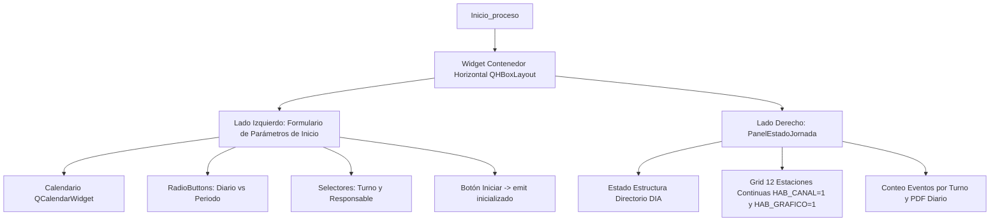

# `src/subprogramas/inicio.py` — Contexto Técnico para Agentes IA

> Módulo de configuración e inicialización de jornada sísmica (selección de fecha, analista responsable, turno diario o consolidado por período) con diagnóstico en tiempo real integrado mediante `PanelEstadoJornada`.

**Ruta**: `src/subprogramas/inicio.py`  
**Lenguaje**: Python 3 (PyQt5)  
**Dependencias**: `PyQt5`, `librerias.panel_estado.PanelEstadoJornada`, `librerias.metodos_rsa`, `librerias.metodos_gestion`  
**Proceso**: Invocado desde `src/programa_integrado.py` (`Inicio -> Inicialización de día`).

---

## 1. Arquitectura y Componentes

`Inicio_proceso` une el formulario interactivo de `inicio.ui` con el panel lateral de diagnóstico `PanelEstadoJornada`:

---

## 2. Contratos de Datos y E/S

* **Parámetros del Constructor (`__init__`)**:
  * `directorio_trabajo` (str): Ruta base del repositorio `DIA`.
  * `responsable` (str): Nombre del operador o responsable activo.
  * `periodo` (str): Turno horario o período configurado.

* **Señal Emitida (`inicializado`)**:
  * Firma: `inicializado = pyqtSignal(str, str, str, str)`
  * Argumentos: `(archivo, directorio_trabajo, responsable, periodo)`.

---

## 3. Componentes y Métodos Clave

| Método / Control | Tipo | Descripción |
|---|---|---|
| `Inicio_proceso` | `QMainWindow` | Ventana de configuración de inicio con formulario a la izquierda y diagnóstico a la derecha. |
| `seleccionar_diario(estado)` | Método | Configura los turnos (`00:00-12:00`, `12:00-18:00`, `18:00-24:00`) y habilita el calendario. |
| `seleccionar_periodo(estado)` | Método | Deshabilita el calendario y limpia el período para procesamiento acumulado. |
| `Iniciar()` | Método | Valida campos, emite la señal `inicializado(...)` y cierra la ventana. |
| `showDate(date)` | Método | Actualiza la ruta activa y refresca el diagnóstico en tiempo real en `panel_estado`. |

---

## 4. Decisiones de Diseño y Algoritmos

1. **Diseño Ergonómico de Doble Panel**:
   * Panel izquierdo de ancho fijo (280 px) para captura de parámetros; panel derecho expansible para visualización de tarjetas de estado de estaciones y turnos.
2. **Filtro Estricto de Monitoreo Continuo**:
   * En el diagnóstico solo se evalúan estaciones que satisfacen:
     $$\text{HAB\_CANAL} == \text{'1'} \quad \land \quad \text{HAB\_GRAFICO} == \text{'1'}$$

---

## 5. Riesgos Técnicos y Deuda Técnica

* **Migración a QWidget**:
  * Aunque opera dentro del orquestador, está catalogado para migración a `QWidget` para unificar el estándar de integración.

---

## 6. Checklist de Verificación y Regresión

- [x] Selección de fecha en calendario actualiza inmediatamente el diagnóstico.
- [x] Alternancia Diario/Período habilita/deshabilita los selectores correspondientes.
- [x] Botón Iniciar emite la señal `inicializado` con las 4 cadenas de parámetros requeridas.
