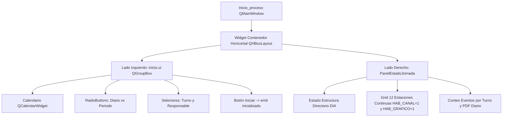

# `src/subprogramas/inicio.py` — Contexto Técnico para Agentes IA

> Módulo de configuración e inicialización de jornada sísmica (selección de fecha, analista responsable, turno diario o consolidado por período) con diagnóstico en tiempo real.

**Ruta**: `src/subprogramas/inicio.py`  
**Lenguaje**: Python 3 (PyQt5)  
**Dependencias**: `PyQt5`, `panel_estado.PanelEstadoJornada`, `metodos_rsa`, `metodos_gestion`  

---

## 1. Arquitectura y Componentes

`Inicio_proceso` une el formulario interactivo de `inicio.ui` con el panel lateral de diagnóstico `PanelEstadoJornada`:

---

## 2. Métodos y Contratos

| Método | Descripción |
|---|---|
| `__init__(dir_trabajo, resp, periodo)` | Inicializa la interfaz fijando por defecto la fecha del sistema, selección Diario y turno `00:00 - 12:00`. |
| `seleccionar_diario(estado)` | Configura los turnos (`00:00-12:00`, `12:00-18:00`, `18:00-24:00`) y habilita el calendario. |
| `seleccionar_periodo(estado)` | Deshabilita el calendario y limpia el período para procesamiento acumulado. |
| `Iniciar()` | Emite la señal `inicializado(archivo, dir_trabajo, resp, periodo)` y cierra el diálogo. |
| `showDate(date)` | Actualiza la ruta activa y refresca el diagnóstico en tiempo real en `panel_estado`. |

---

## 3. Filtro Estricto de Monitoreo Continuo
En el diagnóstico de estaciones solo se despliegan las 12 estaciones de monitoreo continuo activo (`LABR`, `CUSH`, `CHAI`, `UVER`, `FLAD`, `TENG`, `CHA2`, `CHA1`, `CHAB`, `PRM1`, `TST1`, `OBSD`), discriminadas mediante:
$$\text{HAB\_CANAL} == \text{'1'} \quad \land \quad \text{HAB\_GRAFICO} == \text{'1'}$$
