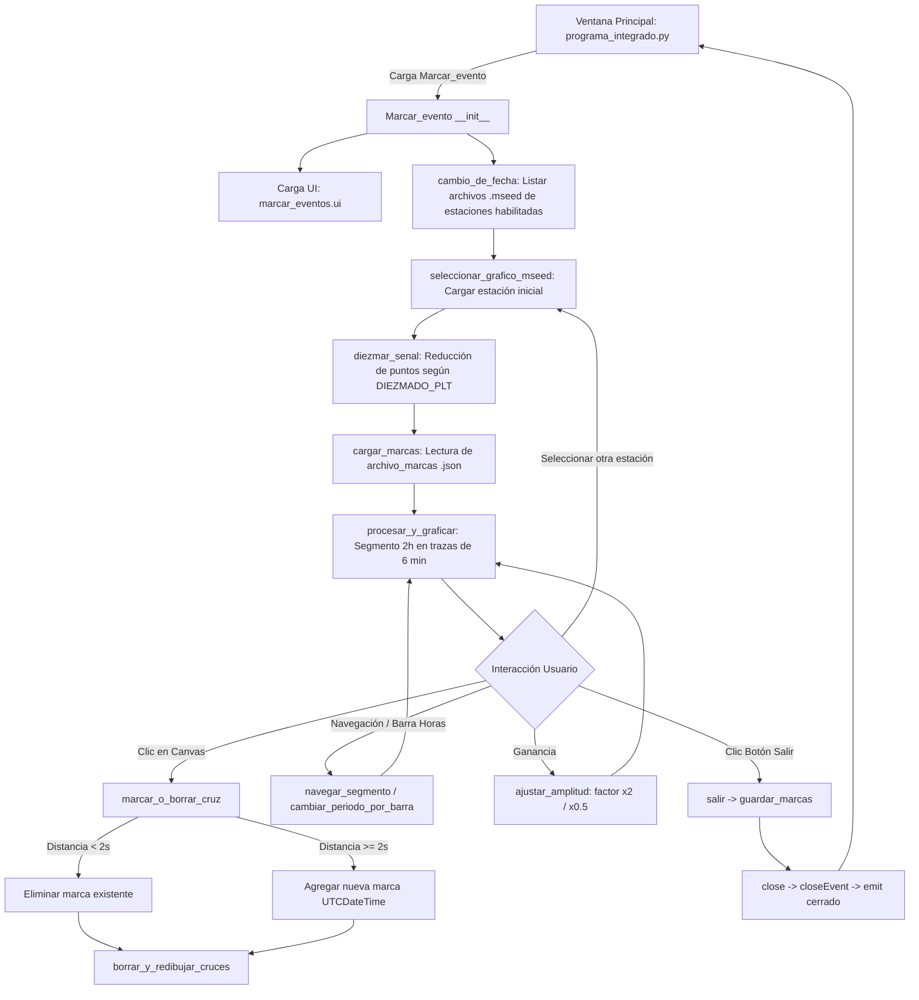

# `src/subprogramas/marcar_eventos.py` — Contexto Técnico para Agentes IA

> Subprograma de inspección y marcado manual de eventos sísmicos sobre registros continuos de 24 horas (MiniSEED), visualizados en segmentos de 2 horas (renglones de 6 minutos) con interacción directa para crear, ajustar o suprimir marcas temporales persistidas en JSON.

**Ruta**: `src/subprogramas/marcar_eventos.py`  
**LOC**: 408 | **Lenguaje**: Python 3 (PyQt5, Matplotlib, ObsPy, NumPy)  
**Dependencias**: `PyQt5.QtWidgets.QWidget`, `obspy`, `matplotlib`, `numpy`, `librerias.metodos_rsa.parametros_estaciones`, `librerias.metodos_gestion.obtener_directorios`, `librerias.metodos_sismicos.diezmar_senal`  
**Proceso**: Invocado desde el menú principal `src/programa_integrado.py` (`Procesamiento -> Marcar eventos`) mediante `cargar_widget_menu()`.


---

## 1. Arquitectura y Flujo de Interacción



---

## 2. Parámetros Operativos y Contratos de Datos

### 2.1. Entradas del Constructor (`__init__`)
* `archivo` (str): Ruta base del día con formato canónico `.../YYYYMMDD000000`.
* `directorio_trabajo` (str): Ruta raíz del repositorio de datos del día (ej. `G:/Mi unidad/DIA/`).
* `responsable` (str): Identificador del operador o institución activa.
* `periodo` (str): Período horario de análisis inicial (ej. `00:00 - 12:00`).

### 2.2. Esquema de Persistencia de Marcas (`marcas.json`)
Las marcas se leen y escriben en la ruta `directorios['archivo_marcas']` estructuradas como una lista JSON de marcas de tiempo en formato estándar ISO-8601 UTC:
```json
[
  "2026-08-24T00:37:46.000000Z",
  "2026-08-24T04:36:54.000000Z",
  "2026-08-24T12:40:11.000000Z"
]
```

---

## 3. Componentes, Métodos y Lógica de Renderizado

| Elemento / Método | Firma / Tipo | Descripción y Responsabilidad |
|---|---|---|
| `CustomScrollArea` | `QScrollArea` | Área de desplazamiento personalizada que soporta *scroll* horizontal mediante `Shift + Rueda del Ratón`. |
| `Marcar_evento` | `QWidget` | Clase principal que orquesta la carga de datos MiniSEED, el visualizador helicoidal y las marcas. |
| `cambio_de_fecha()` | `()` | Lista y ordena los archivos MiniSEED del directorio según `CODIGO` y el flag `HAB_CANAL == '1'` de `parametros_estaciones()`. |
| `seleccionar_grafico_mseed()` | `(item)` | Carga el archivo MiniSEED seleccionado, aplica diezmado rápido con `diezmar_senal()` y restaura la posición del visor. |
| `procesar_y_graficar()` | `()` | Dibuja el segmento de 2 horas en sub-líneas continuas de 6 minutos con separación vertical de `-2000` cuentas y ancho extendido en píxeles. |
| `marcar_o_borrar_cruz()` | `(event)` | Evento de clic en Matplotlib. Si el clic está a `< 2 s` de una marca previa, la suprime; de lo contrario, añade una nueva marca temporal ordenada. |
| `borrar_y_redibujar_cruces()` | `()` | Elimina selectivamente los artistas visuales de tipo cruz (`+`) del eje sin recomputar ni redibujar la serie temporal subyacente. |
| `ajustar_amplitud()` | `(factor)` | Multiplica o divide el escalado de visualización de amplitudes (`amplitude_factor`). |
| `navegar_segmento()` | `(direccion)` | Avanza o retrocede bloques de 2 horas respetando la duración real del archivo de registro. |
| `guardar_marcas()` | `()` | Serializa la lista `self.marcas` en formato ISO a `archivo_marcas` en formato JSON. |
| `limpiar_estado()` | `()` | Libera el canvas (`deleteLater()`), limpia la figura (`clf()`) y elimina buffers antes de desmontar el subprograma. |
| `closeEvent()` | `(event)` | Ejecuta `limpiar_estado()`, emite la señal `cerrado` para restaurar el menú LIFO y acepta el cierre. |

---

## 4. Algoritmo de Coordenadas y Conversión Tiempo / Píxel

Para renderizar 2 horas de datos de forma compacta y legible:
1. **Duración de línea**: Cada renglón horizontal representa $6\text{ minutos} = 360\text{ segundos}$.
2. **Duración de segmento**: Un bloque completo abarca $2\text{ horas} = 7200\text{ segundos} = 20\text{ renglones}$.
3. **Mapeo de clic**:
   $$\text{num\_linea} = \text{round}\left(\frac{y}{-2000}\right)$$
   $$\text{tiempo\_relativo} = x \cdot 60 + \text{num\_linea} \cdot 360$$
   $$\text{tiempo\_absoluto} = \text{inicio\_segmento} + \text{tiempo\_relativo}$$

---

## 5. Riesgos Específicos y Checklist de Estabilidad

1. **Gestión de Memoria en Streams Diarios**:
   * Los archivos MiniSEED de 24 horas a 100 Hz pueden contener más de $8.6 \times 10^6$ muestras.
   * `diezmar_senal()` es obligatorio antes del trazado para evitar bloqueos del hilo principal de PyQt5.
2. **Redibujado Eficiente de Marcas**:
   * Al agregar o quitar una marca, no se debe redibujar toda la serie temporal (`procesar_y_graficar()`), sino únicamente las líneas de cruces mediante `borrar_y_redibujar_cruces()`.
3. **Persistencia Automática**:
   * Al cambiar de estación en la lista (`seleccionar_grafico_mseed`) o salir del módulo (`salir`), las marcas existentes se guardan automáticamente en disco para evitar pérdidas accidentales.
4. **Ciclo de Vida LIFO y Arquitectura QWidget**:
   * El subprograma opera estrictamente como `QWidget` embebido, con `marcar_eventos.ui` como raíz `QWidget`.
   * El cierre emite `self.cerrado.emit()` y limpia los punteros Qt/Matplotlib en `limpiar_estado()`.

> [!IMPORTANT]
> **Directiva de Deuda Técnica para Subprogramas**:
> Todos los subprogramas que se integren en `programa_integrado.py` deben heredar de `QWidget` (o `QDialog` para modales) y sus archivos `.ui` deben tener raíz `<widget class="QWidget">`. Cualquier subprograma legado que aún mantenga `QMainWindow` debe ser catalogado como deuda técnica crítica para migración inmediata a `QWidget`.

