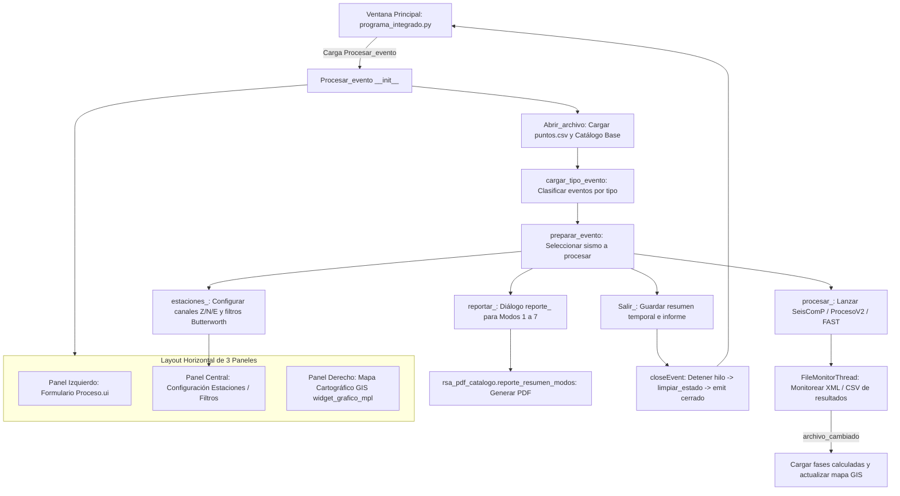

# `src/subprogramas/procesamiento_integrado.py` — Contexto Técnico para Agentes IA

> Núcleo operativo y analítico del procesamiento sísmico de la Red Sísmica de Alerta (RSA). Integra la revisión de eventos, picado de fases, localización hipocentral (SeisComP / ProcesoV2 / FAST), visualizador cartográfico GIS embebido y generación automatizada de catálogos y boletines PDF en 7 modalidades.

**Ruta**: `src/subprogramas/procesamiento_integrado.py`  
**LOC**: 1786 | **Lenguaje**: Python 3 (PyQt5, Matplotlib, ObsPy, NumPy, XML)  
**Dependencias**: `PyQt5`, `obspy`, `matplotlib`, `numpy`, `librerias.rsa_io`, `librerias.rsa_procesamiento`, `librerias.metodos_gis_rsa`, `librerias.metodos_rsa`, `librerias.metodos_gestion`, `librerias.metodos_reportes_individuales`, `librerias.rsa_pdf_catalogo`  
**Proceso**: Invocado desde la ventana principal `src/programa_integrado.py` (`Procesamiento -> Procesamiento integrado`) mediante `cargar_widget_menu()`.

---

## 1. Arquitectura de 3 Paneles y Flujo Operativo

---

## 2. Modalidades de Reporte Sísmico Institucional (Modos 1 a 7)

El módulo define y gestiona 7 modos de generación de catálogos y boletines PDF:

| Modo | Constante / Código | Denominación y Alcance Técnico |
|---|---|---|
| **M1** | `MODO_PERIODO_FRANJAS` (1) | Período por franjas horarias de turno (`00–12`, `12–18`, `18–24`) para control interno. |
| **M2** | `MODO_DIARIO_REVISION` (2) | Reporte diario de revisión con detalle técnico completo y eventos locales/dummies. |
| **M3** | `MODO_OFICIAL_DETALLADO` (3) | Boletín oficial detallado (solo eventos confirmados del catálogo) + página de responsables. |
| **M4** | `MODO_OFICIAL_RESUMEN` (4) | Resumen oficial institucional (solo catálogo condensado, sin desglose de fases). |
| **M5** | `MODO_FACULTAD_RESUMEN` (5) | Resumen ejecutivo institucional para Facultad y redes colaboradoras. |
| **M6** | `MODO_INSTITUCIONAL_DETALLADO` (6) | Catálogo técnico detallado sin campos administrativos de operadores. |
| **M7** | `MODO_INSTITUCIONAL_RESUMEN` (7) | Resumen institucional sintético de alta dirección. |

---

## 3. Clases y Componentes Principales

| Clase / Componente | Tipo / Herencia | Responsabilidad y Operaciones |
|---|---|---|
| `FileMonitorThread` | `QThread` | Hilo de monitoreo asíncrono que detecta modificaciones en archivos de salida de procesamiento sísmico (`.xml`, `.csv`) e informa a la GUI vía `archivo_cambiado`. |
| `Procesar_evento` | `QWidget` | Orquestador central de procesamiento sísmico, manejo de eventos, interacción con FAST/SeisComP, mapa GIS y reportes. |
| `Cambio_Coeficientes_Filtro` | `QWidget` | Subinterfaz para modificar interactivamente frecuencias de corte (`finf`, `fsup`) y orden de filtros Butterworth por canal. |
| `estaciones_` | `QWidget` | Subpanel integrado en el panel central para habilitar/deshabilitar estaciones, canales (`Z`, `N`, `E`) y ganancias visuales. |
| `reporte_` | `QDialog` | Diálogo modal interactivo para configurar y disparar la emisión de catálogos PDF en los modos 1 a 7. |

---

## 4. Métodos Clave de `Procesar_evento`

| Método | Firma | Descripción |
|---|---|---|
| `Abrir_archivo()` | `()` | Carga el archivo base del día, inicializa combos de filtros, listas de eventos y parsea el catálogo existente. |
| `preparar_evento()` | `(nombre_evento)` | Carga la traza MiniSEED del evento seleccionado, inicializa las fases sismológicas y actualiza el mapa GIS. |
| `procesar_()` | `()` | Ejecuta el procesamiento de fases sísmicas y localización hipocentral mediante ProcesoV2 / SeisComP / FAST. |
| `iniciar_monitor_virtual()` | `(archivos)` | Lanza el hilo `FileMonitorThread` para detectar la culminación de cálculos externos. |
| `detener_monitor_virtual()` | `()` | Solicita interrupción segura del hilo de monitoreo y espera su finalización (`quit()`, `wait()`). |
| `guardar_evento()` | `()` | Persiste el catálogo consolidado en `archivo_catalogo` ordenando cronológicamente y eliminando duplicados. |
| `actualizar_mapa()` | `(procesamiento)` | Redibuja el widget cartográfico `widget_mapa` (`widget_grafico_mpl`) con las estaciones y el nuevo epicentro. |
| `Salir_()` | `()` | Valida el guardado de reportes temporales pendientes y cierra el subprograma. |
| `limpiar_estado()` | `()` | Detiene monitores, limpia visores Matplotlib (`clf()`, `deleteLater()`) y vacía estructuras de memoria. |
| `closeEvent()` | `(event)` | Orquesta el desmontaje seguro, limpia el panel central y emite la señal `cerrado` hacia `VentanaPrincipal`. |

---

## 5. Contratos de Datos y Persistencia

### 5.1. Entradas del Constructor
* `archivo` (str): Ruta base del día (`.../YYYYMMDD000000`).
* `directorio_trabajo` (str): Directorio raíz de datos (`G:/Mi unidad/DIA/`).
* `responsable` (str): Operador o entidad responsable.
* `horario` (str): Turno operativo o período de análisis.

### 5.2. Archivos Generados y Modificados
* `archivo_catalogo` (`*_catalogo.csv`): Matriz de eventos procesados con tiempos de origen, coordenadas hipocentrales ($Lat, Lon, Prof$), magnitudes ($Ml, Mw$) y calidad de ajuste.
* `archivo_auxiliar` (`*_aux.csv`): Registro temporal de intentos de procesamiento y flags de revisión.
* `archivo_reporte` (`Reporte_*.pdf`): Documentos PDF oficiales generados por ReportLab con gráficos de fases e intensidades.

### 5.3. Filtrado Dinámico de Eventos en GUI
* `cargar_combo_eventos(self, text)`: Soporta filtrado selectivo por clasificación (`SISMO`, `FF`, `FC`, `INDEFINIDO`, etc.) y el modo global `'TODOS'`, que lista todos los eventos registrados del día sin importar su categoría.

---

## 6. Riesgos Específicos y Checklist de Estabilidad

1. **Ciclo de Vida de Hilos (`QThread`)**:
   * `FileMonitorThread` debe ser detenido explícitamente en `detener_monitor_virtual()` antes de cerrar el widget para evitar cierres abruptos de Python por hilos huérfanos.
2. **Punteros C++ de Subpaneles y Mapas**:
   * `estaciones_` y `widget_mapa` residen en los paneles central y derecho. `limpiar_panel_central()` y `limpiar_estado()` deben invocarse en `closeEvent` para evitar violaciones de acceso en Qt.
3. **Persistencia Atómica del Catálogo**:
   * Las operaciones sobre el catálogo deben ejecutar `ordenar_y_eliminar_duplicados()` antes de invocar `escritura_archivo()` para preservar la integridad cronológica.
4. **Navegación LIFO**:
   * El retorno a la ventana principal se rige exclusivamente por `self.cerrado.emit()` en `closeEvent()`.
