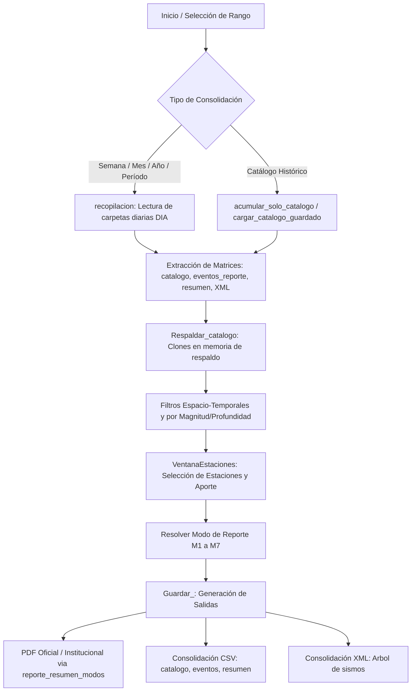

# `reporte_acumulado.py` — Contexto Técnico de Mantenimiento

> Subprograma de consolidación, filtrado espacio-temporal, análisis estadístico y generación de reportes acumulados (semanal, mensual, anual, por período o catálogo histórico) en formato PDF, CSV y XML para la Red Sísmica del Austro.

**Ruta**: [`src/subprogramas/reporte_acumulado.py`](file:///c:/proyectos/rsa_sismologia/src/subprogramas/reporte_acumulado.py)  
**LOC**: 1079 | **Lenguaje**: Python 3.9+ | **Framework**: PyQt5, ObsPy, Matplotlib, ReportLab  
**Interfaz UI**: [`src/ui/reporte_mensual.ui`](file:///c:/proyectos/rsa_sismologia/src/ui/reporte_mensual.ui)  
**Proceso**: Invocado desde `src/programa_integrado.py` o de forma independiente como subprograma.

---

## 1. Arquitectura y Flujo de Procesamiento

---

## 2. Modos de Reporte Soportados (M1 – M7)

| Modo | Constante | Descripción | Alcance |
|---|---|---|---|
| **M1** | `MODO_PERIODO_FRANJAS` | Período por franjas horarias (00–12, 12–18, 18–24) | Control interno y trazabilidad de turnos |
| **M2** | `MODO_DIARIO_REVISION` | Diario de revisión (día o ad-hoc) con detalle de eventos | Revisión operativa interna con dummies locales |
| **M3** | `MODO_OFICIAL_DETALLADO` | Oficial detallado (solo catálogo) + resumen de responsables | Informe oficial externo con desglose técnico |
| **M4** | `MODO_OFICIAL_RESUMEN` | Oficial resumen (solo catálogo, sin detalle) | Síntesis ejecutiva oficial |
| **M5** | `MODO_FACULTAD_RESUMEN` | Institucional resumen (Facultad / Redes), sin detalle | Reporte académico institucional |
| **M6** | `MODO_INSTITUCIONAL_DETALLADO` | Institucional detallado (solo catálogo), sin extras | Informe institucional técnico |
| **M7** | `MODO_INSTITUCIONAL_RESUMEN` | Institucional simplificado, sin detalle | Resumen ejecutivo general |

---

## 3. Modelo de Datos y Contratos

### 3.1. Estructura de Filas del `catalogo` (20 Columnas)
| Índice | Constante | Tipo | Descripción |
|---|---|---|---|
| 0 | `IDX_INDICE` | `int/str` | Identificador único / Secuencial del evento |
| 1 | `IDX_ANIO` | `str` | Año UTC (4 dígitos) |
| 2 | `IDX_MES` | `str` | Mes UTC (2 dígitos) |
| 3 | `IDX_DIA` | `str` | Día UTC (2 dígitos) |
| 4 | `IDX_HORA` | `str` | Hora UTC (2 dígitos) |
| 5 | `IDX_MINUTO` | `str` | Minuto UTC (2 dígitos) |
| 6 | `IDX_SEGUNDO` | `str` | Segundo UTC con decimales |
| 7 | `IDX_LATITUD` | `float/str` | Latitud epicentral en grados decimales |
| 8 | `IDX_LONGITUD` | `float/str` | Longitud epicentral en grados decimales |
| 9 | `IDX_PROFUNDIDAD`| `float/str` | Profundidad focal en kilómetros |
| 10 | `IDX_RMS` | `float/str` | Error cuadrático medio de localización |
| 11 | `IDX_E_X` | `float/str` | Error horizontal en X (km) |
| 12 | `IDX_E_Y` | `float/str` | Error horizontal en Y (km) |
| 13 | `IDX_E_0` | `float/str` | Error en tiempo de origen |
| 14 | `IDX_E_Z` | `float/str` | Error en profundidad en Z (km) |
| 15 | `IDX_MAGNITUD` | `float/str` | Magnitud calculada |
| 16 | `IDX_UNIDAD_MAG` | `str` | Tipo / Escala de magnitud (`Ml`, `Mw`, `Md`) |
| 17 | `IDX_FUENTE` | `str` | Red de origen (`RSA`, `IGEPN`, `USGS`) |
| 18 | `IDX_EVENTO` | `str` | Nombre o ruta relativa del archivo `.sis` |
| 19 | `IDX_LUGAR` | `str` | Descripción geográfica / Ubicación epicentral |

### 3.2. Invariantes del Sistema
- `self.catalogo[0]` contiene siempre los encabezados formales: `["Id","anio","mes","dia","hora","min","seg","lat","long","prof","rms","e-x","e-y","e-0","e-z","Mag","Tipo Mag","Fuente","ruta","Ubicacion"]`.
- `self.catalogo_respaldo` preserva la copia íntegra previa a la aplicación de filtros destructivos en memoria.
- Los filtros espaciales se calculan contra polígonos y rangos definidos por constantes `IDX_LONGITUD_MINIMA`, `IDX_LATITUD_MINIMA`, `IDX_LONGITUD_MAXIMA`, `IDX_LATITUD_MAXIMA`.

---

## 4. Inventario de Componentes y Métodos

### 4.1. Clase `VentanaEstaciones(QtWidgets.QDialog)`
- `__init__(parametros, parent=None)`: Construye diálogo modal de selección con checkboxes dinámicos y filtros rápidos (Sísmicos / Acelerográficos).
- `actualizar_estaciones()`: Filtra dinámicamente la lista según las casillas de tipo de sensor.
- `toggle_todos()`: Marca/desmarca masivamente todas las estaciones disponibles.
- `obtener_estaciones_seleccionadas()`: Retorna lista de índices enteros de estaciones habilitadas.

### 4.2. Clase `Reporte_periodo(QMainWindow)`
| Método | Modifica | Descripción | Riesgo |
|---|---|---|---|
| `__init__()` | Atributos de estado, UI | Inicializa formulario Qt, conecta botones y carga parámetros de estaciones. | Medio |
| `resolver_modo_desde_controles()` | Ninguno | Mapea la selección visual de radio buttons al entero de modo `M1..M7`. | Bajo |
| `inicializar_variables()` | `catalogo`, `resumen`, `eventos_reporte` | Limpia matrices en memoria previo a un nuevo escaneo. | Medio |
| `recopilacion()` | `catalogo`, `raiz`, `reporte_total` | Itera carpetas `AAAA_MM_DD` en el rango temporal acumulando eventos. | Alto |
| `filtros()` | `catalogo`, `nuevo_arbol` | Aplica filtros de magnitud, profundidad, tipo y ubicación sobre el catálogo. | Alto |
| `Respaldar_catalogo()` | `*_respaldo` | Genera copias profundas de catálogo, eventos y resumen. | Medio |
| `Cargar_catalogo()` | `catalogo`, `eventos_reporte` | Restaura el estado a partir de los respaldos guardados. | Medio |
| `acumular_solo_catalogo()` | `catalogo` | Consolida rápidamente archivos `_cat.csv` sin escanear archivos MiniSEED. | Medio |
| `estaciones()` | `reporte_total` | Escanea trazas MiniSEED diarias para contabilizar operatividad y ruido. | Muy Alto (E/S intensiva) |
| `Guardar_()` | Archivos PDF, CSV, XML | Ejecuta el guardado final y compila el reporte PDF con ReportLab. | Alto |
| `limpiar_estado()` | Punteros, figuras | Libera memoria de árboles XML, matrices y canvas. | Medio |
| `Salir_()` | Ventana | Cierra la ventana y emite señal `cerrado`. | Bajo |

---

## 5. Riesgos Técnicos y Deuda Técnica

### ⚠️ Deuda Técnica Prioritaria: Migración Canónica a `QWidget`
- **Estado Actual**: `Reporte_periodo` hereda de `QMainWindow` (`class Reporte_periodo(QMainWindow):`) y carga [`src/ui/reporte_mensual.ui`](file:///c:/proyectos/rsa_sismologia/src/ui/reporte_mensual.ui) directamente con `uic.loadUi(ruta_ui, self)`.
- **Riesgo**: Cuando este subprograma se aloja dentro del contenedor dinámico del menú principal (`programa_integrado.py`), embeber un `QMainWindow` dentro de otro `QMainWindow` puede ocasionar conflictos de jerarquía de eventos en Windows y comportamiento no estándar en redimensionamiento.
- **Acción Requerida**:
  1. Modificar [`src/ui/reporte_mensual.ui`](file:///c:/proyectos/rsa_sismologia/src/ui/reporte_mensual.ui) cambiando la raíz a `<widget class="QWidget" name="Reporte_mensual">` sin `centralwidget`.
  2. Refactorizar `class Reporte_periodo(QWidget)` para montarse directamente sobre un layout vertical u horizontal.

### Otros Riesgos Identificados
1. **Cálculo de fechas en límites de mes**: La expresión de resta directa de días `QDate(hoy.year, hoy.month, hoy.day - 7)` puede generar días inválidos (ej. día 0 o negativo) al inicio de mes si no se utiliza `hoy.addDays(-7)`.
2. **Filtrado Destructivo**: `filtros()` modifica `self.catalogo` in-place. Si no se llama `Respaldar_catalogo()` antes, se pierde el catálogo original.

---

## 6. Checklist de Regresión y Verificación

- [ ] La compilación con `py_compile` no arroja errores de sintaxis.
- [ ] La selección de período (semanal, mensual, anual) genera fechas válidas sin excepción de calendario.
- [ ] Los filtros de magnitud y profundidad no eliminan la fila 0 de encabezados del catálogo.
- [ ] La generación de PDF con `reporte_resumen_modos` respeta los modos M1 a M7 sin colapsar.
- [ ] El diálogo `VentanaEstaciones` permite filtrar por sismos/acelerógrafos y devuelve índices válidos.
- [ ] El cierre del subprograma emite la señal `cerrado` y permite regresar al menú principal de `programa_integrado.py`.
