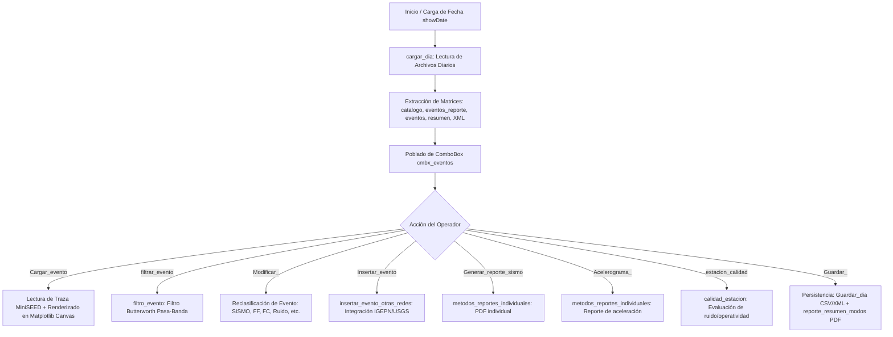

# `reporte_diario.py` — Contexto Técnico de Mantenimiento

> Subprograma de revisión, visualización multicanal, reclasificación de eventos, inserción de datos de otras redes (IGEPN, USGS), cálculo de calidad de estaciones y generación de reportes diarios oficiales en PDF/CSV/XML para la Red Sísmica del Austro.

**Ruta**: [`src/subprogramas/reporte_diario.py`](file:///c:/proyectos/rsa_sismologia/src/subprogramas/reporte_diario.py)  
**LOC**: 552 | **Lenguaje**: Python 3.9+ | **Framework**: PyQt5, ObsPy, Matplotlib, ReportLab  
**Interfaz UI**: [`src/ui/reporte.ui`](file:///c:/proyectos/rsa_sismologia/src/ui/reporte.ui)  
**Proceso**: Invocado desde `src/programa_integrado.py` o de forma independiente como subprograma.

---

## 1. Arquitectura y Flujo de Procesamiento

---

## 2. Dependencias y Relaciones

| Módulo | Elementos Utilizados | Propósito |
|---|---|---|
| [`src/librerias/rsa_io.py`](file:///c:/proyectos/rsa_sismologia/src/librerias/rsa_io.py) | `leer_mseed`, `Guardar_dia` | Lectura de trazas del día y persistencia atómica de reportes. |
| [`src/librerias/rsa_dominio.py`](file:///c:/proyectos/rsa_sismologia/src/librerias/rsa_dominio.py) | `calidad_estacion` | Cálculo de métricas de calidad y ruido por estación. |
| [`src/librerias/metodos_rsa.py`](file:///c:/proyectos/rsa_sismologia/src/librerias/metodos_rsa.py) | `grafico_evento_int`, `cargar_evento`, `cargar_dia`, `insertar_evento_otras_redes` | Funciones centrales de dominio sismológico. |
| [`src/librerias/rsa_pdf_catalogo.py`](file:///c:/proyectos/rsa_sismologia/src/librerias/rsa_pdf_catalogo.py) | `reporte_resumen_modos` | Compilación de reporte PDF según modos M1–M7. |
| [`src/librerias/metodos_gestion.py`](file:///c:/proyectos/rsa_sismologia/src/librerias/metodos_gestion.py) | `parametros_estaciones`, `obtener_directorios` | Mapeo de canales, rutas y metadatos. |
| [`src/librerias/metodos_reportes_individuales.py`](file:///c:/proyectos/rsa_sismologia/src/librerias/metodos_reportes_individuales.py) | `generar_reporte_sismo`, `generar_reporte_acelerograma` | Creación de fichas técnicas individuales. |

---

## 3. Modelo de Datos y Contratos

### 3.1. Estructura de `eventos_reporte`
- Fila 0: `[0, "Fecha; Hora (UTC)", "Evento", "Magn.", "Prof.(km)", "Lat.", "Long.", "Ubicación"]`
- Filas 1..N: Datos consolidados por evento listos para tabla de reporte diario.

### 3.2. Estructura de `catalogo`
- Matriz canónica de 20 columnas con parámetros hipocentrales (origen, coordenadas, profundidad, RMS, errores, magnitud, fuente, ruta `.sis`, ubicación).

### 3.3. Invariantes del Subprograma
- `self.eventos` mantiene la correspondencia exacta con el archivo `AAAAMMDD000000.csv` del día.
- `self.visor` es una instancia única de `Figure` reutilizada mediante `self.visor.clear()` para evitar fugas de memoria GDI en Windows.
- La señal `cerrado` se emite al finalizar la ejecución para permitir a `programa_integrado.py` restaurar el menú principal.

---

## 4. Inventario de Componentes y Métodos

### Clase `Reporte_diario(QMainWindow)`
| Método | Modifica | Descripción | Riesgo |
|---|---|---|---|
| `__init__()` | Atributos de estado, UI | Carga la interfaz `.ui`, inicializa el lienzo Matplotlib y conecta señales. | Medio |
| `showDate()` | `self.archivo`, directorios | Actualiza la fecha seleccionada desde el calendario Qt y lanza `cargar_dia()`. | Medio |
| `cargar_dia()` | `catalogo`, `eventos`, `resumen` | Carga matrices del día y puebla el combo de eventos. | Alto |
| `Cargar_evento()` | `trCanal`, `visor` | Lee el evento seleccionado y lo dibuja en el canvas. | Alto |
| `Graficar_()` | `visor`, `canvas` | Dibuja trazas multicanal del evento seleccionado. | Medio |
| `cambio_pagina()` | `self.pagina`, `visor` | Avanza en la paginación de estaciones (bloques de 6). | Bajo |
| `filtrar_evento()` | `trCanal`, `visor` | Aplica filtro pasa-banda interactivo a la visualización activa. | Medio |
| `Modificar_()` | `eventos_reporte`, `eventos` | Actualiza la clasificación del evento seleccionado. | Medio |
| `Insertar_evento()` | `catalogo`, `eventos` | Inserta solución hipocentral de redes externas (IGEPN, etc.). | Alto |
| `Generar_reporte_sismo()` | Archivo PDF | Genera ficha técnica de sismo individual. | Medio |
| `Acelerograma_()` | Archivo PDF | Genera ficha técnica de acelerograma. | Medio |
| `estacion_calidad()` | Diálogo `estaciones_` | Abre diálogo para cálculo de calidad y niveles de ruido. | Medio |
| `Guardar_()` | Archivos CSV, XML, PDF | Guarda matrices diarias y genera el PDF de reporte diario. | Alto |
| `limpiar_estado()` | Punteros, figuras | Libera canvas, figuras y datos en memoria. | Medio |
| `Salir_()` | Ventana | Cierra la ventana y emite señal `cerrado`. | Bajo |

---

## 5. Riesgos Técnicos y Deuda Técnica

### ⚠️ Deuda Técnica Prioritaria: Migración Canónica a `QWidget`
- **Estado Actual**: `Reporte_diario` hereda de `QMainWindow` (`class Reporte_diario(QMainWindow):`) y carga [`src/ui/reporte.ui`](file:///c:/proyectos/rsa_sismologia/src/ui/reporte.ui) directamente con `uic.loadUi(ruta_ui, self)`.
- **Riesgo**: Al integrarse dinámicamente en el contenedor central de `programa_integrado.py` (`VentanaPrincipal`), incrustar un `QMainWindow` dentro de otro genera inconsistencias en la barra de menú, barras de herramientas y despachos de foco en Windows.
- **Acción Requerida**:
  1. Convertir la raíz de [`src/ui/reporte.ui`](file:///c:/proyectos/rsa_sismologia/src/ui/reporte.ui) a `<widget class="QWidget" name="Reporte">`.
  2. Refactorizar `class Reporte_diario(QWidget)` montándolo directamente en un layout horizontal (`QHBoxLayout(self)`) con ancho fijo de panel de controles y expansión dinámica del canvas.

---

## 6. Checklist de Regresión y Verificación

- [ ] `py_compile` compila `reporte_diario.py` sin errores de sintaxis.
- [ ] La selección de fecha en el calendario carga correctamente los eventos del día.
- [ ] La visualización de trazas en `FigureCanvas` renderiza las 6 estaciones por página sin solapamiento.
- [ ] El botón de filtrado aplica la banda seleccionada y actualiza el gráfico.
- [ ] La modificación de tipo de evento actualiza las matrices y se refleja al presionar `Guardar`.
- [ ] La inserción de eventos de otras redes incorpora los parámetros en `catalogo` y `eventos_reporte`.
- [ ] Al salir, se emite la señal `cerrado` y la aplicación retorna limpiamente a `programa_integrado.py`.
