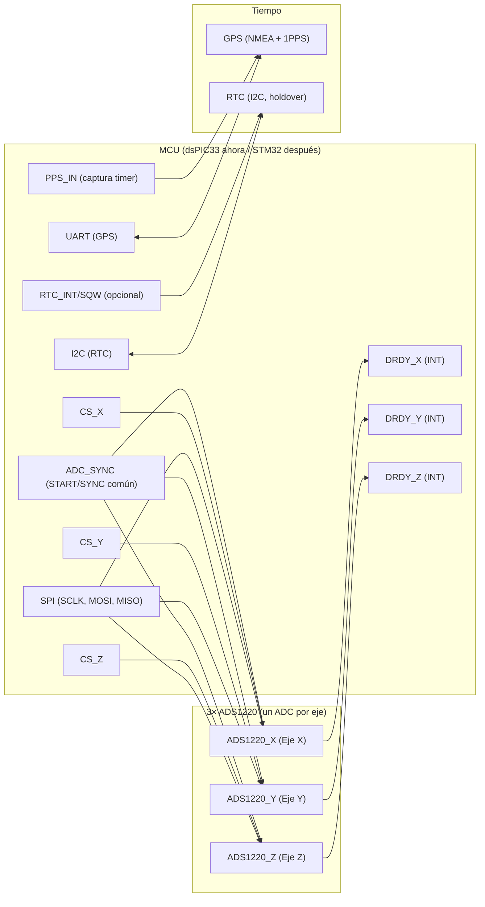

```mermaid
flowchart LR
  %% =========================
  %%  BUS / SISTEMA COMPLETO
  %% =========================

  subgraph MCU["MCU (dsPIC33 ahora / STM32 después)"]
    SPI["SPI (SCLK, MOSI, MISO)"]
    CSX["CS_X"]
    CSY["CS_Y"]
    CSZ["CS_Z"]
    SYNC["ADC_SYNC (START/SYNC común)"]
    DRX["DRDY_X (INT)"]
    DRY["DRDY_Y (INT)"]
    DRZ["DRDY_Z (INT)"]
    UART["UART (GPS)"]
    PPS["PPS_IN (captura timer)"]
    I2C["I2C (RTC)"]
    RTCINT["RTC_INT/SQW (opcional)"]
  end

  subgraph ADCs["3× ADS1220 (un ADC por eje)"]
    ADCX["ADS1220_X (Eje X)"]
    ADCY["ADS1220_Y (Eje Y)"]
    ADCZ["ADS1220_Z (Eje Z)"]
  end

  subgraph TIME["Tiempo"]
    GPS["GPS (NMEA + 1PPS)"]
    RTC["RTC (I2C, holdover)"]
  end

  %% SPI común
  SPI --> ADCX
  SPI --> ADCY
  SPI --> ADCZ

  %% CS independientes
  CSX --> ADCX
  CSY --> ADCY
  CSZ --> ADCZ

  %% START/SYNC común
  SYNC --> ADCX
  SYNC --> ADCY
  SYNC --> ADCZ

  %% DRDY independientes a MCU
  ADCX --> DRX
  ADCY --> DRY
  ADCZ --> DRZ

  %% GPS
  UART <--> GPS
  PPS --> GPS

  %% RTC
  I2C <--> RTC
  RTCINT --> RTC
```
