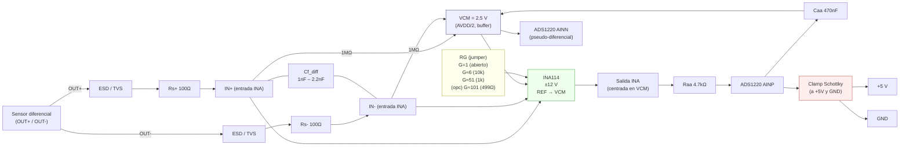

```mermaid
flowchart LR
  %% ==========================================
  %%  CAMINO DIFERENCIAL UNIVERSAL POR CANAL
  %%  Lennartz / Güralp / FBA
  %%  INA114 ±12V + ADS1220 AVDD=5V + Fs=200 sps
  %% ==========================================

  %% Sensor
  SENS["Sensor diferencial<br/>(OUT+ / OUT-)"]

  %% Protección y RF
  SENS -->|OUT+| ESDP["ESD / TVS"]
  SENS -->|OUT-| ESDN["ESD / TVS"]

  ESDP --> RSP["Rs+ 100Ω"]
  ESDN --> RSN["Rs- 100Ω"]

  RSP --> INP["IN+ (entrada INA)"]
  RSN --> INN["IN- (entrada INA)"]

  %% Filtro RF diferencial
  INP --- CFD["Cf_diff<br/>1nF – 2.2nF"] --- INN

  %% VCM
  VCM["VCM = 2.5 V<br/>(AVDD/2, buffer)"]

  INP -->|1MΩ| VCM
  INN -->|1MΩ| VCM

  %% INA114
  INA["INA114<br/>±12 V<br/>REF → VCM"]

  INP --> INA
  INN --> INA
  VCM --> INA

  %% Selección de ganancia
  RGSEL["RG (jumper)<br/>G=1 (abierto)<br/>G≈6 (10k)<br/>G≈51 (1k)<br/>(opc) G≈101 (499Ω)"]
  RGSEL --> INA

  %% Salida INA
  INA --> OUT["Salida INA<br/>(centrada en VCM)"]

  %% Anti-alias principal
  OUT --> RAA["Raa 4.7kΩ"]
  RAA --> ADCIN["ADS1220 AINP"]

  ADCIN --> CAA["Caa 470nF"]
  CAA --> VCM

  %% Protección ADC
  CLAMP["Clamp Schottky<br/>(a +5V y GND)"]
  ADCIN --> CLAMP

  CLAMP --> VDD["+5 V"]
  CLAMP --> GND["GND"]

  %% Referencia AINN
  VCM --> AINN["ADS1220 AINN<br/>(pseudo-diferencial)"]

  %% Estilos
  classDef ref fill:#eef,stroke:#447,stroke-width:1px;
  classDef amp fill:#efe,stroke:#4a4,stroke-width:1px;
  classDef cfg fill:#ffe,stroke:#aa4,stroke-width:1px;
  classDef prot fill:#fee,stroke:#c44,stroke-width:1px;

  class VCM ref;
  class INA amp;
  class RGSEL cfg;
  class CLAMP prot;
```
